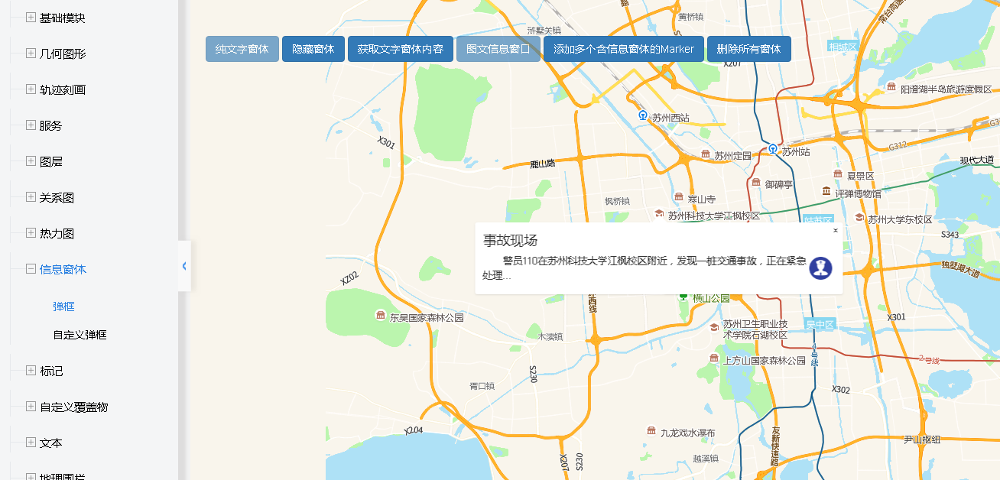

# 弹框

> 纯文字/图文信息窗口，可隐藏窗体或获取文字窗体内容，添加多个含窗体的Marker，删除所有窗体




## 运行结果：
```
<!DOCTYPE html>
<html lang="en">

<head>
    <meta charset="UTF-8">
    <title>弹框</title>
    <link rel="stylesheet" href="/kmapdemo/css/bootstrap.min.css">
    <link rel="stylesheet" href="/kmapdemo/css/main.css">
    <script src='/kmapdemo/js/jquery-2.2.3.min.js'></script>
    <script src="/kmapdemo/js/bootstrap.min.js"></script>
    <style>
        html,
        body {
            margin: 0;
            padding: 0;
        }

        html,
        body,
        #map {
            width: 100%;
            height: 100%;
        }
    </style>
</head>

<body>
    <div class="ceng">
        <button class="btn btn-primary" id="show_popup">纯文字窗体</button>
        <button class="btn btn-primary" id="hide_popup">隐藏窗体</button>
        <button class="btn btn-primary" id="get_popup">获取文字窗体内容</button>
        <button class="btn btn-primary" id="popup_img">图文信息窗口</button>
        <button class="btn btn-primary" id="add_marker">添加多个含信息窗体的Marker</button>
        <button class="btn btn-primary" id="remove_all_popups">删除所有窗体</button>
    </div>
    <div id="map"></div>
    <script src="/kmapdemo/kmap/kmap-service-main-v1.6.7.js"></script>
    <script>
        window.onload = function() {
            var kmap;
            var onLoadMap = function() {
                //这里运行地图加载之后的方法
                var popup01, markerType01;
                var picturePopup;

                // Marker点击事件
                function showPopup(event) {
                    //console.log(event.mapPoint);
                    // kmap.clear({ fiter: 'popup' });
                    var point = [120.58, 31.29];
                    var marker = event.target.overlay;

                    kmap.addPopup({
                        htmlTxt: JSON.parse(event.currentTarget.dataset.extra).text,
                        marker: marker,
                        closeButton: true,
                        anchor: 'bottom',
                        point: point,
                        ended: function(popup) {}
                    });
                }

                // 纯文字窗体
                document.getElementById('show_popup').addEventListener('click', function() {
                    kmap.addPopup({
                        htmlTxt: 'This is a popup',
                        title: 'test',
                        closeButton: true,
                        closeOnClick: false,
                        anchor: 'top',
                        point: [120.58, 31.29],
                        ended: function(popup) {
                            popup01 = popup.data;
                        }
                    });
                    document.getElementById('show_popup').setAttribute('disabled', true);
                });
                // 隐藏传文字窗体
                document.getElementById('hide_popup').addEventListener('click', function() {
                    kmap.removePopup({
                        popup: popup01
                    });
                    popup01 = null;
                    document.getElementById('show_popup').removeAttribute('disabled');
                });
                //获取纯文字窗体内容
                document.getElementById('get_popup').addEventListener('click', function() {
                    if (popup01) {
                        kmap.getPopupContent({
                            popup: popup01,
                            callback: function(d) {
                                alert(d.data.data);
                            }
                        });
                    } else {
                        alert('无文字信息窗体');
                    }
                });
                //图文信息窗口
                document.getElementById('popup_img').addEventListener('click', function() {
                    var html = `<h4 style="margin:0 0 5px 0;padding:0.2em 0">事故现场</h4>` +
                        `` +
                        `<p style='margin:0;line-height:1.5;font-size:13px;text-indent:2em'>警员110在苏州科技大学江枫校区附近，发现一桩交通事故，正在紧急处理...</p>` +
                        `</div>`;
                    kmap.addPopup({
                        htmlTxt: html,
                        title: 'test',
                        closeButton: true,
                        closeOnClick: false,
                        anchor: 'top',
                        point: [120.55985690229573, 31.304152411378453],
                        ended: function(popup) {
                            // popup01 = popup.data;
                            picturePopup = popup.data;
                            picturePopup && picturePopup.on('close', function() {
                                document.getElementById('popup_img').removeAttribute('disabled');
                            });
                            document.getElementById('popup_img').setAttribute('disabled', true);
                        }
                    });

                });
                // 添加含信息窗体的Marker
                document.getElementById('add_marker').addEventListener('click', function() {
                    var points = [{
                            point: [120.5788, 31.2906],
                            name: '警察',
                            text: '警员编号：27149',
                            id: 'm00001'
                        },
                        {
                            point: [120.80590637208059, 31.331358387618764],
                            name: '警察',
                            text: '警员编号：27156',
                            id: 'm00002'
                        }
                    ];
                    var url = '/kmapdemo/images/police.png';
                    // 添加Marker
                    kmap.addMarkers({
                        data: points,
                        url: url,
                        ended: function(markerType) {
                            markerType01 = markerType.data;
                            document.getElementById('add_marker').disabled = true;
                        }
                    });
                    // 为Marker绑定事件
                    kmap.addEventOnMarkers({
                        markerType: markerType01,
                        event: 'click',
                        handler: showPopup
                    })
                });
                //删除所有窗体
                document.getElementById('remove_all_popups').addEventListener('click', function() {
                    kmap.removeAllPopups();
                    kmap.removeMarkersByType();
                    document.getElementById('show_popup').removeAttribute('disabled');
                    document.getElementById('popup_img').removeAttribute('disabled');
                    document.getElementById('add_marker').removeAttribute('disabled');
                });
            };
            //调用科达地图API接口的配置项
            var config = {
                configUrl: '/kmapdemo/kmap/config.json',
                containerId: 'map',
                mapType: 3,
                onLoadMap: onLoadMap //配置回调方法，用来处理业务
            };

            kmap = new KMap(config);
        }
    </script>
</body>

</html>
```

