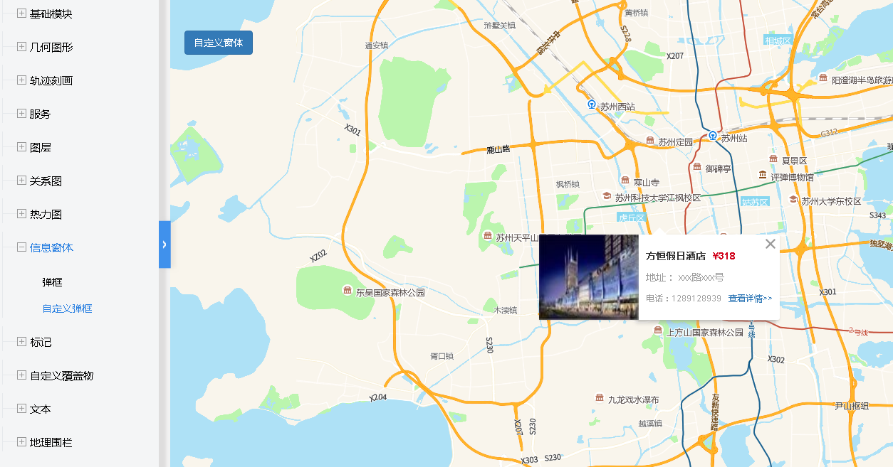

# 自定义窗体

> 可自定义窗体内容




## 运行结果：
```
<!DOCTYPE html>
<html lang="en">

<head>
    <meta charset="UTF-8">
    <title>自定义弹框</title>
    <link rel="stylesheet" href="/kmapdemo/css/bootstrap.min.css">
    <link rel="stylesheet" href="/kmapdemo/css/main.css">
    <script src='/kmapdemo/js/jquery-2.2.3.min.js'></script>
    <script src="/kmapdemo/js/bootstrap.min.js"></script>
    <style>
        html,
        body {
            margin: 0;
            padding: 0;
        }

        html,
        body,
        #map {
            width: 100%;
            height: 100%;
        }
    </style>
</head>

<body>
    <style>
        .minemap-popup-content {
            padding: 0px 0px 0px 0px;
        }
    </style>
    <div class="ceng">
        <button class="btn btn-primary" id="custom_popup">自定义窗体</button>
    </div>
    <div id="map"></div>
    <script src="/kmapdemo/kmap/kmap-service-main-v1.6.7.js"></script>
    <script>
        window.onload = function() {
            var kmap;
            var onLoadMap = function() {
                var popupId = 0;
                //这里运行地图加载之后的方法
                // 自定义窗体
                document.getElementById('custom_popup').addEventListener('click', function() {
                    var html = ` 
        <div style='float: left; padding: 20px 10px 10px 10px; box-shadow: -4px 4px 8px 0 rgba(152,152,152,0.50)'><div style='font-size: 14px;color: #333333; margin-bottom: 10px'><b>方恒假日酒店</b><span style='color: #D0021B; padding-left: 10px'><b>¥318</b></span></div>
        <div style='font-size: 14px;color: #9B9B9B; margin-bottom: 10px'>地址： xxx路xxx号</div>
        <div style='color: #9B9B9B; margin-bottom: 10px'>电话：1289128939<a href='https://www.baidu.com/' style='padding-left: 10px'>查看详情>></a></div></div>
        `;
                    kmap.addPopup({
                        htmlTxt: html,
                        title: 'test',
                        closeButton: false,
                        closeOnClick: false,
                        anchor: 'top',
                        point: [120.58 + Math.random() * 0.01, 31.29 + Math.random() * 0.01],
                        ended: function(popup) {
                            var popup01 = popup.data;
                            console.log(popup01);
                            console.log(popupId);
                            document.getElementById(`${popupId}`).addEventListener('click', function() {
                                kmap.removePopup({
                                    popup: popup01
                                });
                                document.getElementById('custom_popup').removeAttribute('disabled');
                            });
                        }
                    });
                    popupId = popupId + 1;
                });

            };
            //调用科达地图API接口的配置项
            var config = {
                configUrl: '/kmapdemo/kmap/config.json',
                containerId: 'map',
                mapType: 3,
                onLoadMap: onLoadMap //配置回调方法，用来处理业务
            };

            kmap = new KMap(config);
        }
    </script>
</body>

</html>
```

