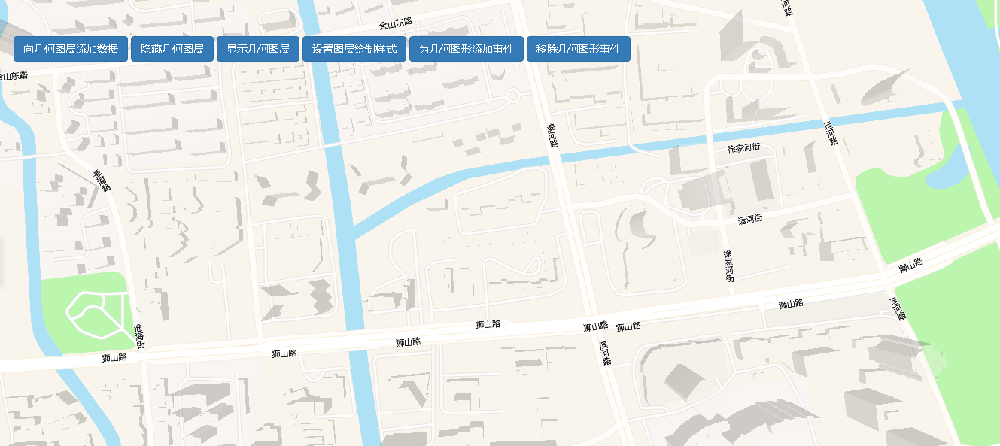

# 几何图层的显示和隐藏

> 可向图层添加数据，隐藏图层，显示图层，设置图层样式，为几何图形添加事件，移除几何图形事件





## 运行代码：

```
<!DOCTYPE html>
<html lang="en">

<head>
    <meta charset="UTF-8">
    <title>几何图层的显示和隐藏</title>
    <link rel="stylesheet" href="/kmapdemo/css/bootstrap.min.css">
    <link rel="stylesheet" href="/kmapdemo/css/main.css">
    <script src='/kmapdemo/js/jquery-2.2.3.min.js'></script>
    <script src="/kmapdemo/js/bootstrap.min.js"></script>
    <style>
        html,
        body {
            margin: 0;
            padding: 0;
        }

        html,
        body,
        #map {
            width: 100%;
            height: 100%;
        }
    </style>
</head>

<body>
    <div class="ceng">
        <button id="geometric_Layer_display" class="btn btn-primary">向几何图层添加数据</button>
        <button id="geometric_Layer_Hide" class="btn btn-primary">隐藏几何图层</button>
        <button id="geometric_Layer_Show" class="btn btn-primary">显示几何图层</button>
        <button id="setPaintProperty" class="btn btn-primary">设置图层绘制样式</button>
        <button id="addEvent" class="btn btn-primary">为几何图形添加事件</button>
        <button id="removeEvent" class="btn btn-primary">移除几何图形事件</button>

    </div>
    <div id="map"></div>
    <script src="/kmapdemo/kmap/kmap-service-main-v1.6.7.js"></script>
    <script>
        window.onload = function() {
            var kmap;
            var onLoadMap = function() {
                //这里运行地图加载之后的方法
                var data = {
                    'type': 'FeatureCollection',
                    'features': [{
                        'type': 'Feature',
                        'geometry': {
                            'type': 'Point',
                            'coordinates': [120.56683, 31.29484]
                        },
                        'properties': {
                            'id': 'my-feature-id',
                            'color': 'red'
                        }
                    }, {
                        'type': 'Feature',
                        'geometry': {
                            'type': 'LineString',
                            'coordinates': [
                                [120.56299444111534, 31.295183793773376],
                                [120.56564446362194, 31.295642183519078],
                                [120.56520458134656, 31.294413693981596],
                                [120.56696411046005, 31.294523708621327]
                            ]
                        },
                        'properties': {
                            'id': 'a329c6dad327e83f2a844bd9b79c14ce',
                            'color': 'red'
                        }
                    }, {
                        'type': 'Feature',
                        'geometry': {
                            'type': 'Polygon',
                            'coordinates': [
                                [
                                    [120.56310172948486, 31.293982802065415],
                                    [120.56503291996796, 31.294028641723756],
                                    [120.5628442374113, 31.292818467248154],
                                    [120.56310172948486, 31.293982802065415]
                                ]
                            ]
                        },
                        'properties': {
                            'id': 'bec7ebb89ec416c008b8f792e28ce7f1',
                            'color': 'blue'
                        }

                    }, {
                        'type': 'Feature',
                        'geometry': {
                            'type': 'Polygon',
                            'coordinates': [
                                [
                                    [120.56906813440528, 31.29500502117584],
                                    [120.56906130888156, 31.29506463843309],
                                    [120.56905283859217, 31.29509372868373],
                                    [120.56904109461145, 31.29512196463258],
                                    [120.56902619004033, 31.29514907435201],
                                    [120.569008268418, 31.295174796760605],
                                    [120.56898750233947, 31.295198884137513],
                                    [120.56896409179343, 31.295221104508123],
                                    [120.56893826223623, 31.29524124387812],
                                    [120.56891026242064, 31.295259108294363],
                                    [120.56888036200019, 31.295274525712752],
                                    [120.56884884893225, 31.29528734765513],
                                    [120.56881602670491, 31.295297450639172],
                                    [120.56878221141416, 31.295304737367626],
                                    [120.56874772871973, 31.295309137665313],
                                    [120.56871291070883, 31.29531060915496],
                                    [120.56867809269792, 31.295309137665313],
                                    [120.56864361000349, 31.295304737367626],
                                    [120.56860979471274, 31.295297450639172],
                                    [120.5685769724854, 31.29528734765513],
                                    [120.56854545941746, 31.295274525712752],
                                    [120.568515558997, 31.295259108294363],
                                    [120.56848755918142, 31.29524124387812],
                                    [120.56846172962422, 31.295221104508123],
                                    [120.56843831907818, 31.295198884137513],
                                    [120.56841755299965, 31.295174796760605],
                                    [120.56839963137732, 31.29514907435201],
                                    [120.5683847268062, 31.29512196463258],
                                    [120.56837298282548, 31.29509372868373],
                                    [120.56836451253609, 31.29506463843309],
                                    [120.56835939751156, 31.295034974035673],
                                    [120.56835768701237, 31.29500502117584],
                                    [120.56835939751156, 31.294975068316006],
                                    [120.56836451253609, 31.29494540391859],
                                    [120.56837298282548, 31.294916313667947],
                                    [120.5683847268062, 31.2948880777191],
                                    [120.56839963137732, 31.294860967999668],
                                    [120.56841755299965, 31.294835245591074],
                                    [120.56843831907818, 31.294811158214166],
                                    [120.56846172962422, 31.294788937843556],
                                    [120.56848755918142, 31.29476879847356],
                                    [120.568515558997, 31.294750934057316],
                                    [120.56854545941746, 31.294735516638926],
                                    [120.5685769724854, 31.29472269469655],
                                    [120.56860979471274, 31.294712591712507],
                                    [120.56864361000349, 31.294705304984053],
                                    [120.56867809269792, 31.294700904686366],
                                    [120.56871291070883, 31.29469943319672],
                                    [120.56874772871973, 31.294700904686366],
                                    [120.56878221141416, 31.294705304984053],
                                    [120.56881602670491, 31.294712591712507],
                                    [120.56884884893225, 31.29472269469655],
                                    [120.56888036200019, 31.294735516638926],
                                    [120.56891026242064, 31.294750934057316],
                                    [120.56893826223623, 31.29476879847356],
                                    [120.56896409179343, 31.294788937843556],
                                    [120.56898750233947, 31.294811158214166],
                                    [120.569008268418, 31.294835245591074],
                                    [120.56902619004033, 31.294860967999668],
                                    [120.56904109461145, 31.2948880777191],
                                    [120.56905283859217, 31.294916313667947],
                                    [120.56906130888156, 31.29494540391859],
                                    [120.5690664239061, 31.294975068316006],
                                    [120.56906813440528, 31.29500502117584],
                                    [120.56906813440528, 31.29500502117584]
                                ]
                            ]
                        },
                        'properties': {
                            'id': 'f34cf93de8613f2edd2ec35244e2e331',
                            'color': 'blue'
                        }

                    }]
                };
                var dataBM = {
                    'type': 'FeatureCollection',
                    'features': [{
                        'type': 'Feature',
                        'geometry': {
                            'type': 'Point',
                            'coordinates': [
                                [120.56683, 31.29484]
                            ]
                        },
                        'properties': {
                            'id': 'my-feature-id',
                            'color': ''
                        }
                    }, {
                        'type': 'Feature',
                        'geometry': {
                            'type': 'LineString',
                            'coordinates': [
                                [120.56299444111534, 31.295183793773376],
                                [120.56564446362194, 31.295642183519078],
                                [120.56520458134656, 31.294413693981596],
                                [120.56696411046005, 31.294523708621327]
                            ]
                        },
                        'properties': {
                            'id': 'a329c6dad327e83f2a844bd9b79c14ce',
                            'color': 'red'
                        }
                    }, {
                        'type': 'Feature',
                        'geometry': {
                            'type': 'Polygon',
                            'coordinates': [
                                [120.56310172948486, 31.293982802065415],
                                [120.56503291996796, 31.294028641723756],
                                [120.5628442374113, 31.292818467248154],
                                [120.56310172948486, 31.293982802065415]
                            ]
                        },
                        'properties': {
                            'id': 'bec7ebb89ec416c008b8f792e28ce7f1',
                            'color': 'blue'
                        }

                    }, {
                        'type': 'Feature',
                        'geometry': {
                            'type': 'Polygon',
                            'coordinates': [
                                [120.56906813440528, 31.29500502117584],
                                [120.56906130888156, 31.29506463843309],
                                [120.56905283859217, 31.29509372868373],
                                [120.56904109461145, 31.29512196463258],
                                [120.56902619004033, 31.29514907435201],
                                [120.569008268418, 31.295174796760605],
                                [120.56898750233947, 31.295198884137513],
                                [120.56896409179343, 31.295221104508123],
                                [120.56893826223623, 31.29524124387812],
                                [120.56891026242064, 31.295259108294363],
                                [120.56888036200019, 31.295274525712752],
                                [120.56884884893225, 31.29528734765513],
                                [120.56881602670491, 31.295297450639172],
                                [120.56878221141416, 31.295304737367626],
                                [120.56874772871973, 31.295309137665313],
                                [120.56871291070883, 31.29531060915496],
                                [120.56867809269792, 31.295309137665313],
                                [120.56864361000349, 31.295304737367626],
                                [120.56860979471274, 31.295297450639172],
                                [120.5685769724854, 31.29528734765513],
                                [120.56854545941746, 31.295274525712752],
                                [120.568515558997, 31.295259108294363],
                                [120.56848755918142, 31.29524124387812],
                                [120.56846172962422, 31.295221104508123],
                                [120.56843831907818, 31.295198884137513],
                                [120.56841755299965, 31.295174796760605],
                                [120.56839963137732, 31.29514907435201],
                                [120.5683847268062, 31.29512196463258],
                                [120.56837298282548, 31.29509372868373],
                                [120.56836451253609, 31.29506463843309],
                                [120.56835939751156, 31.295034974035673],
                                [120.56835768701237, 31.29500502117584],
                                [120.56835939751156, 31.294975068316006],
                                [120.56836451253609, 31.29494540391859],
                                [120.56837298282548, 31.294916313667947],
                                [120.5683847268062, 31.2948880777191],
                                [120.56839963137732, 31.294860967999668],
                                [120.56841755299965, 31.294835245591074],
                                [120.56843831907818, 31.294811158214166],
                                [120.56846172962422, 31.294788937843556],
                                [120.56848755918142, 31.29476879847356],
                                [120.568515558997, 31.294750934057316],
                                [120.56854545941746, 31.294735516638926],
                                [120.5685769724854, 31.29472269469655],
                                [120.56860979471274, 31.294712591712507],
                                [120.56864361000349, 31.294705304984053],
                                [120.56867809269792, 31.294700904686366],
                                [120.56871291070883, 31.29469943319672],
                                [120.56874772871973, 31.294700904686366],
                                [120.56878221141416, 31.294705304984053],
                                [120.56881602670491, 31.294712591712507],
                                [120.56884884893225, 31.29472269469655],
                                [120.56888036200019, 31.294735516638926],
                                [120.56891026242064, 31.294750934057316],
                                [120.56893826223623, 31.29476879847356],
                                [120.56896409179343, 31.294788937843556],
                                [120.56898750233947, 31.294811158214166],
                                [120.569008268418, 31.294835245591074],
                                [120.56902619004033, 31.294860967999668],
                                [120.56904109461145, 31.2948880777191],
                                [120.56905283859217, 31.294916313667947],
                                [120.56906130888156, 31.29494540391859],
                                [120.5690664239061, 31.294975068316006],
                                [120.56906813440528, 31.29500502117584],
                                [120.56906813440528, 31.29500502117584]
                            ]
                        },
                        'properties': {
                            'id': 'f34cf93de8613f2edd2ec35244e2e331',
                            'color': 'blue'
                        }

                    }]
                };
                var renderDraw = {
                    type: 'polygon',
                    coordinates: [
                        [
                            [120.56906813440528, 31.29500502117584],
                            [120.56906130888156, 31.29506463843309],
                            [120.56905283859217, 31.29509372868373],
                            [120.56904109461145, 31.29512196463258],
                            [120.56902619004033, 31.29514907435201],
                            [120.569008268418, 31.295174796760605],
                            [120.56898750233947, 31.295198884137513],
                            [120.56896409179343, 31.295221104508123],
                            [120.56893826223623, 31.29524124387812],
                            [120.56891026242064, 31.295259108294363],
                            [120.56888036200019, 31.295274525712752],
                            [120.56884884893225, 31.29528734765513],
                            [120.56881602670491, 31.295297450639172],
                            [120.56878221141416, 31.295304737367626],
                            [120.56874772871973, 31.295309137665313],
                            [120.56871291070883, 31.29531060915496],
                            [120.56867809269792, 31.295309137665313],
                            [120.56864361000349, 31.295304737367626],
                            [120.56860979471274, 31.295297450639172],
                            [120.5685769724854, 31.29528734765513],
                            [120.56854545941746, 31.295274525712752],
                            [120.568515558997, 31.295259108294363],
                            [120.56848755918142, 31.29524124387812],
                            [120.56846172962422, 31.295221104508123],
                            [120.56843831907818, 31.295198884137513],
                            [120.56841755299965, 31.295174796760605],
                            [120.56839963137732, 31.29514907435201],
                            [120.5683847268062, 31.29512196463258],
                            [120.56837298282548, 31.29509372868373],
                            [120.56836451253609, 31.29506463843309],
                            [120.56835939751156, 31.295034974035673],
                            [120.56835768701237, 31.29500502117584],
                            [120.56835939751156, 31.294975068316006],
                            [120.56836451253609, 31.29494540391859],
                            [120.56837298282548, 31.294916313667947],
                            [120.5683847268062, 31.2948880777191],
                            [120.56839963137732, 31.294860967999668],
                            [120.56841755299965, 31.294835245591074],
                            [120.56843831907818, 31.294811158214166],
                            [120.56846172962422, 31.294788937843556],
                            [120.56848755918142, 31.29476879847356],
                            [120.568515558997, 31.294750934057316],
                            [120.56854545941746, 31.294735516638926],
                            [120.5685769724854, 31.29472269469655],
                            [120.56860979471274, 31.294712591712507],
                            [120.56864361000349, 31.294705304984053],
                            [120.56867809269792, 31.294700904686366],
                            [120.56871291070883, 31.29469943319672],
                            [120.56874772871973, 31.294700904686366],
                            [120.56878221141416, 31.294705304984053],
                            [120.56881602670491, 31.294712591712507],
                            [120.56884884893225, 31.29472269469655],
                            [120.56888036200019, 31.294735516638926],
                            [120.56891026242064, 31.294750934057316],
                            [120.56893826223623, 31.29476879847356],
                            [120.56896409179343, 31.294788937843556],
                            [120.56898750233947, 31.294811158214166],
                            [120.569008268418, 31.294835245591074],
                            [120.56902619004033, 31.294860967999668],
                            [120.56904109461145, 31.2948880777191],
                            [120.56905283859217, 31.294916313667947],
                            [120.56906130888156, 31.29494540391859],
                            [120.5690664239061, 31.294975068316006],
                            [120.56906813440528, 31.29500502117584],
                            [120.56906813440528, 31.29500502117584]
                        ]
                    ],
                    callback: function(data) {
                        console.log(data);
                    }
                }

                var displayid = document.getElementById('geometric_Layer_display');
                var showid = document.getElementById('geometric_Layer_Show');
                var hideid = document.getElementById('geometric_Layer_Hide');
                var setPaintProperty = document.getElementById('setPaintProperty');
                var addEvent = document.getElementById('addEvent');
                var removeEvent = document.getElementById('removeEvent');
                displayid.addEventListener('click', function() {
                    kmap.addGeometryLayer({
                        sourceId: 'drawId',
                        data: data,
                        layerId: 'graphical',
                        isSetColor: true
                    });
                });
                showid.addEventListener('click', function() {
                    kmap.showGeometryLayer({
                        layerId: 'graphical'
                    });
                });
                hideid.addEventListener('click', function() {
                    kmap.hideGeometryLayer({
                        layerId: 'graphical'
                    });
                });
                setPaintProperty.addEventListener('click', function() {
                    kmap.setPaintProperty({
                        layerId: 'graphical',
                        name: 'fill-color',
                        value: 'red'
                    });
                    kmap.setPaintProperty({
                        layerId: 'graphical',
                        name: 'line-color',
                        value: 'yellow'
                    });
                    kmap.setPaintProperty({
                        layerId: 'graphical',
                        name: 'circle-color',
                        value: 'green'
                    });
                });
                const clickHandler = () => {
                    alert('你点击了');
                }
                addEvent.addEventListener('click', function() {
                    kmap.addEventOnLayerObject({
                        layerId: 'graphical',
                        event: 'click',
                        handler: clickHandler
                    });
                });

                removeEvent.addEventListener('click', function() {
                    kmap.removeEventOnLayerObject({
                        layerId: 'graphical',
                        event: 'click'
                    });
                });
                // kmap.renderGeometricDraw(renderDraw)
            };
            //调用科达地图API接口的配置项
            var config = {
                configUrl: '/kmapdemo/kmap/config.json',
                containerId: 'map',
                center: [120.56683, 31.29484],
                zoom: 16,
                mapType: 3,
                onLoadMap: onLoadMap //配置回调方法，用来处理业务
            };

            kmap = new KMap(config);
        }
    </script>
</body>

</html>
```

