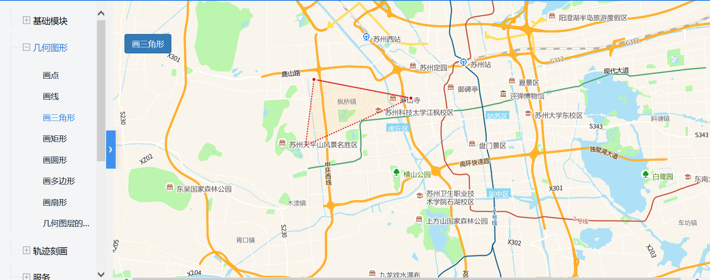

# 画三角形

> 可在地图上标记三角形区域





## 运行代码：

```
<!DOCTYPE html>
<html lang="en">

<head>
    <meta charset="UTF-8">
    <title>画三角形</title>
    <link rel="stylesheet" href="/kmapdemo/css/bootstrap.min.css">
    <link rel="stylesheet" href="/kmapdemo/css/main.css">
    <script src='/kmapdemo/js/jquery-2.2.3.min.js'></script>
    <script src="/kmapdemo/js/bootstrap.min.js"></script>
    <style>
        html,
        body {
            margin: 0;
            padding: 0;
        }

        html,
        body,
        #map {
            width: 100%;
            height: 100%;
        }
    </style>
</head>

<body>
    <div class="ceng">
        <button class="btn btn-primary" id="drawtriangle">画三角形</button>
    </div>
    <div id="map"></div>
    <script src="/kmapdemo/kmap/kmap-service-main-v1.6.7.js"></script>
    <script>
        window.onload = function() {
            var kmap;
            var onLoadMap = function() {
                //这里运行地图加载之后的方法
                var drawrectangle = document.getElementById('drawtriangle');
                drawrectangle.onclick = function() {
                    kmap.drawTriangle({
                        callback: function(res) {
                            console.log(res.data);
                        }
                    });
                };

            };
            //调用科达地图API接口的配置项
            var config = {
                configUrl: '/kmapdemo/kmap/config.json',
                containerId: 'map',
                mapType: 3,
                onLoadMap: onLoadMap //配置回调方法，用来处理业务
            };

            kmap = new KMap(config);
        }
    </script>
</body>

</html>
```

