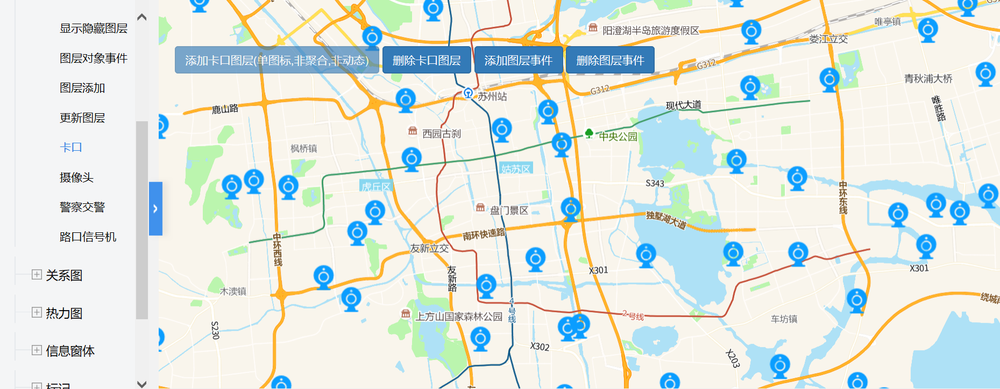

# 卡口

> 添加/删除卡口图层，给图层添加/删除事件




## 运行代码：

```
<!DOCTYPE html>
<html lang="en">

<head>
    <meta charset="UTF-8">
    <title>卡口</title>
    <link rel="stylesheet" href="/kmapdemo/css/bootstrap.min.css">
    <link rel="stylesheet" href="/kmapdemo/css/main.css">
    <script src='/kmapdemo/js/jquery-2.2.3.min.js'></script>
    <script src="/kmapdemo/js/bootstrap.min.js"></script>
    <style>
        html,
        body {
            margin: 0;
            padding: 0;
        }

        html,
        body,
        #map {
            width: 100%;
            height: 100%;
        }
    </style>
</head>

<body>
    <div class="ceng">
        <button type="button" class="btn btn-primary" id="add_layer">添加卡口图层(单图标,非聚合,非动态)</button>
        <button type="button" class="btn btn-primary" id="remove_layer">删除卡口图层</button>
        <button type="button" class="btn btn-primary" id="add_layer_event">添加图层事件</button>
        <button type="button" class="btn btn-primary" id="remove_layer_event">删除图层事件</button>
    </div>
    <div id="map"></div>
    <script src="/kmapdemo/kmap/kmap-service-main-v1.6.7.js"></script>
    <script>
        window.onload = function() {
            var kmap;
            var onLoadMap = function() {
                bindPageEvents();
            };
            //调用科达地图API接口的配置项
            var config = {
                configUrl: '/kmapdemo/kmap/config.json',
                containerId: 'map',
                zoom: 11,
                mapType: 3,
                center: [120.6584389547279, 31.292601214089288],
                onLoadMap: onLoadMap //配置回调方法，用来处理业务
            };
            // 存储返回的layerId
            var layerId = null;

            function bindPageEvents() {
                document.getElementById('add_layer').addEventListener('click', addLayer);
                document.getElementById('remove_layer').addEventListener('click', removeLayer);
                document.getElementById('add_layer_event').addEventListener('click', addLayerEvent);
                document.getElementById('remove_layer_event').addEventListener('click', removeLayerEvent);
            }

            function addLayer() {
                kmap.addCustomLayer({
                    serviceId: '67', // required
                    multi: false, // required
                    url: '/kmapdemo/images/camera-active.png',
                    ended: function(res) {
                        if (res.status === 10) {
                            layerId = res.data;
                        }
                    }
                });
                document.getElementById('add_layer').setAttribute('disabled', true);
            }

            function removeLayer() {
                if (layerId) {
                    kmap.removeLayer({
                        layerId: layerId
                    });
                    layerId = null;
                }
                document.getElementById('add_layer').removeAttribute('disabled');
            }

            const handler = function(e) {
                alert('按F12查看详情');
                console.log(e);
            }

            function addLayerEvent() {
                if (layerId) {
                    kmap.addEventOnLayerObject({
                        layerId: layerId,
                        event: 'click',
                        handler: handler
                    });
                }
            }

            function removeLayerEvent() {
                if (layerId) {
                    kmap.removeEventOnLayerObject({
                        layerId: layerId,
                        event: 'click'
                    });
                }
            }


            kmap = new KMap(config);
        }
    </script>
</body>

</html>
```

