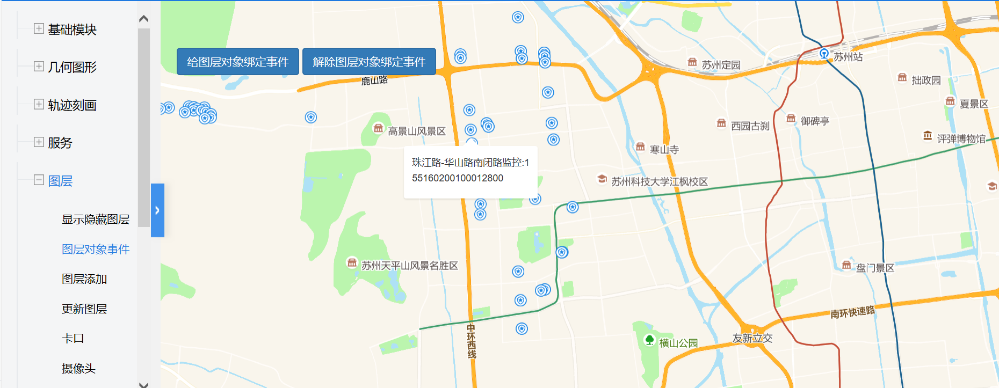

# 图层对象事件

> 给图层绑定/解除事件




## 运行代码：
```
<!DOCTYPE html>
<html lang="en">

<head>
    <meta charset="UTF-8">
    <title>图层对象事件</title>
    <link rel="stylesheet" href="/kmapdemo/css/bootstrap.min.css">
    <link rel="stylesheet" href="/kmapdemo/css/main.css">
    <script src='/kmapdemo/js/jquery-2.2.3.min.js'></script>
    <script src="/kmapdemo/js/bootstrap.min.js"></script>
    <style>
        html,
        body {
            margin: 0;
            padding: 0;
        }

        html,
        body,
        #map {
            width: 100%;
            height: 100%;
        }
    </style>
</head>

<body>
    <div class="ceng">
        <button type="button" class="btn btn-primary" id="bind_rail_events">给图层对象绑定事件</button>
        <button type="button" class="btn btn-primary" id="off_rail_events">解除图层对象绑定事件</button>
    </div>
    <div id="map"></div>
    <script src="/kmapdemo/kmap/kmap-service-main-v1.6.7.js"></script>
    <script>
        window.onload = function() {
            var kmap;

            const sourceData = window.sourceData;
            var myLayerId = 'policeLayer';
            var onLoadMap = function() {
                if (kmap.mapType === 'AG') {
                    kmap.addLayer({
                        layerId: myLayerId,
                        url: 'http://172.16.235.68:6080/arcgis/rest/services/resource/MapServer/0',
                        type: 'feature',
                        outFields: ['*']
                    });
                } else if (kmap.mapType === 'MM') {
                    addPoliceLayer();
                }
                bindPageEvents();
            };
            //调用科达地图API接口的配置项
            var config = {
                configUrl: '/kmapdemo/kmap/config.json',
                containerId: 'map',
                mapType: 3,
                onLoadMap: onLoadMap //配置回调方法，用来处理业务
            };

            function addPoliceLayer() {
                kmap.addLayer({
                    layerId: myLayerId,
                    sourceId: 'policeSource',
                    data: sourceData,
                    iconImage: 'police-15',
                    ended: function() {
                        console.log(kmap.msg);
                    }
                });
            }

            var popup = null;

            function bindPageEvents() {

                document.getElementById('bind_rail_events').addEventListener('click', function() {
                    bindLayerEvents();
                });

                document.getElementById('off_rail_events').addEventListener('click', function() {
                    unBindLayerEvents();
                });
            }

            function fnCallback(e, feature) {
                kmap.clear({
                    fiter: 'popup'
                });
                var innerHtml = feature.properties.name_zh ? feature.properties.name_zh :
                    feature.properties.name + '<br>' + feature.properties.telephone;
                kmap.addPopup({
                    point: feature.geometry.coordinates,
                    anchor: 'top',
                    offset: [0, 10],
                    htmlTxt: innerHtml
                })
            }

            function agCallback(event, feature) {
                var mapPoint = event.mapPoint;
                kmap.addPopup({
                    point: [mapPoint.getLongitude(), mapPoint.getLatitude()],
                    anchor: 'top',
                    htmlTxt: feature.name + '</br>'
                })
            }

            function bindLayerEvents() {
                var callback = fnCallback;
                if (kmap.mapType === 'AG') {
                    callback = agCallback
                }
                kmap.addEventOnLayerObject({
                    layerId: myLayerId,
                    event: 'click',
                    handler: callback
                });
            }

            function unBindLayerEvents(type) {
                kmap.clear({
                    fiter: 'popup'
                });
                kmap.removeEventOnLayerObject({
                    layerId: myLayerId,
                    event: 'click'
                });
            }


            kmap = new KMap(config);
        }
    </script>
</body>

</html>
<script src='/kmapdemo/js/minemap-data.js'></script>
```

