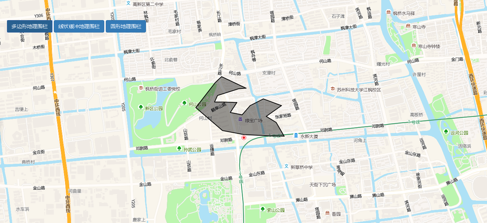

# 地理围栏

> 查看多边形/线状/圆形地理围栏





## 运行代码：

```
<!DOCTYPE html>
<html lang="en">

<head>
    <meta charset="UTF-8">
    <title>地理围栏</title>
    <link rel="stylesheet" href="/kmapdemo/css/bootstrap.min.css">
    <link rel="stylesheet" href="/kmapdemo/css/main.css">
    <script src='/kmapdemo/js/jquery-2.2.3.min.js'></script>
    <script src="/kmapdemo/js/bootstrap.min.js"></script>
    <style>
        html,
        body {
            margin: 0;
            padding: 0;
        }

        html,
        body,
        #map {
            width: 100%;
            height: 100%;
        }
    </style>
</head>

<body>
    <style>
        .bottom-area-alert {
            position: absolute;
            bottom: 10px;
            z-index: 999;
            background: rgba(255, 255, 255, 0.7);
            width: 200px;
            left: 50%;
            text-align: center;
            margin-left: -100px;
        }
    </style>
    <div class="opp-area-btn inner">
        <button class="btn btn-primary" id="polygon_geo_fencing">多边形地理围栏</button>
        <button class="btn btn-primary" id="line_geo_fencing">线状缓冲地理围栏</button>
        <button class="btn btn-primary" id="circle_geo_fencing">圆形地理围栏</button>

    </div>
    <div class="alert bottom-area-alert" id="alerts">地理围栏结果显示区域</div>
    <div id="map"></div>
    <script src="/kmapdemo/kmap/kmap-service-main-v1.6.7.js"></script>
    <script>
        window.onload = function() {
            var kmap;


            var polygonData = window.polygonData;
            var polylineData = window.polylineData;
            var circleData = window.circleData;
            var track_id = null;
            var timeId;
            var timeDelayId;
            var timers = [];

            function onLoadMap() {
                var polygon_geo_fencing = document.getElementById('polygon_geo_fencing');
                var line_geo_fencing = document.getElementById('line_geo_fencing');
                var circle_geo_fencing = document.getElementById('circle_geo_fencing');
                var alerts = document.getElementById('alerts');

                polygon_geo_fencing.addEventListener('click', function() {
                    removeAll();
                    var point = [120.5495989323, 31.3005274325];
                    kmap.moveTolnglat({
                        type: 2,
                        zoom: 14,
                        point
                    });
                    var id = 'e62f6897a21ec189a87fd8ee8a54553c';
                    var body = {
                        pid: id,
                        geojson: formatPointToGeoJSON(point)
                    };

                    kmap.addGeometryLayer({
                        layerId: 'polygon-geo-layer',
                        sourceId: 'polygon-geo-source',
                        data: polygonData
                    });


                    kmap.addMarkers({
                        data: [{
                            point: point,
                            id: id
                        }],
                        url: '/kmapdemo/images/point.png',
                    });


                    const isPointInPolygon = () => {
                        point = [point[0] + (Math.random() - 0.5) * 0.0015, point[1] + (Math.random() - 0.5) * 0.0015]
                        kmap.pointInPolygon({
                            point: point,
                            polygon: polygonData.coordinates[0],
                            callback: res => {
                                kmap.setMarkerProperty({
                                    type: 'id',
                                    id: id,
                                    point: point
                                });
                                if (res.status === 10) {
                                    if (res.data) {
                                        alerts.innerHTML = '目标未出界';
                                        alerts.style.color = 'black';
                                    } else {
                                        alerts.innerHTML = '目标出界了';
                                        alerts.style.color = 'red';
                                    }
                                }
                            }
                        });
                    }

                    timeId = setInterval(function() {
                        isPointInPolygon();
                    }, 1000);
                    timers.push(timeId);
                });

                line_geo_fencing.addEventListener('click', function() {
                    removeAll();
                    var point = [120.55491402825191, 31.299700407612704];
                    kmap.moveTolnglat({
                        type: 2,
                        zoom: 14,
                        point
                    });
                    var id = 'e62f6897a21ec189a87fd8ee8a54553c';

                    kmap.lineToBuffer({
                        polyline: polylineData.coordinates,
                        radius: 10,
                        units: 'meters',
                        callback: function(res) {
                            var lineBuffer = res.data;

                            kmap.addGeometryLayer({
                                layerId: 'polyline-geo-layer',
                                sourceId: 'polyline-geo-source',
                                data: polylineData
                            });

                            kmap.addGeometryLayer({
                                layerId: 'linebuffer-geo-layer',
                                sourceId: 'linebuffer-geo-layer',
                                data: lineBuffer
                            });
                            let resultPoints = [];

                            const getLineChunks = function(p1, p2) {
                                kmap.getLineChunks({
                                    line: [p1, p2],
                                    segmentLength: 0.05,
                                    callback: res => {
                                        const features = res.data.features;
                                        features.map((item, index) => {
                                            const coords = item.geometry.coordinates;
                                            resultPoints.push(coords[0], coords[1]);
                                        })
                                    }
                                });
                            }
                            let originCoords = polylineData.coordinates.slice();
                            while (originCoords.length > 0 && originCoords.length % 2 === 0) {
                                getLineChunks(originCoords.shift(), originCoords.shift());
                            }

                            kmap.addMarkers({
                                data: [{
                                    point: resultPoints[0],
                                    id: id
                                }],
                                url: '/kmapdemo/images/point.png',
                            });

                            const isPointInPolygon = () => {
                                if (resultPoints.length <= 0) {
                                    clearInterval(timeId);
                                }
                                const len = resultPoints.length;

                                point = resultPoints.shift();
                                if (len % 9 === 0 && Array.isArray(point) && Array.length > 0) {
                                    point = [point[0] + (Math.random() - 0.5) * 0.0015, point[1] + (Math.random() - 0.5) * 0.0015];
                                }

                                if (!point) return;
                                kmap.pointInPolygon({
                                    point: point,
                                    polygon: lineBuffer.geometry.coordinates[0],
                                    callback: res => {
                                        kmap.setMarkerProperty({
                                            type: 'id',
                                            id: id,
                                            point: point
                                        });
                                        if (res.status === 10) {
                                            if (res.data) {
                                                alerts.innerHTML = '目标未出界';
                                                alerts.style.color = 'black';
                                            } else {
                                                alerts.innerHTML = '目标出界了';
                                                alerts.style.color = 'red';
                                            }
                                        }
                                    }
                                });
                            }

                            timeId = setInterval(function() {
                                isPointInPolygon();
                            }, 1000);
                            timers.push(timeId);
                        }
                    });
                });

                circle_geo_fencing.addEventListener('click', function() {
                    removeAll();
                    var point = [120.5495989323, 31.3005274325];
                    kmap.moveTolnglat({
                        type: 2,
                        zoom: 14,
                        point
                    });
                    var id = '8fd1920a5dd29d85d71184f25d83f950';
                    var body = {
                        pid: id,
                        geojson: formatPointToGeoJSON(point)
                    };

                    kmap.addGeometryLayer({
                        layerId: 'circle-geo-layer',
                        sourceId: 'circle-geo-source',
                        data: circleData
                    });

                    kmap.addMarkers({
                        data: [{
                            point: point,
                            id: id
                        }],
                        url: '/kmapdemo/images/point.png',
                    });

                    const isPointInPolygon = () => {
                        point = [point[0] + (Math.random() - 0.5) * 0.0015, point[1] + (Math.random() - 0.5) * 0.0015]
                        kmap.pointInPolygon({
                            point: point,
                            polygon: circleData.coordinates[0],
                            callback: res => {
                                kmap.setMarkerProperty({
                                    type: 'id',
                                    id: id,
                                    point: point
                                });
                                if (res.status === 10) {
                                    if (res.data) {
                                        alerts.innerHTML = '目标未出界';
                                        alerts.style.color = 'black';
                                    } else {
                                        alerts.innerHTML = '目标出界了';
                                        alerts.style.color = 'red';
                                    }
                                }
                            }
                        });
                    }

                    timeId = setInterval(function() {
                        isPointInPolygon();
                    }, 1000);
                    timers.push(timeId);
                });
            }

            function formatPointToGeoJSON(point) {
                return JSON.stringify({
                    'type': 'Point',
                    'coordinates': point
                });
            }

            function removeAll() {
                kmap.removeLayer({
                    layerId: 'polygon-geo-layer'
                });
                kmap.removeLayer({
                    layerId: 'polyline-geo-layer'
                });
                kmap.removeLayer({
                    layerId: 'circle-geo-layer'
                });
                kmap.removeLayer({
                    layerId: 'linebuffer-geo-layer'
                });
                kmap.removeMarkersById({
                    id: ['e62f6897a21ec189a87fd8ee8a54553c', '8fd1920a5dd29d85d71184f25d83f950']
                });
                track_id && kmap.removeRealtimeTrack({
                    id: track_id
                });
                alerts.innerHTML = '地理围栏结果显示区域';
                alerts.style.color = 'black';
                timeDelayId && clearTimeout(timeDelayId);
                timeId && clearTimeout(timeId);
                if (timers.length > 0) {
                    timers.forEach(time => clearInterval(time));
                }
            }

            var config = {
                configUrl: '/kmapdemo/kmap/config.json',
                containerId: 'map',
                zoom: 10,
                mapType: 3,
                onLoadMap: onLoadMap
            };


            kmap = new KMap(config);
        }
    </script>
</body>

</html>
<script src='/kmapdemo/js/jquery-2.2.3.min.js'></script>

<script src='/kmapdemo/js/geo-fencing-data.js'></script>
```

