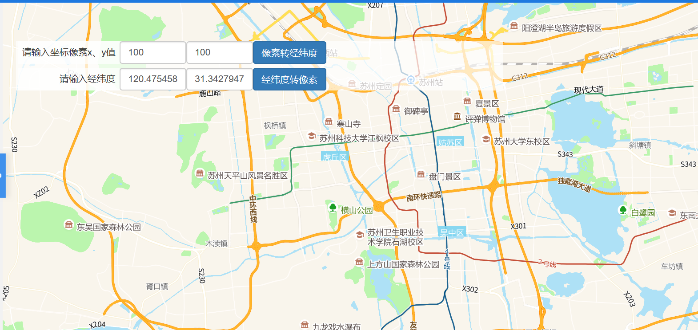

# 像素经纬度转换

> 通过像素坐标得到经纬度  通过经纬度获得像素坐标





## 运行代码：

```
<!DOCTYPE html>
<html lang="en">

<head>
    <meta charset="UTF-8">
    <title>像素经纬度转换</title>
    <link rel="stylesheet" href="/kmapdemo/css/bootstrap.min.css">
    <link rel="stylesheet" href="/kmapdemo/css/main.css">
    <script src='/kmapdemo/js/jquery-2.2.3.min.js'></script>
    <script src="/kmapdemo/js/bootstrap.min.js"></script>
    <style>
        html,
        body {
            margin: 0;
            padding: 0;
        }

        html,
        body,
        #map {
            width: 100%;
            height: 100%;
        }
    </style>
</head>

<body>
    <div class="opp-area-btn inner" style="width: 95%;">
        <div class="row">
            <div style="float:left;width:170px;">
                <span class="text-right">请输入坐标像素x、y值</span>
            </div>
            <div style="float: left;">
                <input type="text" id="screen_x" style="width:100px;float: left; " class="form-control" value="100">
                <input type="text" id="screen_y" class="form-control" style="width: 100px;float: left;" value="100">
            </div>
            <button id="to_lnglat_btn" class="btn btn-primary" style="float: left;">像素转经纬度</button>
            <span id="result_lnglat"></span>
        </div>

        <div class="row" style="margin-top: 6px">
            <div style="float:left;width:170px;">
                <span class="text-right" style="width:152px;">请输入经纬度</span>
            </div>
            <div style="float: left;">
                <input type="text" id="map_lng" style="width:100px;float: left;" class="form-control" value="120.47545822145997">
                <input type="text" id="map_lat" style="width:100px;float: left;" class="form-control" value="31.342794734995394">
            </div>
            <button id="to_pixel_btn" class="btn btn-primary" style="float: left;">经纬度转像素</button>
            <span id="result_pixel"></span>
        </div>
    </div>

    <div id="map"></div>

    <script src="/kmapdemo/kmap/kmap-service-main-v1.6.7.js"></script>
    <script>
        window.onload = function() {
            var kmap;
            var onLoadMap = function() {
                //这里运行地图加载之后的方法
                document.getElementById('to_lnglat_btn').addEventListener('click', function() {
                    var x = document.getElementById('screen_x').value;
                    var y = document.getElementById('screen_y').value;
                    console.log(x, y);
                    if (checkNumber([x, y])) {
                        // 像素转经纬度
                        kmap.getGeoPointByPixel({
                            ePoint: [parseFloat(x), parseFloat(y)],
                            callback: function(result) {
                                //document.getElementById('result_lnglat').innerHTML = JSON.stringify(result.data);
                                console.log(JSON.stringify(result.data));
                                alert(JSON.stringify(result.data));
                            }
                        })
                    } else {
                        alert('请输入正确的像素格式！');
                    }
                })

                document.getElementById('to_pixel_btn').addEventListener('click', function() {
                    var lng = document.getElementById('map_lng').value;
                    var lat = document.getElementById('map_lat').value;
                    if (checkNumber([lng, lat])) {
                        // 经纬度转像素
                        kmap.getPixelByGeoPoint({
                            point: [parseFloat(lng), parseFloat(lat)],
                            callback: function(result) {
                                //document.getElementById('result_pixel').innerHTML = JSON.stringify(result.data);
                                console.log(JSON.stringify(result.data));
                                alert(JSON.stringify(result.data));
                            }
                        })
                    } else {
                        alert('请输入正确的经纬度格式！');
                    }

                })

                function checkNumber(arr) {
                    for (let i = 0; i < arr.length; i++) {
                        if (isNaN(arr[i])) {
                            return false;
                        }
                    }
                    return true;
                }
            };
            //调用科达地图API接口的配置项
            var config = {
                configUrl: '/kmapdemo/kmap/config.json',
                containerId: 'map',
                mapType: 3,
                onLoadMap: onLoadMap //配置回调方法，用来处理业务
            };

            kmap = new KMap(config);
        }
    </script>
</body>

</html>
```

