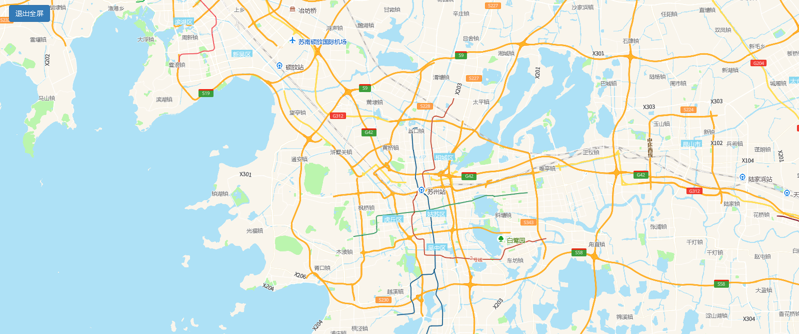

# 全屏

> 全屏显示地图





## 运行代码：

```
<!DOCTYPE html>
<html lang="en">

<head>
    <meta charset="UTF-8">
    <title>全屏</title>
    <link rel="stylesheet" href="/kmapdemo/css/bootstrap.min.css">
    <link rel="stylesheet" href="/kmapdemo/css/main.css">
    <script src='/kmapdemo/js/jquery-2.2.3.min.js'></script>
    <script src="/kmapdemo/js/bootstrap.min.js"></script>
    <style>
        html,
        body {
            margin: 0;
            padding: 0;
        }

        html,
        body,
        #map {
            width: 100%;
            height: 100%;
        }
    </style>
</head>

<body>
    <div id="map">
        <div class="ceng" style="top: 10px">
            <button class="btn btn-primary" id="fullScreen">全屏</button>
        </div>
    </div>
    <script src="/kmapdemo/kmap/kmap-service-main-v1.6.7.js"></script>
    <script>
        window.onload = function() {
            var kmap;
            var onLoadMap = function() {
                document.getElementById('fullScreen').addEventListener('click', function() {
                    var flag = getFullScreenEle();
                    if (!flag) {
                        kmap.fullScreen({
                            flag: true
                        });
                        // document.getElementById('fullScreen').innerText = '退出全屏';
                    } else {
                        kmap.fullScreen({
                            flag: false
                        });
                        // document.getElementById('fullScreen').innerText = '全屏';
                    }
                });
            };

            var config = {
                configUrl: '/kmapdemo/kmap/config.json',
                containerId: 'map',
                zoom: 10,
                mapType: 3,
                onLoadMap: onLoadMap,
            };

            document.addEventListener('fullscreenchange', function() {
                if (!getFullScreenEle()) document.getElementById('fullScreen').innerText = '全屏';
                else {
                    document.getElementById('fullScreen').innerText = '退出全屏';
                    document.getElementById('fullScreen');
                }
            }, true);
            document.addEventListener('mozfullscreenchange', function() {
                if (!getFullScreenEle()) document.getElementById('fullScreen').innerText = '全屏';
                else document.getElementById('fullScreen').innerText = '退出全屏';
            }, true);

            document.addEventListener('webkitfullscreenchange', function() {
                if (!getFullScreenEle()) document.getElementById('fullScreen').innerText = '全屏';
                else document.getElementById('fullScreen').innerText = '退出全屏';
            }, true);

            function getFullScreenEle() {
                var fullscreenElement =
                    document.fullscreenElement ||
                    document.mozFullScreenElement ||
                    document.webkitFullscreenElement;
                return fullscreenElement;
            }


            kmap = new KMap(config);
        }
    </script>
</body>

</html>
```

