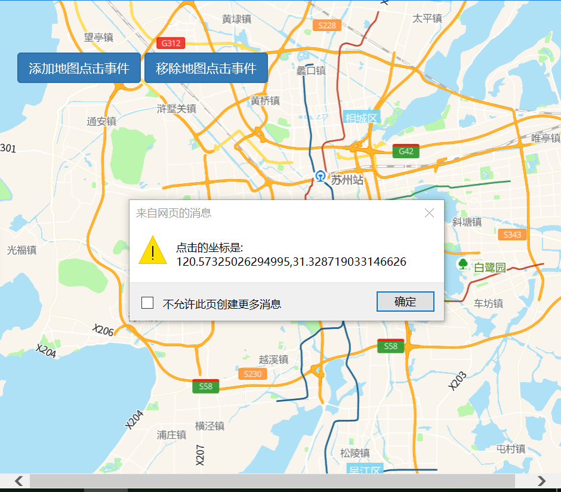

# 地图事件

> 鼠标点击地图某点时反馈坐标





## 运行代码：

```
<!DOCTYPE html>
<html lang="en">

<head>
    <meta charset="UTF-8">
    <title>地图事件</title>
    <link rel="stylesheet" href="/kmapdemo/css/bootstrap.min.css">
    <link rel="stylesheet" href="/kmapdemo/css/main.css">
    <script src='/kmapdemo/js/jquery-2.2.3.min.js'></script>
    <script src="/kmapdemo/js/bootstrap.min.js"></script>
    <style>
        html,
        body {
            margin: 0;
            padding: 0;
        }

        html,
        body,
        #map {
            width: 100%;
            height: 100%;
        }
    </style>
</head>

<body>
    <!-- <div class="btn-group opp-area-btn ceng"> -->
    <div class="ceng">
        <button class="btn btn-primary " id="addMapEvent">添加地图点击事件</button>
        <button class="btn btn-primary" id="removeMapEvent">移除地图点击事件</button>
    </div>
    <div id="map"></div>
    <script src="/kmapdemo/kmap/kmap-service-main-v1.6.7.js"></script>
    <script>
        window.onload = function() {
            var kmap;
            var onLoadMap = function() {
                var addMapEvent = document.getElementById('addMapEvent');
                var removeMapEvent = document.getElementById('removeMapEvent');

                addMapEvent.addEventListener('click', function() {
                    kmap.addEventOnMap({
                        event: 'click',
                        handler: handler
                    });
                });
                removeMapEvent.addEventListener('click', function() {
                    kmap.removeEventOnMap({
                        event: 'click'
                    });
                });
            }
            var handler = function(e) {
                alert('点击的坐标是: ' + [e.lngLat.lng, e.lngLat.lat]);
            }
            var config = {
                configUrl: '/kmapdemo/kmap/config.json',
                containerId: 'map',
                zoom: 10,
                mapType: 3,
                onLoadMap: onLoadMap
            };

            kmap = new KMap(config);
        }
    </script>
</body>

</html>
```

