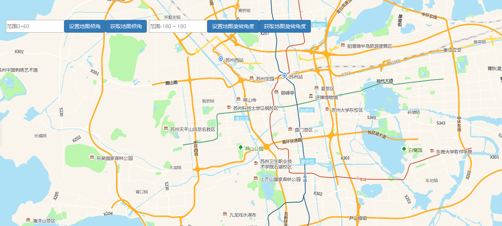

# 地图倾角旋转角

> 鼠标点击地图某点时反馈坐标





## 运行代码：

```
<!DOCTYPE html>
<html lang="en">

<head>
    <meta charset="UTF-8">
    <title>地图倾角旋转角</title>
    <link rel="stylesheet" href="/kmapdemo/css/bootstrap.min.css">
    <link rel="stylesheet" href="/kmapdemo/css/main.css">
    <script src='/kmapdemo/js/jquery-2.2.3.min.js'></script>
    <script src="/kmapdemo/js/bootstrap.min.js"></script>
    <style>
        html,
        body {
            margin: 0;
            padding: 0;
        }

        html,
        body,
        #map {
            width: 100%;
            height: 100%;
        }
    </style>
</head>

<body>
    <div class="ceng">
        <input type="text" id="pitch" style="height: 34px;float: left;" placeholder="范围0~60">
        <button id="setPitch" class="btn btn-primary" style="float: left;">设置地图倾角</button>
        <button id="getPitch" class="btn btn-primary" style="float: left;">获取地图倾角</button>
        <input type="text" id="bear" placeholder="范围-180 ~ 180" style="float: left;height: 34px;margin-left: 6px">
        <button id="setBearing" class="btn btn-primary" style="float: left;">设置地图旋转角度</button>
        <button id="getBearing" class="btn btn-primary" style="float: left;">获取地图旋转角度</button>

        <br>
    </div>
    <div id="map"></div>
    <script src="/kmapdemo/kmap/kmap-service-main-v1.6.7.js"></script>
    <script>
        window.onload = function() {
            var kmap;
            var onLoadMap = function() {
                //这里运行地图加载之后的方法
                var setPitch = document.getElementById("setPitch");
                var getPitch = document.getElementById("getPitch");
                var setBearing = document.getElementById("setBearing");
                var getBearing = document.getElementById("getBearing");
                //设置地图倾角
                setPitch.addEventListener("click", function() {
                    var pitch = document.getElementById("pitch").value;
                    if (checkPitch(pitch)) {
                        kmap.setPitch({
                            degree: parseFloat(pitch)
                        });
                    }
                });

                //获取地图倾角
                getPitch.addEventListener('click', function() {
                    kmap.getPitch({
                        callback: function(res) {
                            alert('地图当前倾角为' + res.data);
                        }
                    });
                })

                //设置地图旋转角度
                setBearing.addEventListener("click", function() {
                    var bear = document.getElementById("bear").value;
                    if (checkBear(bear)) {
                        kmap.setBearing({
                            degree: parseFloat(bear)
                        });
                    }
                });

                //获取地图
                getBearing.addEventListener('click', function() {
                    kmap.getBearing({
                        callback: function(res) {
                            alert('地图当前旋转角度为' + res.data);
                        }
                    });
                })

                //限制输入范围
                function checkPitch(value) {
                    if (isNaN(value) || !value) {
                        alert("请输入有效数字！");
                        return false;
                    } else if (value < 0) {
                        alert("倾斜角度不能小于0度");
                        return false;
                    } else if (value > 60) {
                        alert("倾斜角度不能大于60度");
                        return false;
                    }
                    return true;
                }

                //限制输入范围
                function checkBear(value) {
                    if (isNaN(value) || !value) {
                        alert("请输入有效数字！");
                        return false;
                    } else if (value < -180) {
                        alert("旋转角度不能小于-180度！");
                        return false;
                    } else if (value > 180) {
                        alert("旋转角度不能大于180度");
                        return false;
                    }
                    return true;
                }
            };

            //调用科达地图API接口的配置项
            var config = {
                configUrl: '/kmapdemo/kmap/config.json',
                containerId: "map",
                mapType: 3,
                onLoadMap: onLoadMap //配置回调方法，用来处理业务
            };


            kmap = new KMap(config);
        }
    </script>
</body>

</html>
```

