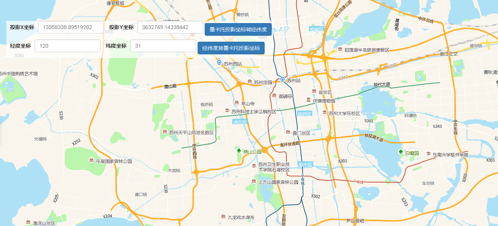

# 地理坐标与投影坐标转换

> 输入的投影坐标和经纬度坐标可相互转换





## 运行代码：

```
<!DOCTYPE html>
<html lang="en">

<head>
    <meta charset="UTF-8">
    <title>地理坐标与投影坐标转换</title>
    <link rel="stylesheet" href="/kmapdemo/css/bootstrap.min.css">
    <link rel="stylesheet" href="/kmapdemo/css/main.css">
    <script src='/kmapdemo/js/jquery-2.2.3.min.js'></script>
    <script src="/kmapdemo/js/bootstrap.min.js"></script>
    <style>
        html,
        body {
            margin: 0;
            padding: 0;
        }

        html,
        body,
        #map {
            width: 100%;
            height: 100%;
        }
    </style>
</head>

<body>
    <div class="opp-area-btn inner">
        <div class="form-inline">
            <div class="form-group">
                <label>投影X坐标</label>
                <input type="text" class="form-control" id="screen_x" placeholder="投影X坐标" value="13358338.89519282">
            </div>
            <div class="form-group">
                <label>投影Y坐标</label>
                <input type="text" class="form-control" id="screen_y" placeholder="投影Y坐标" value="3632749.14338442">
            </div>
            <button class="btn btn-primary" id="to_lnglat_btn">墨卡托投影坐标转经纬度</button>
            <br>
            <div class="form-group">
                <label>经度坐标</label>
                <input type="text" class="form-control" id="map_lng" placeholder="经度坐标" value="120">
            </div>
            <div class="form-group">
                <label>纬度坐标</label>
                <input type="text" class="form-control" id="map_lat" placeholder="纬度坐标" value="31">
            </div>
            <button class="btn btn-primary" id="to_pixel_btn">经纬度转墨卡托投影坐标</button>
        </div>
    </div>


    <div id="map"></div>

    <script src="/kmapdemo/kmap/kmap-service-main-v1.6.7.js"></script>
    <script>
        window.onload = function() {
            var kmap;
            var onLoadMap = function() {

                document.getElementById('to_lnglat_btn').addEventListener('click', function() {
                    var x = document.getElementById('screen_x').value;
                    var y = document.getElementById('screen_y').value;
                    if (checkNumber([x, y])) {
                        // 投影坐标转经纬度
                        kmap.mercatorToWgs84({
                            point: [parseFloat(x), parseFloat(y)],
                            callback: function(result) {
                                console.log(result.data);
                                alert('详细结果请按F12查看');
                            }
                        });
                    } else {
                        alert('请输入正确的坐标格式！');
                    }

                });

                document.getElementById('to_pixel_btn').addEventListener('click', function() {
                    var lng = document.getElementById('map_lng').value;
                    var lat = document.getElementById('map_lat').value;
                    if (checkNumber([lng, lat])) {
                        // 经纬度转投影坐标
                        kmap.wgs84ToMercator({
                            point: [parseFloat(lng), parseFloat(lat)],
                            callback: function(result) {
                                console.log(result.data);
                                alert('详细结果请按F12查看');
                            }
                        })
                    } else {
                        alert('请输入正确的坐标格式！');
                    }


                });

                function checkNumber(arr) {
                    for (let i = 0; i < arr.length; i++) {
                        if (isNaN(arr[i])) {
                            return false;
                        }
                    }
                    return true;
                }
            };

            //调用科达地图API接口的配置项
            var config = {
                configUrl: '/kmapdemo/kmap/config.json',
                containerId: 'map',
                onLoadMap: onLoadMap //配置回调方法，用来处理业务
            };


            kmap = new KMap(config);
        }
    </script>
</body>

</html>
```

