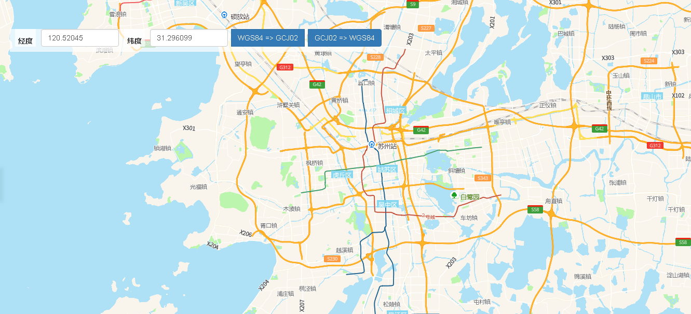

# 坐标系转换

> WGS84和GCJ02相互转换





## 运行代码：

```
<!DOCTYPE html>
<html lang="en">

<head>
    <meta charset="UTF-8">
    <title>坐标系转换</title>
    <link rel="stylesheet" href="/kmapdemo/css/bootstrap.min.css">
    <link rel="stylesheet" href="/kmapdemo/css/main.css">
    <script src='/kmapdemo/js/jquery-2.2.3.min.js'></script>
    <script src="/kmapdemo/js/bootstrap.min.js"></script>
    <style>
        html,
        body {
            margin: 0;
            padding: 0;
        }

        html,
        body,
        #map {
            width: 100%;
            height: 100%;
        }
    </style>
</head>

<body>
    <div class="btn-group opp-area-btn inner">
        <label for="lng" style="margin-top:0" class="text-right">经度</label>
        <input type="text" id="lng" value="120.52045" class="form-control" style="width: 150px;float: left;">
        <label for="lat" class="text-right" style="margin-top:0">纬度</label>
        <input type="text" id="lat" value="31.296099" class="form-control" style="width: 150px;float: left;">
        <div class="btn-group" style="float: left;">
            <button type="button" class="btn btn-primary" id="wgs84togcj02" style="margin-left: 6px">WGS84 => GCJ02</button>
            <button type="button" class="btn btn-primary" id="gcj02towgs84" style="margin-left: 6px">GCJ02 => WGS84</button>
        </div>
    </div>
    <div id="map"></div>
    <script src="/kmapdemo/kmap/kmap-service-main-v1.6.7.js"></script>
    <script>
        window.onload = function() {
            var kmap;
            var onLoadMap = function() {
                var wgs84togcj02 = document.getElementById('wgs84togcj02');
                var gcj02towgs84 = document.getElementById('gcj02towgs84');

                wgs84togcj02.addEventListener('click', function() {
                    var lng = document.getElementById('lng').value;
                    var lat = document.getElementById('lat').value;
                    if (checkNumber([lng, lat])) {
                        kmap.wgs84togcj02({
                            point: getPoint(),
                            callback: function(res) {
                                alert(`转化后的坐标是:${res.data}`);
                            }
                        });
                    } else {
                        alert('请输入正确格式的经纬度！');
                    }
                });
                gcj02towgs84.addEventListener('click', function() {
                    var lng = document.getElementById('lng').value;
                    var lat = document.getElementById('lat').value;
                    if (checkNumber([lng, lat])) {
                        kmap.gcj02towgs84({
                            point: getPoint(),
                            callback: function(res) {
                                alert(`转化后的坐标是:${res.data}`);
                            }
                        });
                    } else {
                        alert('请输入正确格式的经纬度！');
                    }

                });

                function checkNumber(arr) {
                    for (let i = 0; i < arr.length; i++) {
                        if (isNaN(arr[i])) {
                            return false;
                        }
                    }
                    return true;
                }

                function getPoint() {
                    var lng = document.getElementById('lng').value;
                    var lat = document.getElementById('lat').value;
                    return [parseFloat(lng), parseFloat(lat)];
                }
            };
            var config = {
                configUrl: '/kmapdemo/kmap/config.json',
                containerId: 'map',
                zoom: 10,
                onLoadMap: onLoadMap,
                mapType: 3,
            };


            kmap = new KMap(config);
        }
    </script>
</body>

</html>
```

