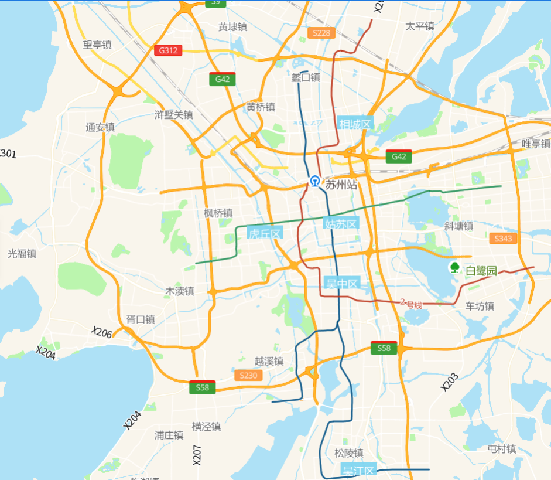

# 基础地图

> 使用地图





## 运行代码：

```
<!DOCTYPE html>
<html lang="en">
<head>
    <meta charset="UTF-8">
    <title>基础地图</title>
    <link rel="stylesheet" href="/kmapdemo/css/bootstrap.min.css">
    <link rel="stylesheet" href="/kmapdemo/css/main.css">
    <script src='/kmapdemo/js/jquery-2.2.3.min.js'></script>
    <script src="/kmapdemo/js/bootstrap.min.js"></script>
    <style>
        html,
        body {
            margin: 0;
            padding: 0;
        }
        html,
        body,
        #map {
            width: 100%;
            height: 100%;
        }
    </style>
</head>
	<body>
    <div id="map"></div>
    <script src="/kmapdemo/kmap/kmap-service-main-v1.6.7.js"></script>
    <script>
        window.onload = function() {
            var kmap;
            var config = {
                configUrl: '/kmapdemo/kmap/config.json',
                containerId: 'map',
                zoom: 10,
                mapType: 3,
                onLoadMap: function() {
                    // callback code
                }
            };
            // export{
            //     config
            // }
            kmap = new KMap(config);
    window.kmap=kmap;	
        }
    </script>

</body>

</html>
```

