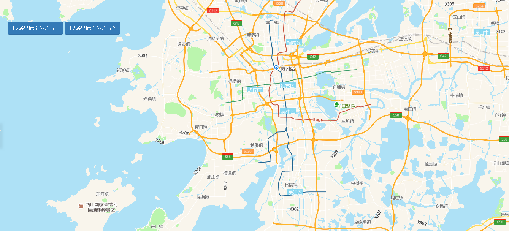

# 定位

> 坐标定位到地图，可缩放比例尺





## 运行代码：

```
<!DOCTYPE html>
<html lang="en">

<head>
    <meta charset="UTF-8">
    <title>定位</title>
    <link rel="stylesheet" href="/kmapdemo/css/bootstrap.min.css">
    <link rel="stylesheet" href="/kmapdemo/css/main.css">
    <script src='/kmapdemo/js/jquery-2.2.3.min.js'></script>
    <script src="/kmapdemo/js/bootstrap.min.js"></script>
    <style>
        html,
        body {
            margin: 0;
            padding: 0;
        }

        html,
        body,
        #map {
            width: 100%;
            height: 100%;
        }
    </style>
</head>

<body>
    <div class="ceng">
        <!-- <div class="btn-group opp-area-btn"> -->
        <button class="btn btn-primary" id="move_to_lnglat_01">根据坐标定位方式1</button>
        <button class="btn btn-primary" id="move_to_lnglat_02">根据坐标定位方式2</button>
    </div>
    <div id="map"></div>
    <script src="/kmapdemo/kmap/kmap-service-main-v1.6.7.js"></script>
    <script>
        window.onload = function() {
            var kmap;
            var onLoadMap = function() {
                //这里运行地图加载之后的方法
                // console.log('运行 onLoadMap 方法');
                // 定位方式1 传对角坐标
                document.getElementById('move_to_lnglat_01').addEventListener('click', function() {
                    kmap.moveTolnglat({
                        type: 1,
                        lngLatBounds: [
                            [120.54095204744613, 31.281417311108214],
                            [120.59270795260181, 31.30826077764496]
                        ]
                    });
                });
                // 定位方式2 传中心点与zoom
                document.getElementById('move_to_lnglat_02').addEventListener('click', function() {
                    kmap.moveTolnglat({
                        type: 2,
                        zoom: 10,
                        point: [120.573, 31.235]
                    });
                });
            };
            //调用科达地图API接口的配置项
            var config = {
                configUrl: '/kmapdemo/kmap/config.json',
                containerId: 'map',
                mapType: 3,
                onLoadMap: onLoadMap //配置回调方法，用来处理业务
            };

            kmap = new KMap(config);
        }
    </script>
</body>

</html>
```

