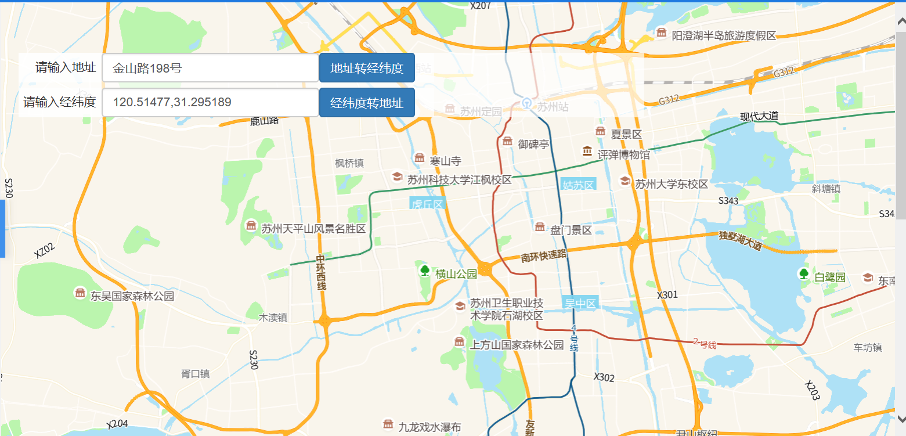

# 正逆地址转换

> 输入地址得到其经纬度坐标





## 运行代码：

```
<!DOCTYPE html>
<html lang="en">

<head>
    <meta charset="UTF-8">
    <title>正逆地址转换</title>
    <link rel="stylesheet" href="/kmapdemo/css/bootstrap.min.css">
    <link rel="stylesheet" href="/kmapdemo/css/main.css">
    <script src='/kmapdemo/js/jquery-2.2.3.min.js'></script>
    <script src="/kmapdemo/js/bootstrap.min.js"></script>
    <style>
        html,
        body {
            margin: 0;
            padding: 0;
        }

        html,
        body,
        #map {
            width: 100%;
            height: 100%;
        }
    </style>
</head>

<body>
    <div class="opp-area-btn inner" style="width: 95%;">
        <div class="row">
            <div style="float:left;width:110px;">
                <span class="text-right" style="width:100px;">请输入地址</span>
            </div>
            <input type="text" id="address" class="form-control" style="width:250px;float: left;" value="金山路198号">
            <button id="to_lnglat_btn" class="btn btn-primary" style="float: left;">地址转经纬度</button>
            <div class="text-left">
                <span id="address_to_lnglat" style="float: left;margin-left: 10px"></span>
            </div>
        </div>
        <div class="row" style="margin-top: 6px">
            <div style="float:left;width:110px;">
                <span class=" text-right" style="width:100px;">请输入经纬度</span>
            </div>
            <input type="text" id="lnglat" class="form-control" value="120.51477,31.295189" style="width:250px;float: left;">
            <button id="to_address_btn" class="btn btn-primary" style="float: left;">经纬度转地址</button>
            <div class="text-left">
                <span id="lnglat_to_address" style="float: left;margin-left: 10px"></span>
            </div>
        </div>
    </div>
    <div id="map"></div>
    <div id="map"></div>
    <script src="/kmapdemo/kmap/kmap-service-main-v1.6.7.js"></script>
    <script>
        window.onload = function() {
            var kmap;
            var onLoadMap = function() {
                //这里运行地图加载之后的方法
                document.getElementById('to_lnglat_btn').addEventListener('click', function() {
                    var keyword = document.getElementById('address').value;
                    if (!keyword) {
                        alert('请输入地址');
                        return;
                    }
                    // 地址转经纬度
                    kmap.getGeoPoint({
                        keyword: keyword,
                        code: '',
                        callback: function(result) {
                            // 获取结果集第一个元素的经纬度坐标显示在页面上
                            var point = null;
                            if (result.status !== 10) {
                                document.getElementById('address_to_lnglat').innerHTML = kmap.msg.message;
                                return;
                            }
                            point = result.data;
                            document.getElementById('address_to_lnglat').innerHTML = point.toString();
                        }
                    });
                })

                document.getElementById('to_address_btn').addEventListener('click', function() {
                    var lnglat = document.getElementById('lnglat').value.split(',');
                    if (checkNumber(lnglat)) {
                        kmap.getLocation({
                            point: [parseFloat(lnglat[0]), parseFloat(lnglat[1])],
                            callback: function(result) {
                                if (result.status !== 10) {
                                    document.getElementById('lnglat_to_address').innerHTML = kmap.msg.message;
                                    return;
                                } else if (result.data.address === '') {
                                    alert('未搜索到结果');
                                    return;
                                }
                                document.getElementById('lnglat_to_address').innerHTML = result.data.address || result.city + result.dist;
                            }
                        })
                    } else {
                        alert('请输入正确经纬度格式');
                    }
                })

                function checkNumber(arr) {
                    for (let i = 0; i < arr.length; i++) {
                        if (isNaN(arr[i])) {
                            return false;
                        }
                    }
                    return true;
                }
            };
            //调用科达地图API接口的配置项
            var config = {
                configUrl: '/kmapdemo/kmap/config.json',
                containerId: 'map',
                mapType: 3,
                onLoadMap: onLoadMap //配置回调方法，用来处理业务
            };

            kmap = new KMap(config);
        }
    </script>
</body>

</html>
```

