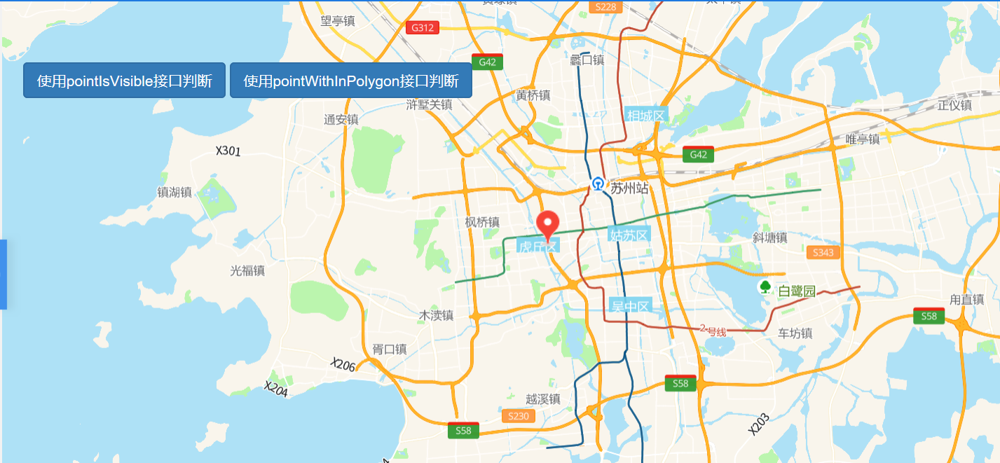
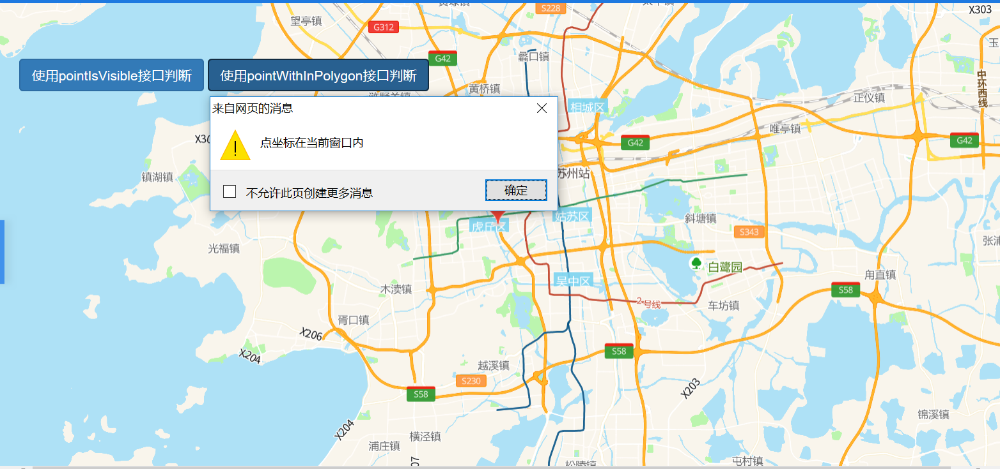

# 点坐标是否可见

> 点击地图某点后反馈坐标是否在窗口内 







## 运行代码：

```
<!DOCTYPE html>
<html lang="en">

<head>
    <meta charset="UTF-8">
    <title>点坐标是否可见</title>
    <link rel="stylesheet" href="/kmapdemo/css/bootstrap.min.css">
    <link rel="stylesheet" href="/kmapdemo/css/main.css">
    <script src='/kmapdemo/js/jquery-2.2.3.min.js'></script>
    <script src="/kmapdemo/js/bootstrap.min.js"></script>
    <style>
        html,
        body {
            margin: 0;
            padding: 0;
        }

        html,
        body,
        #map {
            width: 100%;
            height: 100%;
        }
    </style>
</head>

<body>
    <div class="ceng">
        <button id="pointIsVisible" class="btn btn-primary">使用pointIsVisible接口判断</button>
        <button id="pointWithInPolygon" class="btn btn-primary">使用pointWithInPolygon接口判断</button>
    </div>
    <div id="map"></div>
    <script src="/kmapdemo/kmap/kmap-service-main-v1.6.7.js"></script>
    <script>
        window.onload = function() {
            var kmap;
            var onLoadMap = function() {
                var point = [120.57794006344278, 31.294694063683096];
                // 不可见的点坐标, [118.83537323819314, 31.167854704938634]
                // 可见的点坐标, [120.5758801269518, 31.363318025535648]

                kmap.addMarkers({
                    data: [{
                        point: point
                    }],
                    offset: [0, -17],
                    url: 'data:image/png;base64,iVBORw0KGgoAAAANSUhEUgAAABYAAAAiCAMAAABsgdmyAAAAGXRFWHRTb2Z0d2FyZQBBZG9iZSBJbWFnZVJlYWR5ccllPAAAAyJpVFh0WE1MOmNvbS5hZG9iZS54bXAAAAAAADw/eHBhY2tldCBiZWdpbj0i77u/IiBpZD0iVzVNME1wQ2VoaUh6cmVTek5UY3prYzlkIj8+IDx4OnhtcG1ldGEgeG1sbnM6eD0iYWRvYmU6bnM6bWV0YS8iIHg6eG1wdGs9IkFkb2JlIFhNUCBDb3JlIDUuMy1jMDExIDY2LjE0NTY2MSwgMjAxMi8wMi8wNi0xNDo1NjoyNyAgICAgICAgIj4gPHJkZjpSREYgeG1sbnM6cmRmPSJodHRwOi8vd3d3LnczLm9yZy8xOTk5LzAyLzIyLXJkZi1zeW50YXgtbnMjIj4gPHJkZjpEZXNjcmlwdGlvbiByZGY6YWJvdXQ9IiIgeG1sbnM6eG1wPSJodHRwOi8vbnMuYWRvYmUuY29tL3hhcC8xLjAvIiB4bWxuczp4bXBNTT0iaHR0cDovL25zLmFkb2JlLmNvbS94YXAvMS4wL21tLyIgeG1sbnM6c3RSZWY9Imh0dHA6Ly9ucy5hZG9iZS5jb20veGFwLzEuMC9zVHlwZS9SZXNvdXJjZVJlZiMiIHhtcDpDcmVhdG9yVG9vbD0iQWRvYmUgUGhvdG9zaG9wIENTNiAoV2luZG93cykiIHhtcE1NOkluc3RhbmNlSUQ9InhtcC5paWQ6MzlEQ0Q2RUU1RkJFMTFFNzkwMEJENEY0N0VCRDgyRDMiIHhtcE1NOkRvY3VtZW50SUQ9InhtcC5kaWQ6MzlEQ0Q2RUY1RkJFMTFFNzkwMEJENEY0N0VCRDgyRDMiPiA8eG1wTU06RGVyaXZlZEZyb20gc3RSZWY6aW5zdGFuY2VJRD0ieG1wLmlpZDozOURDRDZFQzVGQkUxMUU3OTAwQkQ0RjQ3RUJEODJEMyIgc3RSZWY6ZG9jdW1lbnRJRD0ieG1wLmRpZDozOURDRDZFRDVGQkUxMUU3OTAwQkQ0RjQ3RUJEODJEMyIvPiA8L3JkZjpEZXNjcmlwdGlvbj4gPC9yZGY6UkRGPiA8L3g6eG1wbWV0YT4gPD94cGFja2V0IGVuZD0iciI/PiyCwFUAAAFoUExURfusp/qWjvdeU/hsYfZJPPZKPP708//49/mFfPZeUvZHOfdPQvdOQt3d3fz8/P7t7P7q6f7w7vy6tdra2viCef/7+vFgVdvb2//9/f7y8f3d2/3LyPdYTf7o5vujnN/f3/l9df3i4PZFOP79/fzDv/dWSvZEOP/w8P7i4OWblf3Averq6vh5b/dfVPy9uPhvZ/VJPP3m5PT09PdbT/v7+/dmW9zc3Pqgm/dYTPdYS/h2bvdpYPZSRu7u7unp6eLi4uXl5fZEN+Scl/Ly8ubm5v3f3fqoov39/fhnXe/v7/drYP/8/PdVSv3e2/VKPfZMQfVIO/l5cPhfVf3e3Pj4+P7u7fukn/ZOQPPz8/y1sfqXj/3Sz/ZIPPZbT/qpo/drYfZKPvmDfP7g3vVEN/VENv/+/fZOQeHh4fdSR/hxZ/dhV/qOiPy4tP3SzvmHf/utp/hxaNnZ2fZDNfZENvVDNfZDNv///////x8v4DkAAAB4dFJOU///////////////////////////////////////////////////////////////////////////////////////////////////////////////////////////////////////////////////////////////AHxXGIwAAAGoSURBVHjabJEJVxNBDMfTg1Joy1Fa2tKWIod4gQp4oqCCKJeA4C14gCiHwk6Sna9PMvt6UJt5b3fml0zmnwSss27YKm1+Ld2C7uAM+ol9jjITMjG3hWJVPDAtUBAzEtPuQIB/Jg0RoTr0b5IvFRc65LJkUIiIhqmjIDgkZyNLQ9XYUMhCuZPICA4Ss17gzjIM6l4cV/+dfnosPnEQD8K5QX3r4IYv9l63jOYInpB7bkip/+tYMxH+gX1HDTjsn2gWpufwXfKJPQjwDxEiQW8gbJyqt1ml7zacTgxDXARpM4bGff/urKvUYBwm0Rg0iHTn9rdhV62Ej0J2zYmV2tgYbZfgsVWwaadVF7oeSh/S2sGMVK4HV5Y6Mq6x7RHN4WJFK2GkPRhDbzhokXuAJ3qrQ+t5pOGiXrQ97KnN0m4nFKqSw/X6iK39Eg2KbftrG7Fd0gzMe/Yyzq+okki+CduiSi7aZmxfE9+z/+MzImiBryFdaYFt4sNIE3719FnK6+/3cvM3d+q4K+WJvbiuX2+hjitezfqmGnJ/nPt9v8/LVRaXZ9z5QoABAKplLBEoKF6wAAAAAElFTkSuQmCC'
                });

                document.getElementById('pointIsVisible').addEventListener('click', function() {
                    kmap.pointIsVisible({
                        point: point,
                        callback: function(res) {
                            if (res.data === true) {
                                alert('点坐标在窗口范围内');
                            } else {
                                alert('点坐标不在窗口范围内');
                            }
                        }
                    });
                });

                document.getElementById('pointWithInPolygon').addEventListener('click', function() {
                    kmap.getBounds({
                        callback: function(res) {
                            var bounds = res.data;
                            var points = [
                                [bounds[0][0], bounds[1][1]],
                                [bounds[1][0], bounds[1][1]],
                                [bounds[1][0], bounds[0][1]],
                                [bounds[0][0], bounds[0][1]],
                                [bounds[0][0], bounds[1][1]]
                            ];
                            kmap.pointInPolygon({
                                point: point,
                                polygon: points,
                                callback: function(res) {
                                    console.log(res);
                                    if (res.data === true) {
                                        alert('点坐标在当前窗口内');
                                    } else if (res.data === false) {
                                        alert('点坐标不在当前窗口内');
                                    } else {
                                        alert('出错了');
                                    }
                                }
                            });
                        }
                    });
                })
            }
            var config = {
                configUrl: '/kmapdemo/kmap/config.json',
                containerId: 'map',
                zoom: 10,
                mapType: 3,
                onLoadMap: onLoadMap
            };

            kmap = new KMap(config);
        }
    </script>
</body>

</html>
```

