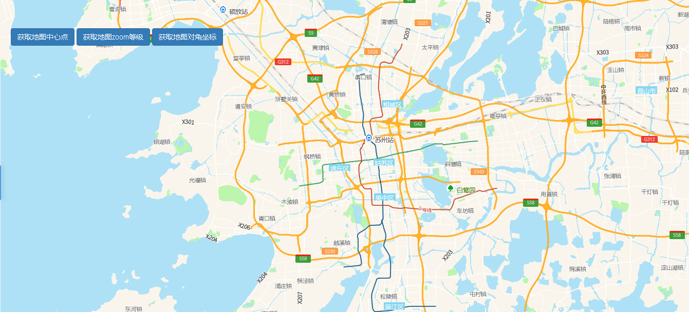

# 经纬度、层级

> 可获取地图中心点，地图zoom等级，对角坐标





## 运行结果：

```
<!DOCTYPE html>
<html lang="en">

<head>
    <meta charset="UTF-8">
    <title>经纬度、层级</title>
    <link rel="stylesheet" href="/kmapdemo/css/bootstrap.min.css">
    <link rel="stylesheet" href="/kmapdemo/css/main.css">
    <script src='/kmapdemo/js/jquery-2.2.3.min.js'></script>
    <script src="/kmapdemo/js/bootstrap.min.js"></script>
    <style>
        html,
        body {
            margin: 0;
            padding: 0;
        }

        html,
        body,
        #map {
            width: 100%;
            height: 100%;
        }
    </style>
</head>

<body>
    <div id="map"></div>
    <!-- <div class="btn-group opp-area-btn"> -->
    <div class="ceng">
        <button class="btn btn-primary" id="getCenter">获取地图中心点</button>
        <button class="btn btn-primary" id="getZoom">获取地图zoom等级</button>
        <button class="btn btn-primary" id="getBounds">获取地图对角坐标</button>
    </div>
    <script src="/kmapdemo/kmap/kmap-service-main-v1.6.7.js"></script>
    <script>
        window.onload = function() {
            var kmap;
            var onLoadMap = function() {
                document.getElementById('getCenter').addEventListener('click', function() {
                    // kmap.getCenter({
                    //     callback: function (res) {
                    //         if (res && res.status === 10) {
                    //             alert(`地图的中心点是: ${res.data}`);
                    //         }
                    //     }
                    // });
                    const center =
                        kmap.getCenter({
                            callback: function(res) {
                                // if (res && res.status === 10) {
                                //     alert(`地图的中心点是: ${res.data}`);
                                // }
                            }
                        });
                    alert(`地图的中心点是: ${center}`);
                });
                document.getElementById('getZoom').addEventListener('click', function() {
                    kmap.getZoom({
                        callback: function(res) {
                            if (res && res.status === 10) {
                                alert(`地图的zoom等级是: ${res.data}`);
                            }
                        }
                    });
                });
                document.getElementById('getBounds').addEventListener('click', function() {
                    kmap.getBounds({
                        callback: function(res) {
                            console.log(res);
                            if (res && res.status === 10) {
                                alert(`地图的对角坐标是: \n左下角: ${res.data[0]}\n右上角: ${res.data[1]}`);
                            }
                        }
                    });
                });
            }
            var config = {
                configUrl: '/kmapdemo/kmap/config.json',
                containerId: 'map',
                zoom: 10,
                mapType: 3,
                onLoadMap: onLoadMap
            };

            kmap = new KMap(config);
        }
    </script>
</body>

</html>
```

