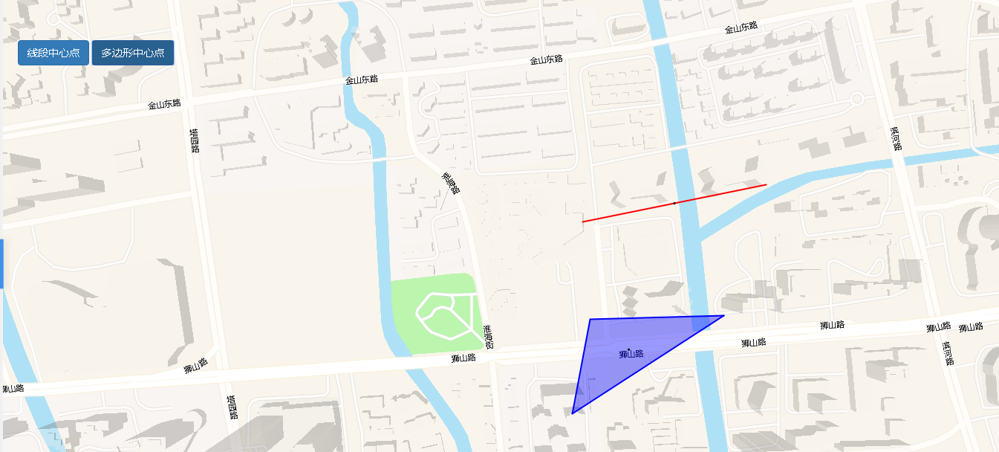

# 获取中心点

> 可获取地图中心点





## 运行代码：

```
<!DOCTYPE html>
<html lang="en">

<head>
    <meta charset="UTF-8">
    <title>获取中心点</title>
    <link rel="stylesheet" href="/kmapdemo/css/bootstrap.min.css">
    <link rel="stylesheet" href="/kmapdemo/css/main.css">
    <script src='/kmapdemo/js/jquery-2.2.3.min.js'></script>
    <script src="/kmapdemo/js/bootstrap.min.js"></script>
    <style>
        html,
        body {
            margin: 0;
            padding: 0;
        }

        html,
        body,
        #map {
            width: 100%;
            height: 100%;
        }
    </style>
</head>

<body>
    <!-- <div class="btn-group opp-area-btn"> -->
    <div class="ceng">
        <button class="btn btn-primary" id="center_of_line">线段中心点</button>
        <button class="btn btn-primary" id="center_of_polygon">多边形中心点</button>
        <p id="mes" style="margin: 0 0px;line-height: 36px;float: left;"></p>
    </div>
    <div id="map"></div>
    <script src="/kmapdemo/kmap/kmap-service-main-v1.6.7.js"></script>
    <script>
        window.onload = function() {
            var kmap;
            var onLoadMap = function() {
                //这里运行地图加载之后的方法
                var data = {
                    'type': 'FeatureCollection',
                    'features': [{
                            'type': 'Feature',
                            'geometry': {
                                'type': 'Polygon',
                                'coordinates': [
                                    [
                                        [120.56310172948486, 31.293982802065415],
                                        [120.56503291996796, 31.294028641723756],
                                        [120.5628442374113, 31.292818467248154],
                                        [120.56310172948486, 31.293982802065415]
                                    ]
                                ]
                            },
                            'properties': {
                                'id': 'bec7ebb89ec416c008b8f792e28ce7f1',
                                'color': 'blue'
                            }
                        },
                        {
                            'type': 'Feature',
                            'geometry': {
                                'type': 'LineString',
                                'coordinates': [
                                    [120.56299444111534, 31.295183793773376],
                                    [120.56564446362194, 31.295642183519078]
                                ]
                            },
                            'properties': {
                                'id': 'a329c6dad327e83f2a844bd9b79c14ce',
                                'color': 'red'
                            }
                        }
                    ]
                };
                var line = data.features[1].geometry.coordinates;
                document.getElementById('center_of_line').addEventListener('click', function() {
                    kmap.getCenterOfLine({
                        line: line,
                        callback: function(res) {
                            kmap.addGeometryLayer({
                                sourceId: 'center_of_line',
                                data: {
                                    'type': 'FeatureCollection',
                                    'features': [{
                                        'type': 'Feature',
                                        'geometry': {
                                            'type': 'Point',
                                            'coordinates': res.data
                                        },
                                        'properties': {}
                                    }]
                                },
                                layerId: 'center_of_line',
                            });
                            alert(`线中心点坐标是: ${res.data}`);
                        }
                    });
                });
                var polygon = data.features[0].geometry.coordinates[0];
                document.getElementById('center_of_polygon').addEventListener('click', function() {
                    kmap.getCenterOfPolygon({
                        polygon: polygon,
                        callback: function(res) {
                            kmap.addGeometryLayer({
                                sourceId: 'center_of_polygon',
                                data: {
                                    'type': 'FeatureCollection',
                                    'features': [{
                                        'type': 'Feature',
                                        'geometry': {
                                            'type': 'Point',
                                            'coordinates': res.data
                                        },
                                        'properties': {}
                                    }]
                                },
                                layerId: 'center_of_polygon',
                            });
                            alert(`多边形中心点坐标是: ${res.data}`);
                        }
                    });
                });
                kmap.addGeometryLayer({
                    sourceId: 'drawId',
                    data: data,
                    layerId: 'graphicals',
                    isSetColor: true
                });
            };
            //调用科达地图API接口的配置项
            var config = {
                configUrl: '/kmapdemo/kmap/config.json',
                containerId: 'map',
                zoom: 16,
                mapType: 3,
                center: [120.56183, 31.29484],
                onLoadMap: onLoadMap //配置回调方法，用来处理业务
            };

            kmap = new KMap(config);
        }
    </script>
</body>

</html>
```

