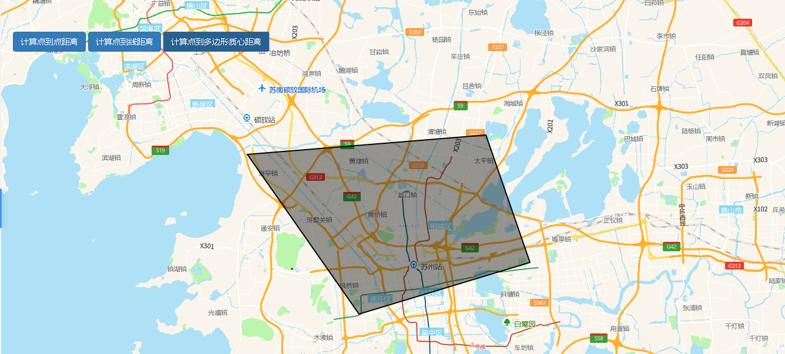

# 获取距离

> 可计算点到点，点到线，点到多边形质心距离





## 运行代码：

```
<!DOCTYPE html>
<html lang="en">

<head>
    <meta charset="UTF-8">
    <title>获取距离</title>
    <link rel="stylesheet" href="/kmapdemo/css/bootstrap.min.css">
    <link rel="stylesheet" href="/kmapdemo/css/main.css">
    <script src='/kmapdemo/js/jquery-2.2.3.min.js'></script>
    <script src="/kmapdemo/js/bootstrap.min.js"></script>
    <style>
        html,
        body {
            margin: 0;
            padding: 0;
        }

        html,
        body,
        #map {
            width: 100%;
            height: 100%;
        }
    </style>
</head>

<body>
    <div class="ceng">
        <button class="btn btn-primary" id="p2p_distance">计算点到点距离</button>
        <button class="btn btn-primary" id="p2line_distance">计算点到线距离</button>
        <button class="btn btn-primary" id="p2area_distance">计算点到多边形质心距离</button>
    </div>
    <div id="map"></div>
    <script src="/kmapdemo/kmap/kmap-service-main-v1.6.7.js"></script>
    <script>
        window.onload = function() {
            var kmap;
            var onLoadMap = function() {
                //这里运行地图加载之后的方法
                var units = 'kilometers';
                var point_from = [120.60952575684735, 31.318747470617566];
                var point_to = [120.66102416994221, 31.30349480298125];
                // 获取两点之间距离（单位：千米）
                document.getElementById('p2p_distance').addEventListener('click', function() {
                    addLayer('pointToPoint');
                    kmap.distancePoints({
                        startPoint: point_from,
                        endPoint: point_to,
                        units: units,
                        callback: function(res) {
                            alert(`两点之间距离是：${res.data }公里。`);
                        }
                    });
                });

                var line_point = [120.60952575684735, 31.318747470617566];
                var line_line = [
                    [120.47288330064748, 31.447123765893195],
                    [120.65003784161468, 31.400248658105667]
                ];
                // 获取点到线段之间距离（单位：千米）
                document.getElementById('p2line_distance').addEventListener('click', function() {
                    addLayer('pointToLine');
                    kmap.distancePointToLine({
                        point: line_point,
                        line: line_line,
                        units: units,
                        callback: function(res) {
                            alert(`点到线距离是：${res.data }公里。`);
                        }
                    });
                });

                var polygon_point = [120.4686389317771, 31.32544415654816];
                var polygon_polygon = [
                    [120.4164538731967, 31.439752235978133],
                    [120.69523194935641, 31.45908291128518],
                    [120.74673036244832, 31.331896005717624],
                    [120.54691651967465, 31.280268833627886],
                    [120.4164538731967, 31.439752235978133]
                ];
                // 获取点到面之间距离（单位：千米）
                document.getElementById('p2area_distance').addEventListener('click', function() {
                    addLayer('pointToPolygon');
                    kmap.distancePointToPolygon({
                        point: polygon_point,
                        polygon: polygon_polygon,
                        callback: function(res) {
                            alert(`点到面距离是：${res.data }公里。`);
                        }
                    })
                })

                // 添加图层
                function addLayer(type) {
                    var pointToPoint = {
                        type: 'FeatureCollection',
                        features: [{
                                geometry: {
                                    type: 'Point',
                                    coordinates: point_from
                                },
                                type: 'Feature',
                                properties: {
                                    color: 'red'
                                }
                            },
                            {
                                geometry: {
                                    type: 'Point',
                                    coordinates: point_to
                                },
                                type: 'Feature',
                                properties: {
                                    color: 'red'
                                }
                            }
                        ]
                    };
                    var pointToLine = {
                        type: 'FeatureCollection',
                        features: [{
                                type: 'Feature',
                                geometry: {
                                    type: 'Point',
                                    coordinates: line_point
                                },
                                properties: {
                                    color: 'blue'
                                }
                            },
                            {
                                type: 'Feature',
                                geometry: {
                                    type: 'LineString',
                                    coordinates: line_line
                                },
                                properties: {
                                    color: 'blue'
                                }
                            }
                        ]
                    };
                    var pointToPolygon = {
                        type: 'FeatureCollection',
                        features: [{
                                type: 'Feature',
                                geometry: {
                                    type: 'Point',
                                    coordinates: polygon_point
                                },
                                properties: {
                                    color: 'orange'
                                }
                            },
                            {
                                type: 'Feature',
                                geometry: {
                                    type: 'Polygon',
                                    coordinates: [polygon_polygon]
                                },
                                properties: {
                                    color: 'orange'
                                }
                            }
                        ]
                    };
                    kmap.removeLayer({
                        layerId: 'pointToPoint'
                    });
                    kmap.removeLayer({
                        layerId: 'pointToLine'
                    });
                    kmap.removeLayer({
                        layerId: 'pointToPolygon'
                    });
                    switch (type) {
                        case 'pointToPoint':
                            kmap.addGeometryLayer({
                                layerId: 'pointToPoint',
                                sourceId: 'pointToPoint',
                                data: pointToPoint
                            });
                            break;
                        case 'pointToLine':
                            kmap.addGeometryLayer({
                                layerId: 'pointToLine',
                                sourceId: 'pointToLine',
                                data: pointToLine
                            });
                            break;
                        case 'pointToPolygon':
                            kmap.addGeometryLayer({
                                layerId: 'pointToPolygon',
                                sourceId: 'pointToPolygon',
                                data: pointToPolygon
                            });
                            break;
                        default:
                            break;
                    }
                }
            };
            //调用科达地图API接口的配置项
            var config = {
                configUrl: '/kmapdemo/kmap/config.json',
                containerId: 'map',
                zoom: 10,
                center: [120.59017518669339, 31.39697627250719],
                mapType: 3,
                onLoadMap: onLoadMap //配置回调方法，用来处理业务
            };

            kmap = new KMap(config);
        }
    </script>
</body>

</html>
```

