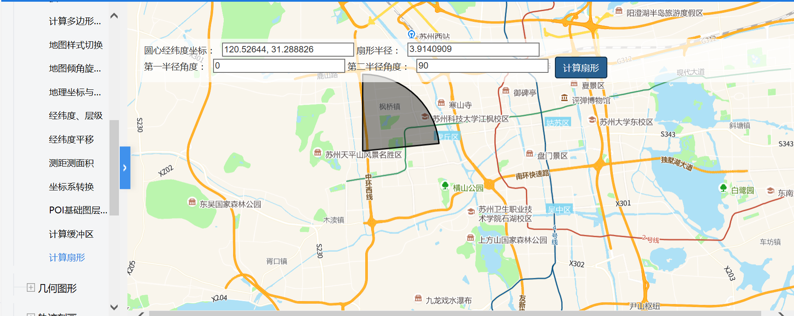

# 计算扇形

> 输入圆心经纬度，扇形半径，第一半径和第二半径角度，控制台打印出结果





## 运行代码：

```
<!DOCTYPE html>
<html lang="en">

<head>
    <meta charset="UTF-8">
    <title>计算扇形</title>
    <link rel="stylesheet" href="/kmapdemo/css/bootstrap.min.css">
    <link rel="stylesheet" href="/kmapdemo/css/main.css">
    <script src='/kmapdemo/js/jquery-2.2.3.min.js'></script>
    <script src="/kmapdemo/js/bootstrap.min.js"></script>
    <style>
        html,
        body {
            margin: 0;
            padding: 0;
        }

        html,
        body,
        #map {
            width: 100%;
            height: 100%;
        }
    </style>
</head>

<body>
    <div class="ceng" style="width: 100%;opacity: 1;background: rgba(255, 255, 255, 0.7);padding: 6px">
        <div>
            <span>圆心经纬度坐标：</span>
            <input id="center" style="margin-left:6px;width:20%" value="120.52644, 31.288826">
            <span>扇形半径：</span>
            <input id="radius" style="margin-left:6px;width:20%" value="3.9140909">
        </div>
        <div>
            <span>第一半径角度：</span>
            <input id="bearing1" style="margin-left:6px;width:20%" value="0">
            <span>第二半径角度：</span>
            <input id="bearing2" style="margin-left:6px;width:20%" value="90">
            <button class="btn btn-primary" id="sector" style="margin-left:6px;">计算扇形</button>
        </div>
    </div>
    <div id="map"></div>
    <script src="/kmapdemo/kmap/kmap-service-main-v1.6.7.js"></script>
    <script>
        window.onload = function() {
            var kmap;
            var onLoadMap = function() {
                //这里运行地图加载之后的方法
                var sector = document.getElementById('sector');
                sector.addEventListener('click', function() {
                    var center = [document.getElementById('center').value.split(',')[0], document.getElementById('center').value.split(',')[1]];
                    var radius = document.getElementById('radius').value;
                    var bearing1 = document.getElementById('bearing1').value;
                    var bearing2 = document.getElementById('bearing2').value;
                    if (checkLnglat(center[0], center[1], radius, bearing1, bearing2)) {
                        kmap.getSector({
                            center: [parseFloat(center[0]), parseFloat(center[1])],
                            radius: parseFloat(radius),
                            bearing1: parseFloat(bearing1),
                            bearing2: parseFloat(bearing2),
                            callback: function(res) {
                                alert('F12打开控制台查看结果');
                                kmap.clear();
                                kmap.addGeometryLayer({
                                    sourceId: "drawId",
                                    data: res.data,
                                    layerId: "graphical",
                                    isSetColor: true
                                });
                                console.log(res.data);
                            }
                        });
                    } else {
                        alert('经纬度应是0~180范围内纯数字！');
                    }
                })

                //计算扇形
                function checkNumber(arr) {
                    for (let i = 0; i < arr.length; i++) {
                        if (isNaN(arr[i])) {
                            return false;
                        }
                    }
                    return true;
                }

                function checkLnglat(lng, lat) {
                    if (checkNumber([lng, lat])) {
                        if (lng > 180 || lng < 0 || lat > 180 || lat < 0) {
                            return false
                        }
                    } else {
                        return false;
                    }
                    return true;
                }
            };
            //调用科达地图API接口的配置项
            var config = {
                configUrl: '/kmapdemo/kmap/config.json',
                containerId: 'map',
                mapType: 3,
                zoom: 11,
                onLoadMap: onLoadMap //配置回调方法，用来处理业务
            };


            kmap = new KMap(config);
        }
    </script>
</body>

</html>
```

