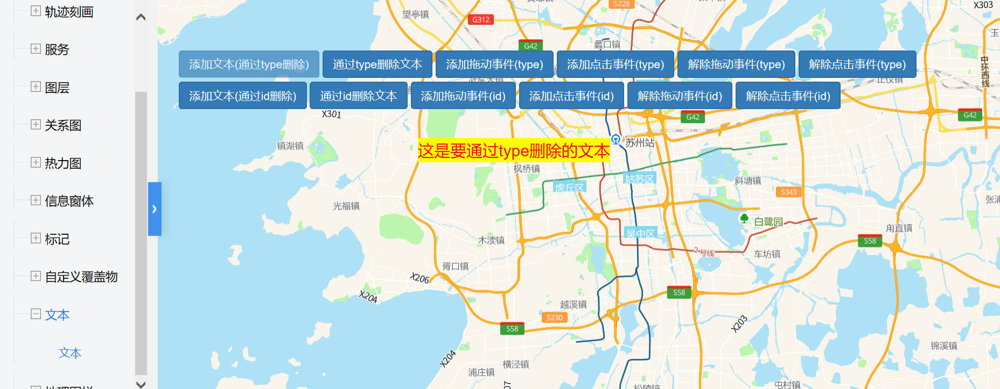

# 文本

> 通过(type)添加/删除普通事件/拖动事件/文本通过（id)添加/删除文本/拖动事件/点击事件




#### 运行代码：
```
<!DOCTYPE html>
<html lang="en">

<head>
    <meta charset="UTF-8">
    <title>文本</title>
    <link rel="stylesheet" href="/kmapdemo/css/bootstrap.min.css">
    <link rel="stylesheet" href="/kmapdemo/css/main.css">
    <script src='/kmapdemo/js/jquery-2.2.3.min.js'></script>
    <script src="/kmapdemo/js/bootstrap.min.js"></script>
    <style>
        html,
        body {
            margin: 0;
            padding: 0;
        }

        html,
        body,
        #map {
            width: 100%;
            height: 100%;
        }
    </style>
</head>

<body>
    <style>
        .removeWithType {
            font-size: 20px;
            line-height: 30px;
            background-color: yellow;
            color: red;
        }

        .removeWithId {
            font-size: 20px;
            line-height: 40px;
            background-color: green;
            color: white;
        }

        body {
            -webkit-touch-callout: none;
            -webkit-user-select: none;
            -khtml-user-select: none;
            -moz-user-select: none;
            -ms-user-select: none;
            user-select: none;
        }
    </style>
    <div class="ceng">
        <div class="row" style="margin-left: 6px;margin-right: 6px">
            <button class="btn btn-primary" id="addTextByType" style="margin-top: 5px">添加文本(通过type删除)</button>
            <button class="btn btn-primary" id="removeTextByType" style="margin-top: 5px">通过type删除文本</button>
            <button class="btn btn-primary" id="add_drag_event" style="margin-top: 5px">添加拖动事件(type)</button>
            <button class="btn btn-primary" id="add_click_event" style="margin-top: 5px">添加点击事件(type)</button>
            <button class="btn btn-primary" id="remove_drag_event" style="margin-top: 5px">解除拖动事件(type)</button>
            <button class="btn btn-primary" id="remove_del_event" style="margin-top: 5px">解除点击事件(type)</button>
        </div>
        <div class="row" style="margin-left: 6px;margin-right: 6px">
            <button class="btn btn-primary" id="addTextById" style="margin-top: 5px">添加文本(通过id删除)</button>
            <button class="btn btn-primary" id="removeTextById" style="margin-top: 5px">通过id删除文本</button>
            <button class="btn btn-primary" id="add_drag_event_id" style="margin-top: 5px">添加拖动事件(id)</button>
            <button class="btn btn-primary" id="add_click_event_id" style="margin-top: 5px">添加点击事件(id)</button>
            <button class="btn btn-primary" id="remove_drag_event_id" style="margin-top: 5px">解除拖动事件(id)</button>
            <button class="btn btn-primary" id="remove_del_event_id" style="margin-top: 5px">解除点击事件(id)</button>
        </div>
    </div>
    <div id="map"></div>
    <script src="/kmapdemo/kmap/kmap-service-main-v1.6.7.js"></script>
    <script>
        window.onload = function() {
            var kmap;
            var onLoadMap = function() {

                //type   
                var addTextByType = document.getElementById('addTextByType');
                var removeTextByType = document.getElementById('removeTextByType');
                var add_drag_event = document.getElementById('add_drag_event');
                var add_click_event = document.getElementById('add_click_event');
                var remove_drag_event = document.getElementById('remove_drag_event');
                var remove_click_event = document.getElementById('remove_del_event');

                //id
                var addTextById = document.getElementById('addTextById');
                var removeTextById = document.getElementById('removeTextById');
                var add_drag_event_id = document.getElementById('add_drag_event_id');
                var add_click_event_id = document.getElementById('add_click_event_id');
                var remove_drag_event_id = document.getElementById('remove_drag_event_id');
                var remove_click_event_id = document.getElementById('remove_del_event_id');

                var textType;
                var textId;


                function clickHandler(e, opts) {
                    // console.log(' evt: ', e);
                    // console.log('opts: ',opts);
                    alert(e.target.innerHTML);
                }
                // 拖动开始事件
                function dragStart(e) {
                    // ...
                    console.log('drag start');
                }

                // 拖动过程事件
                function dragMove(e) {
                    // ...
                    console.log('draging');
                }

                // 拖动结束事件
                function dragEnd(e) {
                    console.log('drag end');
                }
                // type
                add_drag_event.addEventListener('click', function() {
                    textType && kmap.addEventOnTexts({
                        textType: textType,
                        event: 'drag',
                        dragEnd: dragEnd,
                        dragStart: dragStart,
                        dragMove: dragMove
                    });
                });
                add_click_event.addEventListener('click', function() {
                    textType && kmap.addEventOnTexts({
                        textType: textType,
                        event: 'click',
                        handler: clickHandler
                    });
                });
                remove_drag_event.addEventListener('click', function() {
                    kmap.removeEventOnTexts({
                        textType: textType,
                        event: 'drag',
                        dragEnd: dragEnd,
                        dragStart: dragStart,
                        dragMove: dragMove
                    });
                });
                remove_click_event.addEventListener('click', function() {
                    kmap.removeEventOnTexts({
                        textType: textType,
                        event: 'click',
                        handler: clickHandler
                    });
                });

                // id 
                add_drag_event_id.addEventListener('click', function() {
                    textId && kmap.addEventOnTexts({
                        textType: textId,
                        event: 'drag',
                        dragEnd: dragEnd,
                        dragStart: dragStart,
                        dragMove: dragMove
                    });
                });
                add_click_event_id.addEventListener('click', function() {
                    textId && kmap.addEventOnTexts({
                        textType: textId,
                        event: 'click',
                        handler: clickHandler
                    });
                });
                remove_drag_event_id.addEventListener('click', function() {
                    kmap.removeEventOnTexts({
                        textType: textId,
                        event: 'drag',
                        dragEnd: dragEnd,
                        dragStart: dragStart,
                        dragMove: dragMove
                    });
                });
                remove_click_event_id.addEventListener('click', function() {
                    kmap.removeEventOnTexts({
                        textType: textId,
                        event: 'click',
                        handler: clickHandler
                    });
                });


                addTextByType.addEventListener('click', function() {
                    kmap.addText({
                        points: [{
                            point: [120.4426708984168, 31.33047861102378],
                            htmlTxt: '这是要通过type删除的文本'
                        }],
                        textType: 'removeWithType',
                        ended: function(res) {
                            textType = res.data;
                            addTextByType.setAttribute('disabled', 'disabled');
                        }
                    });
                });
                removeTextByType.addEventListener('click', function() {
                    if (textType) {
                        kmap.removeTextByType({
                            textType: textType
                        });
                        addTextByType.removeAttribute('disabled');
                    }
                });
                addTextById.addEventListener('click', function() {
                    kmap.addText({
                        points: [{
                            point: [120.82032592775812, 31.2659392554352],
                            htmlTxt: '这是要通过id删除的文本',
                            id: 'textId'
                        }],
                        textType: 'removeWithId',
                        ended: function(res) {
                            textId = res.data;
                            //textType = res.data;
                            addTextById.setAttribute('disabled', 'disabled');
                        }
                    });
                });
                removeTextById.addEventListener('click', function() {
                    kmap.removeTextById({
                        id: 'textId'
                    });
                    addTextById.removeAttribute('disabled');
                });
            }
            var config = {
                configUrl: '/kmapdemo/kmap/config.json',
                containerId: 'map',
                zoom: 10,
                mapType: 3,
                onLoadMap: onLoadMap
            };

            kmap = new KMap(config);
        }
    </script>
</body>

</html>
```

