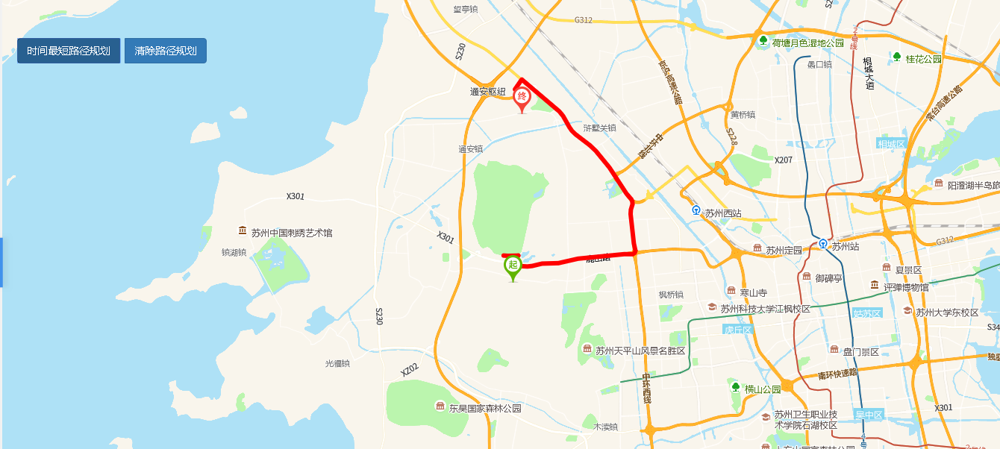

# 时间最短路径规划

> 查询最短路径规划，可删除路径规划





## 运行代码：

```
<!DOCTYPE html>
<html lang="en">

<head>
    <meta charset="UTF-8">
    <title>时间最短路径规划</title>
    <link rel="stylesheet" href="/kmapdemo/css/bootstrap.min.css">
    <link rel="stylesheet" href="/kmapdemo/css/main.css">
    <script src='/kmapdemo/js/jquery-2.2.3.min.js'></script>
    <script src="/kmapdemo/js/bootstrap.min.js"></script>
    <style>
        html,
        body {
            margin: 0;
            padding: 0;
        }

        html,
        body,
        #map {
            width: 100%;
            height: 100%;
        }
    </style>
</head>

<body>
    <div class="btn-group opp-area-btn">
        <button class="btn btn-primary" id="min_time_plan">时间最短路径规划</button>
        <button class="btn btn-primary" id="clear_route" style="margin-left: 6px">清除路径规划</button>
    </div>
    <div id="map"></div>
    <script src="/kmapdemo/kmap/kmap-service-main-v1.6.7.js"></script>
    <script>
        window.onload = function() {
            var kmap;
            var onLoadMap = function() {
                //这里运行地图加载之后的方法
                // console.log('运行 onLoadMap 方法');

                var min_time_route;

                document.getElementById('min_time_plan').addEventListener('click', function() {
                    if (min_time_route) {
                        kmap.removeRoutePlanning({
                            id: min_time_route
                        });
                        min_time_route = null;
                    }
                    kmap.createMinTimeRoutePlanning({
                        startPoint: [120.464, 31.325],
                        endPoint: [120.468, 31.391],
                        offset: [-11, -32],
                        ended: function(res) {
                            min_time_route = res.data;
                            kmap.moveTolnglat({
                                type: 2,
                                zoom: 11,
                                point: [120.464, 31.325]
                            });
                        }
                    });
                });

                // 清除路径规划
                document.getElementById('clear_route').addEventListener('click', function() {
                    if (min_time_route) {
                        kmap.removeRoutePlanning({
                            id: min_time_route
                        });
                        min_time_route = null;
                    }
                })
            };
            //调用科达地图API接口的配置项
            var config = {
                configUrl: '/kmapdemo/kmap/config.json',
                containerId: 'map',
                mapType: 3,
                onLoadMap: onLoadMap //配置回调方法，用来处理业务
            };

            kmap = new KMap(config);
        }
    </script>
</body>

</html>
```

