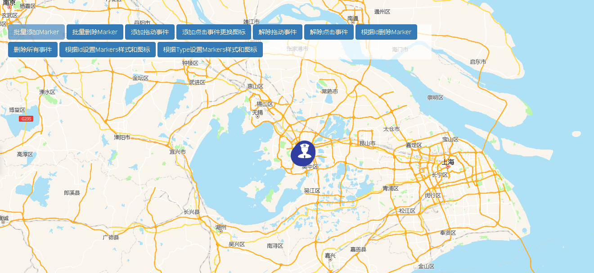

# 标记

> 批量添加/删除Marker，添加/解除拖动事件，添加/解除点击事件，根据ID解除Marker，解除所有事件，根据ID设置Markers样式和图标，根据Type设置Markers样式和图标



## 运行代码：
```
<!DOCTYPE html>
<html lang="en">

<head>
    <meta charset="UTF-8">
    <title>标记</title>
    <link rel="stylesheet" href="/kmapdemo/css/bootstrap.min.css">
    <link rel="stylesheet" href="/kmapdemo/css/main.css">
    <script src='/kmapdemo/js/jquery-2.2.3.min.js'></script>
    <script src="/kmapdemo/js/bootstrap.min.js"></script>
    <style>
        html,
        body {
            margin: 0;
            padding: 0;
        }

        html,
        body,
        #map {
            width: 100%;
            height: 100%;
        }
    </style>
</head>

<body>
    <div class="opp-area-btn inner">
        <div class="form-inline">
            <button class="btn btn-primary" id="add_markers">批量添加Marker</button>
            <button class="btn btn-primary" id="remove_markers">批量删除Marker</button>
            <button class="btn btn-primary" id="add_drag_event">添加拖动事件</button>
            <button class="btn btn-primary" id="add_click_event">添加点击事件更换图标</button>
            <button class="btn btn-primary" id="remove_drag_event">解除拖动事件</button>
            <button class="btn btn-primary" id="remove_del_event">解除点击事件</button>
            <button class="btn btn-primary" id="removeById">根据Id删除Marker</button>
            <button class="btn btn-primary" id="removeAll">删除所有事件</button>
            <button class="btn btn-primary" id="set_PropertyById">根据Id设置Markers样式和图标</button>
            <button class="btn btn-primary" id="set_PropertyByType">根据Type设置Markers样式和图标</button>
        </div>
    </div>
    <div id="map"></div>
    <style>
        body {
            -webkit-touch-callout: none;
            -webkit-user-select: none;
            -khtml-user-select: none;
            -moz-user-select: none;
            -ms-user-select: none;
            user-select: none;
        }
    </style>
    <script src="/kmapdemo/kmap/kmap-service-main-v1.6.7.js"></script>
    <script>
        window.onload = function() {
            var kmap;
            var onLoadMap = function() {
                //这里运行地图加载之后的方法
                var markerType01;

                // 点击事件handler，不要使用匿名函数
                function clickHandler(e, opts) {
                    // 根据点击的Marker Id删除该Marker
                    //kmap.removeMarkersById({id: e.target.id});

                    kmap.setMarkerProperty({
                        type: 'id',
                        id: e.target.id,
                        url: '/kmapdemo/images/point.png'
                    });
                }

                // 拖动开始事件
                function dragStart(e) {
                    console.log('dragstart', e);
                }

                // 拖动过程事件
                function dragMove(e) {
                    console.log('dragmove', e);
                }

                // 拖动结束事件
                function dragEnd(e) {
                    console.log('drag end');
                }

                // 添加多个Markers
                document.getElementById('add_markers').addEventListener('click', function() {
                    var points = [{
                            point: [120.58, 31.29],
                            name: '警察1',
                            id: 'm01',
                            customProps: {
                                username: '警察1'
                            }
                        },
                        {
                            point: [120.59, 31.29],
                            name: '警察2',
                            id: 'm02',
                            customProps: {
                                username: '警察2'
                            }
                        },
                        {
                            point: [120.59, 31.30],
                            name: '警察3',
                            id: 'm03',
                            customProps: {
                                username: '警察3'
                            }
                        },
                        {
                            point: [120.60, 31.30],
                            name: '警察4',
                            id: 'm04',
                            customProps: {
                                username: '警察4'
                            }
                        },
                        {
                            point: [120.60, 31.31],
                            name: '警察5',
                            id: 'm05',
                            customProps: {
                                username: '警察5'
                            }
                        }
                    ];

                    kmap.addMarkers({
                        data: points,
                        url: '/kmapdemo/images/police.png',
                        markerType: '__testMarkerType__',
                        style: 'width:50px;height:50px;background-repeat:no-repeat;background-position:center;',
                        ended: function(markerType) {
                            markerType01 = markerType.data;
                            document.getElementById('add_markers').disabled = true;
                        }
                    });
                });
                // 根据markerType移除Markers
                document.getElementById('remove_markers').addEventListener('click', function() {
                    //markerType01 && kmap.removeMarkersByType({markerType: markerType01});
                    kmap.removeMarkersByType();
                    document.getElementById('add_markers').disabled = false;
                });
                // 为Markers绑定点击事件更换图标
                document.getElementById('add_click_event').addEventListener('click', function() {
                    markerType01 && kmap.addEventOnMarkers({
                        markerType: markerType01,
                        event: 'click',
                        handler: clickHandler
                    });
                });
                // 为Markers解除删除事件
                document.getElementById('remove_del_event').addEventListener('click', function() {
                    kmap.removeEventOnMarkers({
                        markerType: markerType01,
                        event: 'click',
                        handler: clickHandler
                    });
                });
                // 为Markers绑定拖动事件
                document.getElementById('add_drag_event').addEventListener('click', function() {
                    markerType01 && kmap.addEventOnMarkers({
                        markerType: markerType01,
                        event: 'drag',
                        dragEnd: dragEnd,
                        dragStart: dragStart,
                        dragMove: dragMove
                    });
                });
                // 为Markers解除拖动事件
                document.getElementById('remove_drag_event').addEventListener('click', function() {
                    kmap.removeEventOnMarkers({
                        markerType: markerType01,
                        event: 'drag',
                        dragEnd: dragEnd
                    });
                });
                //根据Id移除Marker
                document.getElementById('removeById').addEventListener('click', function() {
                    kmap.removeMarkersById({
                        id: ['m05', 'm04']
                    });
                }, false);
                //删除所有事件
                document.getElementById('removeAll').addEventListener('click', function() {
                    kmap.removeEventOnMarkers({
                        markerType: markerType01,
                    });
                });
                //根据id设置Markers样式和图标
                document.getElementById('set_PropertyById').addEventListener('click', function() {
                    kmap.setMarkerProperty({
                        type: 'id',
                        id: 'm01',
                        url: '/kmapdemo/images/point.png',
                        point: [120.58, 31.29]
                    });
                });
                //根据Type设置Markers样式和图标
                document.getElementById('set_PropertyByType').addEventListener('click', function() {
                    kmap.setMarkerProperty({
                        type: 'markerType',
                        markerType: markerType01,
                        style: 'width: 36px; height: 36px; background-size: 20px 20px;',
                        points: [
                            [120.58, 31.29],
                            [120.58, 31.28]
                        ]
                    });
                });
            };
            //调用科达地图API接口的配置项
            var config = {
                configUrl: '/kmapdemo/kmap/config.json',
                containerId: 'map',
                zoom: 8,
                onLoadMap: onLoadMap //配置回调方法，用来处理业务
            };

            kmap = new KMap(config);
        }
    </script>
</body>

</html>
```

