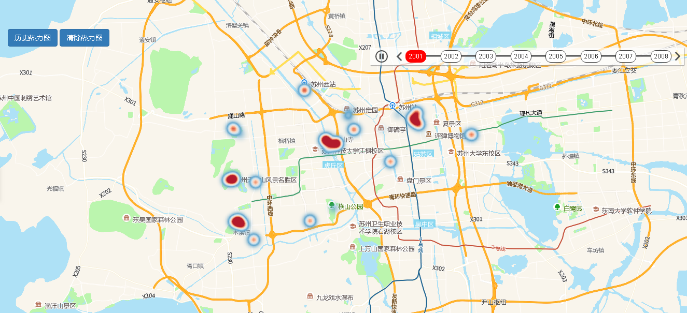

# 历史热力图

> 查看/清除历史热力图




## 运行代码：
```
<!DOCTYPE html>
<html lang="en">

<head>
    <meta charset="UTF-8">
    <title>历史热力图</title>
    <link rel="stylesheet" href="/kmapdemo/css/bootstrap.min.css">
    <link rel="stylesheet" href="/kmapdemo/css/main.css">
    <script src='/kmapdemo/js/jquery-2.2.3.min.js'></script>
    <script src="/kmapdemo/js/bootstrap.min.js"></script>
    <style>
        html,
        body {
            margin: 0;
            padding: 0;
        }

        html,
        body,
        #map {
            width: 100%;
            height: 100%;
        }
    </style>
</head>

<body>
    <div class="ceng">
        <button class="btn btn-primary" id="show_heat">历史热力图</button>
        <button class="btn btn-primary" id="clear_heat">清除热力图</button>
    </div>
    <div id="map"></div>

    <script src="/kmapdemo/kmap/kmap-service-main-v1.6.7.js"></script>
    <script>
        window.onload = function() {
            var kmap;

            const resultObject = window.resultObject;
            var onLoadMap = function() {
                //这里运行地图加载之后的方法
                // console.log('运行 onLoadMap 方法');

                document.getElementById('show_heat').addEventListener('click', function() {
                    kmap.createHistoryHeatLayer({
                        layerId: 'heatmap22',
                        sourceId: 'source22',
                        dataList: resultObject,
                        timeAxis: {
                            conLen: 600,
                            titLen: 40
                        }
                    });
                    var top = document.getElementsByClassName('ceng')[0].offsetHeight;
                    document.getElementsByClassName('js-silder')[0].style.top = `${top + 60}px `;
                });
                document.getElementById('clear_heat').addEventListener('click', function() {
                    kmap.removeHeatLayer({
                        layerId: 'heatmap22'
                    });
                });
            };
            //调用科达地图API接口的配置项
            var config = {
                configUrl: '/kmapdemo/kmap/config.json',
                containerId: 'map',
                mapType: 3,
                onLoadMap: onLoadMap //配置回调方法，用来处理业务
            };

            kmap = new KMap(config);
        }
    </script>
</body>

</html>
<script src='/kmapdemo/js/heat-map-data.js'></script>
```

