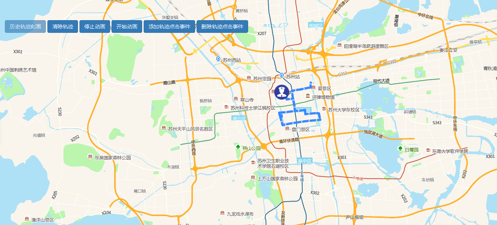

# 历史轨迹刻画

> 可刻画历史轨迹，清除轨迹，开始/停止动画，添加或删除轨迹点击事件





## 运行代码：

```
<!DOCTYPE html>
<html lang="en">

<head>
    <meta charset="UTF-8">
    <title>历史轨迹刻画</title>
    <link rel="stylesheet" href="/kmapdemo/css/bootstrap.min.css">
    <link rel="stylesheet" href="/kmapdemo/css/main.css">
    <script src='/kmapdemo/js/jquery-2.2.3.min.js'></script>
    <script src="/kmapdemo/js/bootstrap.min.js"></script>
    <style>
        html,
        body {
            margin: 0;
            padding: 0;
        }

        html,
        body,
        #map {
            width: 100%;
            height: 100%;
        }
    </style>
</head>

<body>
    <div class="ceng">
        <button class="btn btn-primary" id="add_history_track">历史轨迹刻画</button>
        <button class="btn btn-primary" id="clear_history_track">清除轨迹</button>
        <button class="btn btn-primary" id="stop_history_track">停止动画</button>
        <button class="btn btn-primary" id="start_history_track">开始动画</button>
        <button class="btn btn-primary" id="addEvent">添加轨迹点击事件</button>
        <button class="btn btn-primary" id="removeEvent">删除轨迹点击事件</button>
        <!-- <button class="btn btn-primary" id="add_obj">添加地图对象</button>
	<button class="btn btn-primary" id="ctrl_obj">控制地图对象运动</button> -->
    </div>
    <div id="map"></div>
    <script src="/kmapdemo/kmap/kmap-service-main-v1.6.7.js"></script>
    <script>
        window.onload = function() {
            var kmap;
            var onLoadMap = function() {
                //这里运行地图加载之后的方法

                var data = [
                    [120.6085883482159, 31.31467279032333],
                    [120.64529476773481, 31.29787364755869],
                    [120.61063114026956, 31.296673594178458],
                    [120.6377373361226, 31.32371895969277]
                ];
                var data_1 = [
                    [120.6089283482159, 31.3198779032333],
                    [120.648779476773481, 31.29765164755869],
                    [120.6187654026956, 31.2912383594178458],
                    [120.6312373361226, 31.3145571895969277]
                ]
                var historyTrack_id;
                var historyTrack_id_1;
                document.getElementById('add_history_track').addEventListener('click', function(e) {
                    kmap.createHistoryTrack({
                        points: data,
                        duration: 100,
                        lineStyle: 0,
                        actorWidth: 40,
                        actorHeight: 40,
                        type: 2,
                        actorVisible: true,
                        animation: true,
                        url: '/kmapdemo/images/police.png',
                        ended: function(res) {
                            if (res.status === 10) {
                                historyTrack_id = res.data;
                                e.target.setAttribute('disabled', 'disabled');
                            }
                        },
                    });
                    // kmap.createHistoryTrack({
                    //     points: data_1,
                    //     duration: 100,
                    //     lineStyle: 0,
                    //     actorWidth: 40,
                    //     actorHeight: 40,
                    //     type: 1,
                    //     actorVisible: true,
                    //     animation: false,
                    //     url: 'images/police.png',
                    //     ended: function (res) {
                    //         if (res.status === 10) {
                    //             historyTrack_id_1 = res.data;
                    //             // e.target.setAttribute('disabled', 'disabled');
                    //         }
                    //     },
                    // });
                });


                document.getElementById('clear_history_track').addEventListener('click', function() {
                    if (historyTrack_id) {
                        kmap.removeHistoryTrack({
                            id: historyTrack_id
                        });
                        document.getElementById('add_history_track').removeAttribute('disabled');
                    }
                    if (historyTrack_id_1) {
                        kmap.removeHistoryTrack({
                            id: historyTrack_id_1
                        });
                    }
                });

                document.getElementById('stop_history_track').addEventListener('click', function() {
                    kmap.stopHistoryTrackAnimation({
                        id: historyTrack_id
                    });
                });

                document.getElementById('start_history_track').addEventListener('click', function() {
                    kmap.startHistoryTrackAnimation({
                        id: historyTrack_id
                    });
                });

                const handler = function(e) {
                    console.log(e);
                    alert(`你点击了.lng:${e.lngLat.lng},lat:${e.lngLat.lat}`);
                }

                document.getElementById('addEvent').addEventListener('click', function() {
                    kmap.addTrackLayerEvent({
                        id: historyTrack_id,
                        eventType: 'click',
                        handler: handler
                    })
                });

                document.getElementById('removeEvent').addEventListener('click', function() {
                    kmap.removeTrackLayerEvent({
                        id: historyTrack_id,
                        eventType: 'click',
                    });
                });


                // document.getElementById('add_obj').addEventListener('click', function () {
                //     kmap.addMapObject({
                //         id: 'id',
                //         callback: function (res) {
                //             alert(res.data);
                //         }
                //     });
                // });
                // document.getElementById('ctrl_obj').addEventListener('click', function () {
                //     kmap.customMotion({
                //         obj: {},
                //         callback: function (res) {
                //             alert(res.data);
                //         }
                //     });
                // });
            };
            //调用科达地图API接口的配置项
            var config = {
                configUrl: '/kmapdemo/kmap/config.json',
                containerId: 'map',
                mapType: 3,
                onLoadMap: onLoadMap //配置回调方法，用来处理业务
            };


            kmap = new KMap(config);
        }
    </script>
</body>

</html>
```

