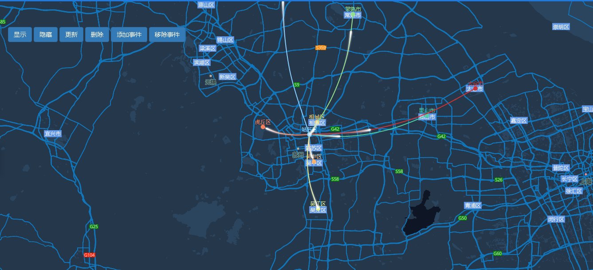

# 迁徙图

> 显示实时迁徙路径，显示/隐藏/更新/删除路径，添加/移除事件




## 运行代码：
```
<!DOCTYPE html>
<html lang="en">

<head>
    <meta charset="UTF-8">
    <title>迁徙图</title>
    <link rel="stylesheet" href="/kmapdemo/css/bootstrap.min.css">
    <link rel="stylesheet" href="/kmapdemo/css/main.css">
    <script src='/kmapdemo/js/jquery-2.2.3.min.js'></script>
    <script src="/kmapdemo/js/bootstrap.min.js"></script>
    <style>
        html,
        body {
            margin: 0;
            padding: 0;
        }

        html,
        body,
        #map {
            width: 100%;
            height: 100%;
        }
    </style>
</head>

<body>
    <div class="ceng">
        <button class="btn btn-primary" id="showRelationMap">显示</button>
        <button class="btn btn-primary" id="hideRelationMap">隐藏</button>
        <button class="btn btn-primary" id="updateRelationMap">更新</button>
        <button class="btn btn-primary" id="removeRelationMap">删除</button>
        <button class="btn btn-primary" id="addRelationmapEvent">添加事件</button>
        <button class="btn btn-primary" id="removeRelationMapEvent">移除事件</button>
    </div>
    <div id="map"></div>
    <script src="/kmapdemo/kmap/kmap-service-main-v1.6.7.js"></script>
    <script>
        window.onload = function() {
            var kmap;
            // var onLoadMap = function () {
            //     //这里运行地图加载之后的方法
            //     var data = [
            //         {
            //             points: [[116.4551, 40.2539], [121.4648, 31.2891]],
            //             color: 'red',
            //             startTitle: '北京',
            //             endTitle: '上海'
            //         },
            //         {
            //             points: [[116.4551, 40.2539], [113.5107, 23.2196]],
            //             color: 'blue',
            //             startTitle: '北京',
            //             endTitle: '广州'
            //         },
            //         {
            //             points: [[116.4551, 40.2539], [122.2229, 39.4409]],
            //             color: 'blue',
            //             startTitle: '北京',
            //             endTitle: '大连'
            //         },
            //         {
            //             points: [[116.4551, 40.2539], [108.479, 23.1152]],
            //             color: 'green',
            //             startTitle: '北京',
            //             endTitle: '南宁'
            //         },
            //         {
            //             points: [[116.4551, 40.2539], [116.0046, 28.6633]],
            //             color: 'yellow',
            //             startTitle: '北京',
            //             endTitle: '南昌'
            //         },
            //         {
            //             points: [[116.4551, 40.2539], [91.1865, 30.1465]],
            //             color: 'purple',
            //             startTitle: '北京',
            //             endTitle: '拉萨'
            //         },
            //         {
            //             points: [[116.4551, 40.2539], [125.8154, 44.2584]],
            //             color: 'blue',
            //             startTitle: '北京',
            //             endTitle: '长春'
            //         },
            //         {
            //             points: [[116.4551, 40.2539], [110.3467, 41.4899]],
            //             color: 'red',
            //             startTitle: '北京',
            //             endTitle: '包头'
            //         },
            //         {
            //             points: [[116.4551, 40.2539], [107.7539, 30.1904]],
            //             color: 'yellow',
            //             startTitle: '北京',
            //             endTitle: '重庆'
            //         },
            //         {
            //             points: [[116.4551, 40.2539], [119.4543, 31.5582]],
            //             color: 'green',
            //             startTitle: '北京',
            //             endTitle: '常州'
            //         },
            //         {
            //             points: [[116.4551, 40.2539], [112.3352, 37.9413]],
            //             color: 'yellow',
            //             startTitle: '北京',
            //             endTitle: '太原'
            //         }
            //     ];
            //     kmap.addRelationLayer({
            //         colors: {
            //             red: 'red',
            //             blue: 'blue',
            //             green: 'green',
            //             yellow: 'yellow',
            //             purple: 'purple'
            //         },
            //         animation: true,
            //         showStart: true,
            //         showEnd: true,
            //         solid: true,
            //         data: data,
            //         ended: function (res) {

            //         }
            //     });
            // };
            // var config = {
            //     containerId: 'map',
            //     zoom: 4,
            //     mapType: 3,
            //     style: 'http://10.255.228.242/service/solu/style/id/2374',
            //     onLoadMap: onLoadMap//配置回调方法，用来处理业务
            // };

            var onLoadMap = function() {
                var data = [{
                    from: {
                        name: '姑苏区',
                        point: [120.618, 31.336]
                    },
                    to: {
                        name: '虎丘区',
                        point: [120.474, 31.356]
                    }
                }, {
                    from: {
                        name: '姑苏区',
                        point: [120.618, 31.336]
                    },
                    to: {
                        name: '吴中区',
                        point: [120.632, 31.264]
                    }
                }, {
                    from: {
                        name: '姑苏区',
                        point: [120.618, 31.336]
                    },
                    to: {
                        name: '相城区',
                        point: [120.642, 31.369]
                    }
                }, {
                    from: {
                        name: '姑苏区',
                        point: [120.618, 31.336]
                    },
                    to: {
                        name: '吴江区',
                        point: [120.645, 31.139]
                    }
                }, {
                    from: {
                        name: '姑苏区',
                        point: [120.618, 31.336]
                    },
                    to: {
                        name: '常熟市',
                        point: [120.753, 31.654]
                    }
                }, {
                    from: {
                        name: '姑苏区',
                        point: [120.618, 31.336]
                    },
                    to: {
                        name: '昆山市',
                        point: [120.982, 31.386]
                    }
                }, {
                    from: {
                        name: '姑苏区',
                        point: [120.618, 31.336]
                    },
                    to: {
                        name: '太仓市',
                        point: [121.132, 31.458]
                    }
                }, {
                    from: {
                        name: '姑苏区',
                        point: [120.618, 31.336]
                    },
                    to: {
                        name: '张家港市',
                        point: [120.558, 31.876]
                    }
                }];

                var layerId = 'relationLayer11';

                kmap.addRelationLayer({
                    layerId: layerId,
                    data: data,
                    //marker点半径
                    markerRadius: 5,
                    //marker点颜色,为空或null则默认取线条颜色
                    markerColor: null,
                    //线条类型 solid、dashed
                    lineType: 'solid',
                    //线条宽度
                    lineWidth: 2,
                    //线条颜色
                    colors: ['#F9815C', '#F8AB60', '#EDCC72', '#E2F194', '#94E08A', '#4ECDA5', '#CD3333', '#87CEFF'],
                    //移动点半径
                    moveRadius: 2,
                    //移动点颜色
                    fillColor: '#fff',
                    //移动点阴影颜色
                    shadowColor: '#fff',
                    //移动点阴影大小
                    shadowBlur: 5,
                    animation: true,
                    ended: function(res) {
                        // console.log(res);
                    }
                });

                //显示
                document.querySelector('#showRelationMap').addEventListener('click', function() {
                    kmap.showRelationLayer({
                        layerId: layerId
                    });
                });
                //隐藏
                document.querySelector('#hideRelationMap').addEventListener('click', function() {
                    kmap.hideRelationLayer({
                        layerId: layerId
                    });
                });
                //更新
                document.querySelector('#updateRelationMap').addEventListener('click', function() {
                    kmap.updateRelationLayer({
                        layerId: layerId,
                        data: [{
                                from: {
                                    name: '虎丘区',
                                    point: [120.474, 31.356]
                                },
                                to: {
                                    name: '吴中区',
                                    point: [120.632, 31.264]
                                }
                            },
                            {
                                from: {
                                    name: '虎丘区',
                                    point: [120.474, 31.356]
                                },
                                to: {
                                    name: '姑苏区',
                                    point: [120.618, 31.336]
                                }
                            },
                            {
                                from: {
                                    name: '虎丘区',
                                    point: [120.474, 31.356]
                                },
                                to: {
                                    name: '相城区',
                                    point: [120.642, 31.369]
                                }
                            }
                        ],
                        moveRadius: 3,
                        fillColor: '#ed2828',
                        shadowColor: '#ed2828',
                        shadowBlur: 6,
                        markerRadius: 2,
                        lineType: 'dashed',
                    });
                });
                //删除
                document.querySelector('#removeRelationMap').addEventListener('click', function() {
                    kmap.removeRelationLayer({
                        layerId: layerId
                    });
                });
                //添加事件
                document.querySelector('#addRelationmapEvent').addEventListener('click', function() {
                    kmap.addRelationLayerEvent({
                        layerId: layerId,
                        eventType: 'click',
                        handler: function(e, features) {
                            console.log(features);
                            if (features.point.length > 0) {
                                alert('当前点击了点');
                            } else if (features.line.length > 0) {
                                alert('当前点击了关系线');
                            }
                        }
                    })
                });
                //移除事件
                document.querySelector('#removeRelationMapEvent').addEventListener('click', function() {
                    kmap.removeRelationLayerEvent({
                        layerId: layerId,
                        eventType: 'click'
                    })
                });
            }

            var config = {
                configUrl: '/kmapdemo/kmap/config.json',
                containerId: 'map',
                zoom: 9,
                style: 'http://10.255.228.242/service/solu/style/id/2374',
                onLoadMap: onLoadMap //配置回调方法，用来处理业务
            };


            kmap = new KMap(config);
        }
    </script>
</body>

</html>
```

