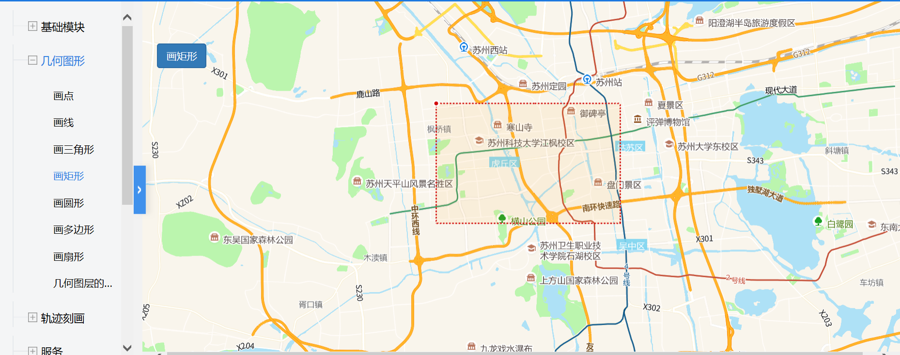

# 画多边形

> 可在地图上标记多边形区域





## 运行代码：

```
<!DOCTYPE html>
<html lang="en">

<head>
    <meta charset="UTF-8">
    <title>画多边形</title>
    <link rel="stylesheet" href="/kmapdemo/css/bootstrap.min.css">
    <link rel="stylesheet" href="/kmapdemo/css/main.css">
    <script src='/kmapdemo/js/jquery-2.2.3.min.js'></script>
    <script src="/kmapdemo/js/bootstrap.min.js"></script>
    <style>
        html,
        body {
            margin: 0;
            padding: 0;
        }

        html,
        body,
        #map {
            width: 100%;
            height: 100%;
        }
    </style>
</head>

<body>
    <div class="ceng">
        <div class="row" style="margin-left: 6px">
            <button class="btn btn-primary" id="drawpolygon">画多边形</button>
            <button class="btn btn-primary" id="drawpoint">画点</button>
            <button class="btn btn-primary" id="drawrect">画矩形</button>
            <button class="btn btn-primary" id="drawpolyline">画线</button>
            <button class="btn btn-primary" id="drawcircle">画圆</button>
            <!-- <button  class="btn btn-primary"id="set_color">改变绘画颜色</button> -->
            <button class="btn btn-primary" id="editThis">进入编辑模式</button>
            <button class="btn btn-primary" id="getAll">获取所有几何图形数据</button>
            <button class="btn btn-primary" id="getSome">获取选中几何图形数据</button>
            <button class="btn btn-primary" id="delAll">删除所有几何图形数据</button>
            <button class="btn btn-primary" id="delSome">删除选中几何图形数据</button>
            <br>
        </div>
        <div class="row" style="margin-top: 6px;margin-left: 6px">
            <input type="text" id="getId" style="height: 34px;float: left;" />
            <button class="btn btn-primary" id="getById" style="float: left;">根据id获取几何图形</button>
            <input type="text" id="delId" style="height: 34px;float: left;margin-left: 6px" />
            <button class="btn btn-primary" id="delById" style="float: left;">根据id删除几何图形</button>
        </div>
    </div>
    <div id="map"></div>
    <script src="/kmapdemo/kmap/kmap-service-main-v1.6.7.js"></script>
    <script>
        window.onload = function() {
            var kmap;

            var onLoadMap = function() {
                var drawpolygon = document.getElementById('drawpolygon');
                var drawpoint = document.getElementById('drawpoint');
                var drawpolyline = document.getElementById('drawpolyline');
                var drawrect = document.getElementById('drawrect');
                var drawcircle = document.getElementById('drawcircle');
                // var set_color = document.getElementById('set_color');
                var getAll = document.getElementById('getAll');
                var getSome = document.getElementById('getSome');
                var delAll = document.getElementById('delAll');
                var delSome = document.getElementById('delSome');
                var getById = document.getElementById('getById');
                var delById = document.getElementById('delById');
                var editThis = document.getElementById('editThis');
                var polygonData = null;


                drawpolygon.onclick = function() {
                    kmap.drawPolygon({
                        callback: function(result) {
                            console.log(result);
                            polygonData = result;
                            $('#getId').val(result.data.id);
                            $('#delId').val(result.data.id);
                            // console.log(JSON.stringify(result.data.features[0].geometry.coordinates));
                        }
                    });
                };

                drawpoint.onclick = function() {
                    kmap.drawPoint({
                        callback: function(result) {
                            console.log(result);
                            $('#getId').val(result.data.id);
                            $('#delId').val(result.data.id);
                            // console.log(JSON.stringify(result.data.features[0].geometry.coordinates));
                        }
                    });
                };

                drawpolyline.onclick = function() {
                    kmap.drawLine({
                        callback: function(result) {
                            console.log(result);
                            $('#getId').val(result.data.id);
                            $('#delId').val(result.data.id);
                            // console.log(JSON.stringify(result.data.features[0].geometry.coordinates));
                        }
                    });
                };

                drawrect.onclick = function() {
                    kmap.drawRectangle({
                        callback: function(result) {
                            console.log(result);
                            $('#getId').val(result.data.id);
                            $('#delId').val(result.data.id);
                            // console.log(JSON.stringify(result.data.features[0].geometry.coordinates));
                        }
                    });
                };

                drawcircle.onclick = function() {
                    kmap.drawCircular({
                        callback: function(result) {
                            console.log(result);
                            $('#getId').val(result.data.id);
                            $('#delId').val(result.data.id);
                            // console.log(JSON.stringify(result.data.features[0].geometry.coordinates));
                        }
                    });
                };
                getAll.onclick = function() {
                    kmap.getAllGeometries({
                        callback: function(res) {
                            alert('结果请按F12在开发者工具中查看');
                            console.log(res);
                        }
                    });
                };
                getSome.onclick = function() {
                    kmap.getSelectedGeometries({
                        callback: function(res) {
                            alert('结果请按F12在开发者工具中查看');
                            console.log(res);
                        }
                    });
                };
                delAll.onclick = function() {
                    kmap.removeAllGeometries({});
                };
                delSome.onclick = function() {
                    kmap.removeSelectedGeometries({});
                };
                getById.onclick = function() {
                    kmap.getGeometryById({
                        id: $('#getId').val(),
                        callback: function(res) {
                            alert('结果请按F12在开发者工具中查看');
                            console.log(res);
                        }
                    });
                };
                delById.onclick = function() {
                    kmap.removeGeometryById({
                        id: $('#delId').val()
                    });
                };

                editThis.onclick = function() {
                    kmap.updatePolygonToEdit({
                        type: 'polygon',
                        coordinates: polygonData.data.coordinates
                    });
                }
                // set_color.onclick = function () {
                //     kmap.setGeometricColor({fiter: 'fill', color: 'red', fillcolor: 'red'});
                // };
            };
            //调用科达地图API接口的配置项
            var config = {
                configUrl: '/kmapdemo/kmap/config.json',
                containerId: 'map',
                mapType: 3,
                onLoadMap: onLoadMap //配置回调方法，用来处理业务
            };


            kmap = new KMap(config);
        }
    </script>
</body>

</html>
<script src='/kmapdemo/js/jquery-2.2.3.min.js'></script>
```


