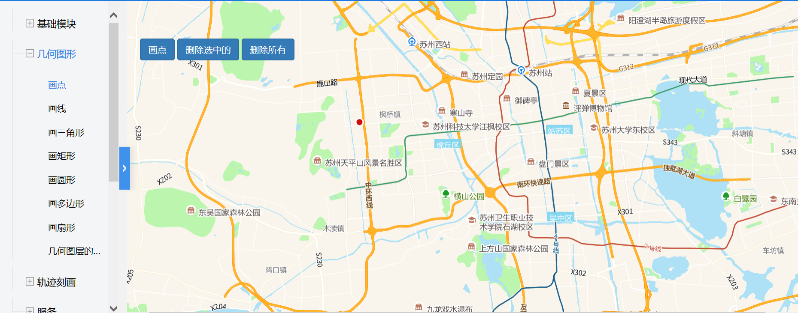

# 画点

> 可在地图上标记点，删除标记点或删除所有标记点





## 运行代码：

```
<!DOCTYPE html>
<html lang="en">

<head>
    <meta charset="UTF-8">
    <title>画点</title>
    <link rel="stylesheet" href="/kmapdemo/css/bootstrap.min.css">
    <link rel="stylesheet" href="/kmapdemo/css/main.css">
    <script src='/kmapdemo/js/jquery-2.2.3.min.js'></script>
    <script src="/kmapdemo/js/bootstrap.min.js"></script>
    <style>
        html,
        body {
            margin: 0;
            padding: 0;
        }

        html,
        body,
        #map {
            width: 100%;
            height: 100%;
        }
    </style>
</head>

<body>
    <div class="ceng">
        <button class="btn btn-primary" id="drawpoint">画点</button>
        <button class="btn btn-primary" id="selectdel">删除选中的</button>
        <button class="btn btn-primary" id="del">删除所有</button>
    </div>
    <div id="map"></div>

    <script src="/kmapdemo/kmap/kmap-service-main-v1.6.7.js"></script>
    <script>
        window.onload = function() {
            var kmap;
            var onLoadMap = function() {
                //这里运行地图加载之后的方法
                var layerId = 'points'; //just for AG
                var selectG = [] //just for AG
                var drawpoint = document.getElementById('drawpoint');
                var del = document.getElementById('del');
                var selectdel = document.getElementById('selectdel');

                function onCallAg() {
                    kmap.addEventOnGraphic({
                        layerId: layerId,
                        event: 'click',
                        callback: function(e, res) {
                            kmap.setGraphicColor({
                                color: 'red',
                                graphic: e.graphic
                            });
                            selectG.push(e.graphic);
                        }
                    });
                }

                drawpoint.addEventListener('click', function() {
                    if (kmap.mapType === 'AG') {
                        kmap.drawPoint({
                            color: 'blue',
                            layerId: layerId,
                            callback: function(result) {
                                console.log(result);
                                onCallAg();
                            }
                        });
                    } else {
                        kmap.drawPoint({
                            callback: function(result) {
                                console.log(result);
                            }
                        });
                    }
                });
                del.addEventListener('click', function() {
                    if (kmap.mapType === 'AG') {
                        kmap.delDraw({
                            layerId: layerId
                        });
                    } else {
                        kmap.removeAllGeometries();
                    }

                });
                selectdel.addEventListener('click', function() {
                    if (kmap.mapType === 'AG') {
                        kmap.delSelect({
                            layerId: layerId,
                            graphic: selectG
                        });
                    } else {
                        kmap.removeSelectedGeometries();
                    }
                });

            };
            //调用科达地图API接口的配置项
            var config = {
                configUrl: '/kmapdemo/kmap/config.json',
                containerId: 'map',
                mapType: 3,
                onLoadMap: onLoadMap //配置回调方法，用来处理业务
            };

            kmap = new KMap(config);
        }
    </script>
</body>

</html>
```

