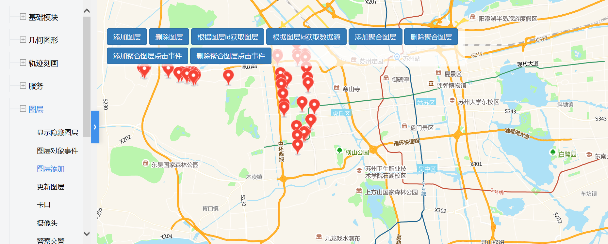

# 图层添加

> 添加/删除图层，根据图层ID获取图层/数据源，添加/删除聚合图层，给聚合图层添加/删除事件




## 运行代码：
```
<!DOCTYPE html>
<html lang="en">

<head>
    <meta charset="UTF-8">
    <title>图层添加</title>
    <link rel="stylesheet" href="/kmapdemo/css/bootstrap.min.css">
    <link rel="stylesheet" href="/kmapdemo/css/main.css">
    <script src='/kmapdemo/js/jquery-2.2.3.min.js'></script>
    <script src="/kmapdemo/js/bootstrap.min.js"></script>
    <style>
        html,
        body {
            margin: 0;
            padding: 0;
        }

        html,
        body,
        #map {
            width: 100%;
            height: 100%;
        }
    </style>
</head>

<body>
    <div class="opp-area-btn inner">
        <div class="form-inline">
            <button class="btn btn-primary" id="add_layer">添加图层</button>
            <button class="btn btn-primary" id="remove_layer">删除图层</button>
            <button class="btn btn-primary" id="get_layer">根据图层Id获取图层</button>
            <button class="btn btn-primary" id="get_source">根据图层Id获取数据源</button>
            <button class="btn btn-primary" id="addClusterLayer">添加聚合图层</button>
            <button class="btn btn-primary" id="removeClusterLayer">删除聚合图层</button>
            <button class="btn btn-primary" id="addClusterLayerEvent">添加聚合图层点击事件</button>
            <button class="btn btn-primary" id="removeClusterLayerEvent">删除聚合图层点击事件</button>
        </div>
    </div>
    <div id="map"></div>
    <script src="/kmapdemo/kmap/kmap-service-main-v1.6.7.js"></script>
    <script>
        window.onload = function() {
            var kmap;

            const sourceData = window.sourceData;
            var onLoadMap = function() {
                bindPageEvents();
                // var imgWeather = new Image();
                // imgWeather.src = '/images/marker.png';
                // imgWeather.onload = function(){
                // 	kmap.map.addImage('ploace-icon', imgWeather);
                // }
                if (kmap.mapType === 'MM') {
                    kmap.addImage({
                        imgName: 'ploace-icon',
                        imgUrl: '/kmapdemo/images/marker.png'
                    });
                    kmap.addImage({
                        imgName: 'ploace-icon2',
                        imgUrl: '/kmapdemo/images/police.png'
                    });
                } else if (kmap.mapType === 'AG') {
                    document.getElementById('get_source').style.display = 'none';
                }
            };
            //调用科达地图API接口的配置项
            var config = {
                configUrl: '/kmapdemo/kmap/config.json',
                containerId: 'map',
                mapType: 3,
                onLoadMap: onLoadMap //配置回调方法，用来处理业务
            };

            function bindPageEvents() {
                document.getElementById('add_layer').addEventListener('click', addLayer);
                document.getElementById('remove_layer').addEventListener('click', removeLayer);
                document.getElementById('get_layer').addEventListener('click', function() {
                    kmap.getLayer({
                        layerId: 'cameraLayer',
                        callback: function(result) {
                            alert('结果请按F12在开发者工具中查看');
                            console.log(result);
                        }
                    });
                });
                document.getElementById('get_source').addEventListener('click', function() {
                    kmap.getSource({
                        layerId: 'cameraLayer',
                        callback: function(result) {
                            alert('结果请按F12在开发者工具中查看');
                            console.log(result);
                        }
                    });
                });
                console.log(sourceData);
                document.getElementById('addClusterLayer').addEventListener('click', function() {
                    kmap.addLayer({
                        layerId: 'clusterLayer',
                        sourceId: 'clusterSource',
                        data: sourceData,
                        iconImage: 'bank-15',
                        clustered: true,
                        enableGetInfo: true,
                        clusteredFilters: [{
                                count: 0,
                                circleColor: 'orange'
                            },
                            {
                                count: 10,
                                circleColor: 'red'
                            },
                            {
                                count: 30,
                                circleColor: 'purple'
                            }
                        ],
                        ended: function(res) {
                            // kmap.addEventOnLayerObject({
                            //     layerId: res.data,
                            //     event: 'click',
                            //     clustered: true,
                            //     handler: function (e, feature, info) {
                            //         alert('结果请按F12在开发者工具中查看');
                            //         console.log('e', e);
                            //         console.log('feature', feature);
                            //         console.log('info', info);
                            //     }
                            // });
                        }
                    });
                });
                document.getElementById('removeClusterLayer').addEventListener('click', function() {
                    kmap.removeLayer({
                        layerId: 'clusterLayer'
                    });
                });

                function handler(e, feature, info) {
                    alert('结果请按F12在开发者工具中查看');
                    console.log('e', e);
                    console.log('feature', feature);
                    console.log('info', info);
                }
                document.getElementById('addClusterLayerEvent').addEventListener('click', function() {
                    kmap.addEventOnLayerObject({
                        layerId: 'clusterLayer',
                        clustered: true,
                        event: 'click',
                        handler: handler
                    });
                });
                document.getElementById('removeClusterLayerEvent').addEventListener('click', function() {
                    kmap.removeEventOnLayerObject({
                        layerId: 'clusterLayer',
                        clustered: true,
                        event: 'click',
                    });
                });


            }

            function addLayer() {
                if (kmap.mapType === 'MM') {
                    kmap.addLayer({
                        layerId: 'cameraLayer',
                        sourceId: 'cameraSource',
                        data: sourceData,
                        iconImage: 'ploace-icon',
                        ended: function(res) {
                            // console.log(res);
                        }
                    });
                } else if (kmap.mapType === 'AG') {
                    kmap.addLayer({
                        layerId: 'cameraLayer',
                        url: 'http://172.16.235.68:6080/arcgis/rest/services/suzhouBaseMap/MapServer',
                        type: 'dynamic',
                        ended: function() {
                            console.log(kmap.msg);
                        }
                    });
                }
            }

            function removeLayer() {
                kmap.removeLayer({
                    layerId: 'cameraLayer'
                });
            }


            kmap = new KMap(config);
        }
    </script>
</body>

</html>
<script src='/kmapdemo/js/minemap-data.js'></script>
```

