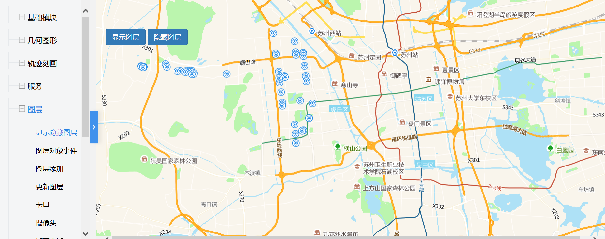
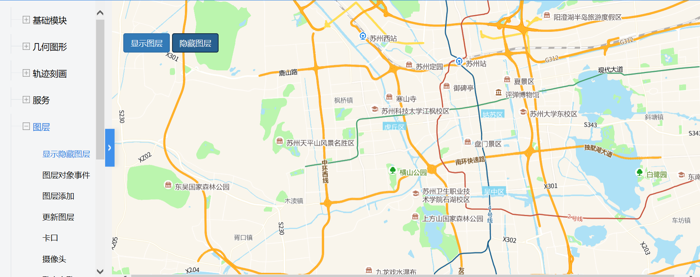

# 显示隐藏图层

> 显示/隐藏图层






## 运行代码：
```
<!DOCTYPE html>
<html lang="en">

<head>
    <meta charset="UTF-8">
    <title>显示隐藏图层</title>
    <link rel="stylesheet" href="/kmapdemo/css/bootstrap.min.css">
    <link rel="stylesheet" href="/kmapdemo/css/main.css">
    <script src='/kmapdemo/js/jquery-2.2.3.min.js'></script>
    <script src="/kmapdemo/js/bootstrap.min.js"></script>
    <style>
        html,
        body {
            margin: 0;
            padding: 0;
        }

        html,
        body,
        #map {
            width: 100%;
            height: 100%;
        }
    </style>
</head>

<body>
    <div class="ceng">
        <!--
	<button type="button" class="btn btn-default" id="hospital_display">显示医院图层</button>
	<button type="button" class="btn btn-danger" id="hospital_hide">隐藏医院图层</button>
	<button type="button" class="btn btn-danger" id="hospital_hide">隐藏医院图层</button>
	-->
        <!--<button type="button" class="btn btn-default" id="rail_display">显示车站图层(自定义)</button>-->
        <!--<button type="button" class="btn btn-danger" id="rail_hide">隐藏车站图层(自定义)</button>-->
        <button type="button" class="btn btn-primary" id="addLayer_display">显示图层</button>
        <button type="button" class="btn btn-primary" id="addLayer_hide">隐藏图层</button>
    </div>
    <div id="map"></div>
    <script src="/kmapdemo/kmap/kmap-service-main-v1.6.7.js"></script>
    <script>
        window.onload = function() {
            var kmap;

            const sourceData = window.sourceData;
            var myLayerId = 'policeLayer';

            var onLoadMap = function() {
                bindPageEvents();
                if (kmap.mapType === 'AG') {
                    document.getElementById('rail_display').style.display = 'none';
                    document.getElementById('rail_hide').style.display = 'none';
                    kmap.addLayer({
                        layerId: myLayerId,
                        url: 'http://172.16.235.68:6080/arcgis/rest/services/road/MapServer/0',
                        type: 'feature'
                    });
                } else if (kmap.mapType === 'MM') {
                    addPoliceLayer();
                }
            };
            //调用科达地图API接口的配置项
            var config = {
                configUrl: '/kmapdemo/kmap/config.json',
                containerId: 'map',
                mapType: 3,
                onLoadMap: onLoadMap //配置回调方法，用来处理业务
            };


            function addPoliceLayer() {
                kmap.addLayer({
                    layerId: myLayerId,
                    sourceId: 'policeSource',
                    data: sourceData,
                    iconImage: 'police-15',
                    ended: function(res) {
                        console.log('addLayer', res);

                    }
                });
            }

            function bindPageEvents() {

                // document.getElementById('rail_display').addEventListener('click', function () {
                //     displayLayer();
                // });

                // document.getElementById('rail_hide').addEventListener('click', function () {
                //     hideLayer();
                // });
                document.getElementById('addLayer_display').addEventListener('click', function() {
                    kmap.showLayer({
                        layerId: myLayerId
                    });
                });
                document.getElementById('addLayer_hide').addEventListener('click', function() {
                    kmap.hideLayer({
                        layerId: myLayerId
                    });
                });
            }

            function displayLayer(type) {
                var layerId = type === 0 ? 'cce2b7e272b44465bcd5f1a578e88f3b' : 'b9bc8f87461a4448af3cd3b5328f211e';
                kmap.showLayer({
                    layerId: layerId,
                    end: function() {
                        console.log(kmap.msg);
                    }
                });
            }

            function hideLayer(type) {
                var layerId = type === 0 ? 'cce2b7e272b44465bcd5f1a578e88f3b' : 'b9bc8f87461a4448af3cd3b5328f211e'
                //车站图层
                kmap.hideLayer({
                    layerId: layerId,
                    end: function() {
                        console.log(kmap.msg);
                    }
                });
            }


            kmap = new KMap(config);
        }
    </script>
</body>

</html>
<script src='/kmapdemo/js/minemap-data.js'></script>
```

