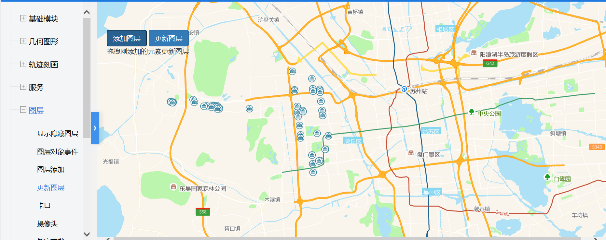

# 更新图层

> 添加/更新图层




## 运行代码：
```
<!DOCTYPE html>
<html lang="en">

<head>
    <meta charset="UTF-8">
    <title>更新图层</title>
    <link rel="stylesheet" href="/kmapdemo/css/bootstrap.min.css">
    <link rel="stylesheet" href="/kmapdemo/css/main.css">
    <script src='/kmapdemo/js/jquery-2.2.3.min.js'></script>
    <script src="/kmapdemo/js/bootstrap.min.js"></script>
    <style>
        html,
        body {
            margin: 0;
            padding: 0;
        }

        html,
        body,
        #map {
            width: 100%;
            height: 100%;
        }
    </style>
</head>

<body>
    <div class="ceng">
        <button type="button" class="btn btn-primary" id="add_layer">添加图层</button>
        <button type="button" class="btn btn-primary" id="update_layer">更新图层</button>
        <!-- 	<button type="button" class="btn btn-primary" id="close_event">注销draw事件</button>
	<button type="button" class="btn btn-primary" id="open_event">注册draw事件</button> -->
        <p class="mes">拖拽刚添加的元素更新图层</p>
    </div>
    <div id="map"></div>
    <script src="/kmapdemo/kmap/kmap-service-main-v1.6.7.js"></script>
    <script>
        window.onload = function() {
            var kmap;

            const sourceData = window.sourceData;
            var onLoadMap = function() {
                bindPageEvents();
            };
            //调用科达地图API接口的配置项
            var config = {
                configUrl: '/kmapdemo/kmap/config.json',
                containerId: 'map',
                zoom: 10,
                mapType: 3,
                onLoadMap: onLoadMap //配置回调方法，用来处理业务
            };

            function bindPageEvents() {
                document.getElementById('add_layer').addEventListener('click', addLayer);
                document.getElementById('update_layer').addEventListener('click', updateLayer);
            }

            function updateLayer() {
                if (kmap.mapType === 'MM') {
                    var data = localStorage.getItem('layDate') ?
                        JSON.parse(localStorage.getItem('layDate')) :
                        sourceData;

                    //just for demo
                    data.features[0].geometry.coordinates = [121.54866, 31.51217];
                    data.features[1].geometry.coordinates = [120.14866, 31.01217];

                    kmap.updateLayer({
                        data: data,
                        layerId: 'points',
                        ended: function() {}
                    });
                } else {
                    kmap.updateLayer({
                        layerId: 'points',
                        ended: function() {

                        }
                    });
                }
            }

            function doDrag() {
                kmap.addEventOnLayerObject({
                    event: 'drag',
                    layerId: 'points',
                    dragStart: function(e) {
                        console.log('dragStart', e);
                    },
                    dragMove: function(e) {
                        console.log('dragMove', e);
                    },
                    dragEnd: function(e) {
                        console.log('dragEnd', e);
                        if (kmap.mapType === 'AG') {
                            kmap.getLayer({
                                layerId: 'points',
                                callback: function(result) {

                                }
                            });
                        } else {
                            kmap.getSource({
                                layerId: 'points',
                                callback: function(res) {
                                    if (res.status === 10) {
                                        localStorage.setItem('layDate', JSON.stringify(res.data._data));
                                    }
                                }
                            });
                        }
                    }
                });
            }

            function addLayer() {
                if (kmap.mapType === 'AG') {
                    kmap.addLayer({
                        layerId: 'points',
                        url: 'http://172.16.235.68:6080/arcgis/rest/services/resource/FeatureServer/0',
                        type: 'feature',
                        outFields: ['*'],
                        ended: function() {
                            doDrag();
                        }
                    });
                } else if (kmap.mapType === 'MM') {
                    var data = localStorage.getItem('layDate') ?
                        JSON.parse(localStorage.getItem('layDate')) :
                        sourceData;

                    kmap.addLayer({
                        data: data,
                        layerId: 'points',
                        sourceId: 'pointsSource',
                        iconImage: 'school-15',
                        ended: function() {
                            doDrag();
                        }
                    });
                }
            }


            kmap = new KMap(config);
        }
    </script>
</body>

</html>
<script src='/kmapdemo/js/minemap-data.js'></script>
```

