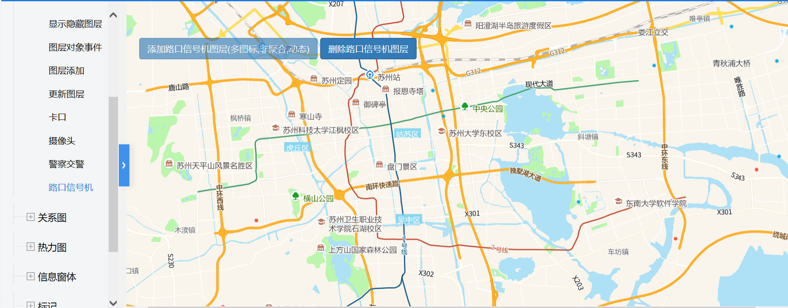

# 路口信号机

> 添加/删除路口信号机图层




## 运行代码：
```
<!DOCTYPE html>
<html lang="en">

<head>
    <meta charset="UTF-8">
    <title>路口信号机</title>
    <link rel="stylesheet" href="/kmapdemo/css/bootstrap.min.css">
    <link rel="stylesheet" href="/kmapdemo/css/main.css">
    <script src='/kmapdemo/js/jquery-2.2.3.min.js'></script>
    <script src="/kmapdemo/js/bootstrap.min.js"></script>
    <style>
        html,
        body {
            margin: 0;
            padding: 0;
        }

        html,
        body,
        #map {
            width: 100%;
            height: 100%;
        }
    </style>
</head>

<body>
    <div class="ceng">
        <button type="button" class="btn btn-primary" id="add_layer">添加路口信号机图层(多图标,非聚合,动态)</button>
        <button type="button" class="btn btn-primary" id="remove_layer">删除路口信号机图层</button>
    </div>
    <div id="map"></div>
    <script src="/kmapdemo/kmap/kmap-service-main-v1.6.7.js"></script>
    <script>
        window.onload = function() {
            var kmap;
            var onLoadMap = function() {
                bindPageEvents();
            };
            //调用科达地图API接口的配置项
            var config = {
                configUrl: '/kmapdemo/kmap/config.json',
                containerId: 'map',
                zoom: 11,
                mapType: 3,
                center: [120.6584389547279, 31.292601214089288],
                onLoadMap: onLoadMap //配置回调方法，用来处理业务
            };
            var layerId = null;

            function bindPageEvents() {

                document.getElementById('add_layer').addEventListener('click', addLayer);
                document.getElementById('remove_layer').addEventListener('click', removeLayer);

            }

            function getDate(callback) { //to do
                var url = '/kgis/spatial/queryinfo/spatialtest';
                var xhr = new XMLHttpRequest();
                xhr.open('GET', url);
                xhr.onreadystatechange = function() {
                    if (xhr.readyState == 4 && xhr.status == 200) {
                        var res = JSON.parse(xhr.responseText);
                        var obj = res.data.rows[0];
                        callback(obj);
                        xhr = null;
                    }
                };
                xhr.send();
            }


            function addLayer() {
                kmap.addCustomLayer({
                    serviceId: '67',
                    clustered: false,
                    multi: true,
                    dynamic: true,
                    timer: 30000,
                    terms: [{
                        column: 'dataId',
                        termType: 'like',
                        value: '1'
                    }],
                    urls: [{
                            url: '/kmapdemo/images/icon-point-red.png',
                            filter: [ // 过滤图标显示哪些数据, 非聚合图层使用
                                {
                                    key: 'status',
                                    value: 1
                                }
                            ]
                        },
                        {
                            url: '/kmapdemo/images/icon-point-blue.png',
                            filter: [{
                                key: 'status',
                                value: 2
                            }]
                        }
                    ],
                    ended: function(res) {
                        console.log(res.data);
                        layerId = res.data;
                    }
                });
                document.getElementById('add_layer').setAttribute('disabled', true);
            }

            function removeLayer() {
                if (layerId) {
                    kmap.removeLayer({
                        layerId: layerId
                    });
                    layerId = null;
                }
                document.getElementById('add_layer').removeAttribute('disabled');
            }


            kmap = new KMap(config);
        }
    </script>
</body>

</html>
```

