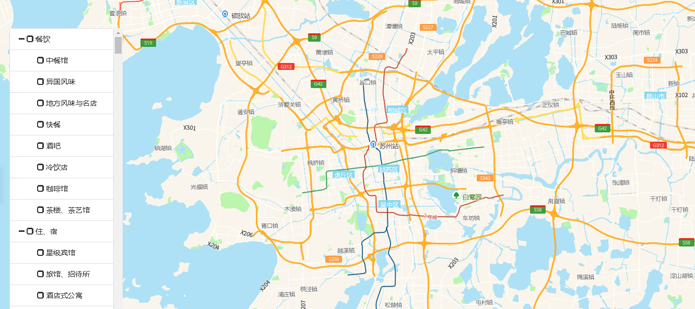

# POI基础图层控制

> 显示餐饮，住宿，金融，教育，文化等产业地址信息





## 运行结果：

```
<!DOCTYPE html>
<html lang="en">

<head>
    <meta charset="UTF-8">
    <title>POI基础图层控制</title>
    <link rel="stylesheet" href="/kmapdemo/css/bootstrap.min.css">
    <link rel="stylesheet" href="/kmapdemo/css/main.css">
    <script src='/kmapdemo/js/jquery-2.2.3.min.js'></script>
    <script src="/kmapdemo/js/bootstrap.min.js"></script>
    <style>
        html,
        body {
            margin: 0;
            padding: 0;
        }

        html,
        body,
        #map {
            width: 100%;
            height: 100%;
        }
    </style>
</head>

<body>
    <style>
        .bottom-20 {
            bottom: 20px;
            overflow-y: auto;
        }

        .left-panel {
            position: absolute;
            top: 58px;
            left: 20px;
            z-index: 999;
            background: rgba(247, 247, 247, 0);
            padding: 0;
        }

        .treeview-panel {
            left: 10px;
            width: 200px;
        }
    </style>
    <div class="left-panel bottom-20">
        <div id="treeview-checkable" class="treeview-panel"></div>
    </div>
    <div id="map"></div>


    <script src="/kmapdemo/kmap/kmap-service-main-v1.6.7.js"></script>
    <script>
        window.onload = function() {
            var kmap;


            function setPoiLayerVisible(kindCode, visible) {
                kmap.getPoiFiltersByKindCode({
                    kindcode: kindCode,
                    callback: function(resp) {
                        const filters = resp.data;
                        if (Array.isArray(filters) && filters.length > 0) {
                            filters.forEach(item => {
                                const {
                                    id
                                } = item;
                                kmap.setPoiLayerVisible({
                                    id,
                                    visible
                                });
                            });
                        }
                    }
                })
            }

            function onLoadMap() {
                var $checkableTree = $('#treeview-checkable').treeview({
                    data: poiList,
                    showIcon: false,
                    showCheckbox: true,
                    showTags: true,
                    onNodeChecked: function(event, node) {
                        const nodes = node.nodes;
                        if (nodes && Array.isArray(nodes)) {
                            nodes.forEach(item => {
                                const nodeId = item['nodeId'];
                                $checkableTree.treeview('checkNode', [nodeId, {
                                    silent: true
                                }]);
                            });
                            nodes.forEach(item => {
                                setPoiLayerVisible(item['kindCode'], true);
                            });
                            return;
                        }
                        setPoiLayerVisible(node['kindCode'], true);
                        const parentNode = $checkableTree.treeview('getParent', node);
                        const childrenNodesAreAllChecked = parentNode.nodes.every(node => {
                            return node.state.checked;
                        });
                        childrenNodesAreAllChecked && $checkableTree.treeview('checkNode', [parentNode['nodeId'], {
                            silent: true
                        }]);
                    },
                    onNodeUnchecked: function(event, node) {
                        const nodes = node.nodes;
                        if (nodes && Array.isArray(nodes)) {
                            nodes.forEach(item => {
                                const nodeId = item['nodeId'];
                                $checkableTree.treeview('uncheckNode', [nodeId, {
                                    silent: true
                                }]);
                            });
                            nodes.forEach(item => {
                                setPoiLayerVisible(item['kindCode'], false);
                            });
                            return;
                        }
                        setPoiLayerVisible(node['kindCode'], false);
                        const parentNode = $checkableTree.treeview('getParent', node);
                        $checkableTree.treeview('uncheckNode', [parentNode['nodeId'], {
                            silent: true
                        }]);
                    }
                });
            }

            var config = {
                configUrl: '/kmapdemo/kmap/config.json',
                containerId: 'map',
                zoom: 10,
                mapType: 3,
                onLoadMap: onLoadMap
            };


            kmap = new KMap(config);
        }
    </script>
</body>

</html>
<script src='/kmapdemo/js/poi.js'></script>

<script src='/kmapdemo/js/jquery-2.2.3.min.js'></script>

<script src='/kmapdemo/js/bootstrap-treeview.min.js'></script>
```

