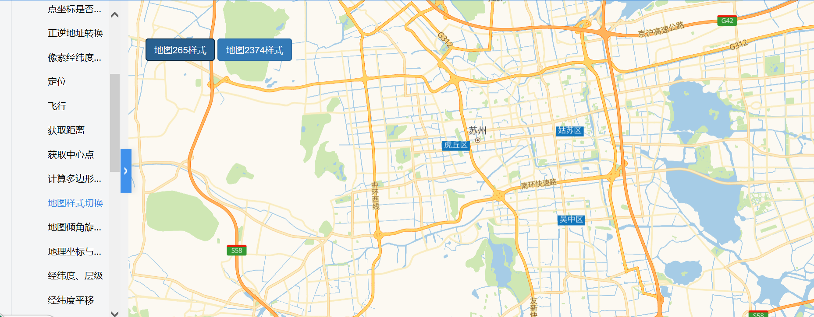
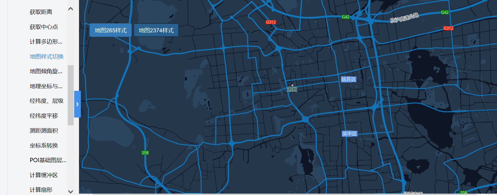

# 地图样式切换

> 地图主题颜色，256为普通样式，2374样式主题色为黑色







## 运行代码：

```
<!DOCTYPE html>
<html lang="en">

<head>
    <meta charset="UTF-8">
    <title>地图样式切换</title>
    <link rel="stylesheet" href="/kmapdemo/css/bootstrap.min.css">
    <link rel="stylesheet" href="/kmapdemo/css/main.css">
    <script src='/kmapdemo/js/jquery-2.2.3.min.js'></script>
    <script src="/kmapdemo/js/bootstrap.min.js"></script>
    <style>
        html,
        body {
            margin: 0;
            padding: 0;
        }

        html,
        body,
        #map {
            width: 100%;
            height: 100%;
        }
    </style>
</head>

<body>
    <div class="ceng">
        <button class="btn btn-primary" id="map265" style="margin-left:6px;">地图265样式</button>
        <button class="btn btn-primary" id="map2374">地图2374样式</button>
        <br>
    </div>
    <div id="map"></div>
    <script src="/kmapdemo/kmap/kmap-service-main-v1.6.7.js"></script>
    <script>
        window.onload = function() {
            var kmap;
            var onLoadMap = function() {
                //这里运行地图加载之后的方法
                var map265 = document.getElementById('map265');
                var map2374 = document.getElementById('map2374');
                // var setMapHand = document.getElementById('setMapHand');

                //设置地图为265样式
                map265.addEventListener('click', function() {
                    if (kmap.mapType === 'BM') {
                        kmap.setMapStyle({
                            styleUrl: 'normal'
                        });
                    } else {
                        kmap.setMapStyle({
                            styleUrl: '/kmapdemo/kmap/652.json'
                        });
                    }
                });
                //设置地图为2374样式
                map2374.addEventListener('click', function() {
                    if (kmap.mapType === 'BM') {
                        kmap.setMapStyle({
                            styleUrl: 'midnight'
                        });
                    } else {
                        kmap.setMapStyle({
                            styleUrl: '/kmapdemo/kmap/2374.json'
                        });
                    }
                });
            };

            //调用科达地图API接口的配置项
            var config = {
                configUrl: '/kmapdemo/kmap/config.json',
                containerId: 'map',
                mapType: 3,
                onLoadMap: onLoadMap //配置回调方法，用来处理业务
            };


            kmap = new KMap(config);
        }
    </script>
</body>

</html>
```


