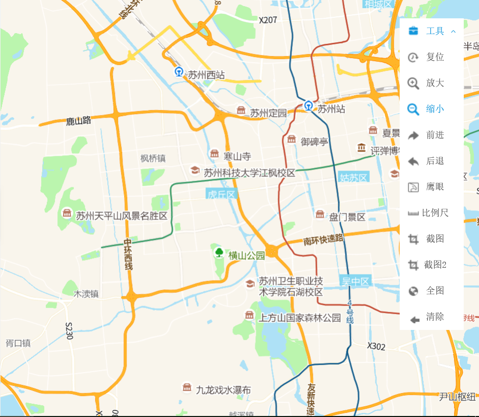

# 工具组件

> 复位 放大 缩小 前进 后退 鹰眼 比例尺 截图 全屏 清除





## 运行代码：

```
<!DOCTYPE html>
<html lang="en">

<head>
    <meta charset="UTF-8">
    <title>工具组件</title>
    <link rel="stylesheet" href="/kmapdemo/css/bootstrap.min.css">
    <link rel="stylesheet" href="/kmapdemo/css/main.css">
    <script src='/kmapdemo/js/jquery-2.2.3.min.js'></script>
    <script src="/kmapdemo/js/bootstrap.min.js"></script>
    <style>
        html,
        body {
            margin: 0;
            padding: 0;
        }

        html,
        body,
        #map {
            width: 100%;
            height: 100%;
        }
    </style>
</head>

<body>
    <div id="map"></div>
    <!--  -->


    <script src="/kmapdemo/kmap/kmap-service-main-v1.6.7.js"></script>
    <script>
        window.onload = function() {
            var kmap;
            var onLoadMap = function() {
                //这里运行地图加载之后的方法
                //console.log('运行 onLoadMap 方法');
                //历史记录器，使用前进后退时要先调用此方法
                kmap.history();
            };
            //截图获取的base64图片
            var imgDate = function(result) {
                alert('结果请按F12在开发者工具中查看');
                // var imgurl = result.data;
                // var imgdom = document.getElementById('imgurl');
                // imgdom.setAttribute('src',imgurl);
                console.log(result.data);
            }
            //自定义截图获取的base64图片
            var customImgDate = function(result) {
                alert('结果请按F12在开发者工具中查看');
                console.log(result.data);
            }
            //调用科达地图API接口的配置项
            //tools配置工具列表
            var config = {
                configUrl: '/kmapdemo/kmap/config.json',
                containerId: 'map',
                mapType: 3,
                tools: {
                    moveTop: true, //上移
                    moveBottom: true, //下移
                    moveLeft: true, //左移
                    moveRight: true, //右移
                    reset: true, //复位
                    zoomIn: true, //放大
                    zoomOut: true, //缩小
                    forward: true, //前进
                    goBack: true, //后退
                    eagle: true, //鹰眼
                    scale: true, //比例尺
                    screenshot: imgDate, //截图
                    customScreenshot: customImgDate, //自定义截图
                    mapFull: true, //全图
                    clear: true //清除
                },
                onLoadMap: onLoadMap //配置回调方法，用来处理业务
            };

            kmap = new KMap(config);
        }
    </script>
</body>

</html>
```


