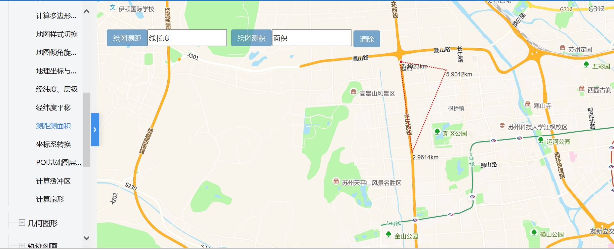

# 测距测面积

> 鼠标瞄点的方式自动计算其距离或内部面积





## 运行代码：

```
<!DOCTYPE html>
<html lang="en">

<head>
    <meta charset="UTF-8">
    <title>测距测面积</title>
    <link rel="stylesheet" href="/kmapdemo/css/bootstrap.min.css">
    <link rel="stylesheet" href="/kmapdemo/css/main.css">
    <script src='/kmapdemo/js/jquery-2.2.3.min.js'></script>
    <script src="/kmapdemo/js/bootstrap.min.js"></script>
    <style>
        html,
        body {
            margin: 0;
            padding: 0;
        }

        html,
        body,
        #map {
            width: 100%;
            height: 100%;
        }
    </style>
</head>

<body>
    <div class="ceng" style="width:auto">
        <button id="distance" class="btn btn-primary" style="float: left;">绘图测距</button>
        <input type="text" id="total_distance" placeholder="线长度" style="height: 34px;float: left;">
        <button id="area" class="btn btn-primary" style="float: left;margin-left: 8px">绘图测积</button>
        <input type="text" id="total_area" placeholder="面积" style="height: 34px;">
        <button id="clear" class="btn btn-primary measure-label" style="right:20px">清除</button>
    </div>
    <div id="map"></div>
    <script src="/kmapdemo/kmap/kmap-service-main-v1.6.7.js"></script>
    <script>
        window.onload = function() {
            var kmap;
            var onLoadMap = function() {
                //这里运行地图加载之后的方法
                var distance = document.getElementById('distance');
                var area = document.getElementById('area');
                var total_distance = document.getElementById('total_distance');
                var total_area = document.getElementById('total_area');
                var clear = document.getElementById('clear');
                var layerIds = [];

                // 测距
                distance.addEventListener('click', function(e) {
                    distance.setAttribute('disabled', true);
                    area.setAttribute('disabled', true);
                    clear.setAttribute('disabled', true);
                    var startText,
                        sClass = kmap.mapType === 'AG' ? 'ag-popup-tools' : 'mm-popup-tools';
                    kmap.measureDistance({
                        units: 'kilometers',
                        callback: function(result) {
                            var result = result.data;
                            if (!result.isEnd) {
                                if (result.isStart) {
                                    kmap.addText({
                                        points: [{
                                            point: result.point,
                                            htmlTxt: '起点',
                                            class: sClass
                                        }],
                                        anchor: 'left',
                                        ended: function(res) {
                                            startText = res;
                                        }
                                    });
                                } else {
                                    kmap.addText({
                                        points: [{
                                            point: result.point,
                                            htmlTxt: result.distance.toFixed(4) + 'km',
                                            class: sClass
                                        }],
                                        anchor: 'left'
                                    });
                                }
                            } else {
                                if (result.index >= 1) {
                                    total_distance.value = result.distance + 'km';
                                    layerIds.push(result.layerId);
                                    if (kmap.mapType === 'BM') {
                                        kmap.addText({
                                            points: [{
                                                point: result.point,
                                                htmlTxt: '总距离：' + result.distance.toFixed(4) + 'km',
                                                class: sClass
                                            }],
                                            anchor: 'left',
                                            ended: function(res) {
                                                startText = res;
                                            }
                                        });
                                    }
                                } else {
                                    kmap.removeTextByType({
                                        textType: startText
                                    });
                                }
                                distance.removeAttribute('disabled');
                                area.removeAttribute('disabled');
                                clear.removeAttribute('disabled');
                            }
                        }
                    });
                });
                // 测面积

                area.addEventListener('click', function(e) {
                    distance.setAttribute('disabled', true);
                    area.setAttribute('disabled', true);
                    clear.setAttribute('disabled', true);
                    var areaText = null;
                    var sClass = kmap.mapType === 'AG' ? 'ag-popup-tools' : 'mm-popup-tools';
                    kmap.measureArea({
                        units: 'meters',
                        callback: function(result) {
                            var result = result.data;
                            if (!result.isEnd) {
                                if (result.index >= 2) {
                                    if (areaText) {
                                        kmap.removeTextByType({
                                            textType: areaText.data
                                        });
                                    }
                                    kmap.addText({
                                        points: [{
                                            point: result.point,
                                            htmlTxt: result.area + '平方米',
                                            class: sClass
                                        }],
                                        anchor: 'left',
                                        ended: function(res) {
                                            areaText = res;
                                        }
                                    });
                                }
                            } else {
                                if (result.index >= 2) {
                                    total_area.value = result.area + '平米';
                                    layerIds.push(result.layerId);
                                    if (kmap.mapType === 'BM') {
                                        if (areaText) {
                                            kmap.removeTextByType({
                                                textType: areaText
                                            });
                                        }
                                        kmap.addText({
                                            points: [{
                                                point: result.point,
                                                htmlTxt: '总面积：' + result.area + '平方米',
                                                class: sClass
                                            }],
                                            anchor: 'left',
                                            ended: function(res) {
                                                areaText = res;
                                            }
                                        });
                                    }
                                }
                                distance.removeAttribute('disabled');
                                area.removeAttribute('disabled');
                                clear.removeAttribute('disabled');
                            }
                        }
                    });
                });
                // 清除
                clear.addEventListener('click', function() {
                    // 清除线几何图层
                    for (var i = 0, len = layerIds.length; i < len; i++) {
                        kmap.removeLayer({
                            layerId: layerIds[i]
                        });
                    }
                    layerIds = [];
                    // kmap.clear({
                    //     fiter: 'text'
                    // });

                    //TODO:
                    kmap.clear();
                    total_distance.value = '';
                    total_area.value = '';
                });
            };
            //调用科达地图API接口的配置项
            var config = {
                configUrl: '/kmapdemo/kmap/config.json',
                containerId: 'map',
                mapType: 3,
                onLoadMap: onLoadMap //配置回调方法，用来处理业务
            };

            kmap = new KMap(config);
        }
    </script>
</body>

</html>
```

