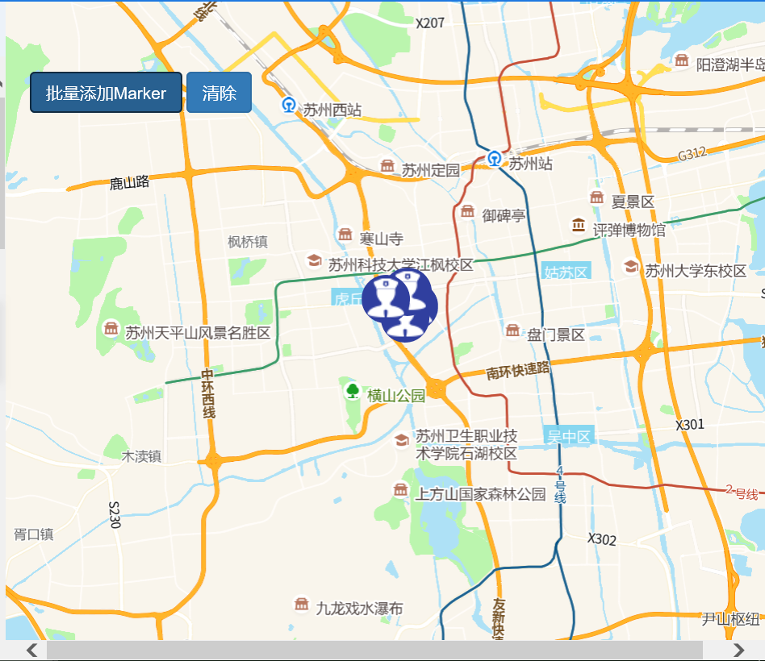
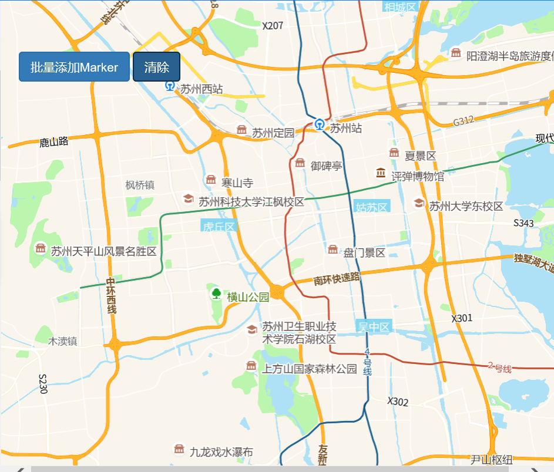

# 清除操作

> 批量添加/清除 Marker 







## 运行代码：

```
<!DOCTYPE html>
<html lang="en">

<head>
    <meta charset="UTF-8">
    <title>清除操作</title>
    <link rel="stylesheet" href="/kmapdemo/css/bootstrap.min.css">
    <link rel="stylesheet" href="/kmapdemo/css/main.css">
    <script src='/kmapdemo/js/jquery-2.2.3.min.js'></script>
    <script src="/kmapdemo/js/bootstrap.min.js"></script>
    <style>
        html,
        body {
            margin: 0;
            padding: 0;
        }

        html,
        body,
        #map {
            width: 100%;
            height: 100%;
        }
    </style>
</head>

<body>
    <div class="ceng">
        <button class="btn btn-primary" id="add_markers">批量添加Marker</button>
        <button id="clear" class="btn btn-primary">清除</button>
    </div>
    <div id="map"></div>
    <script src="/kmapdemo/kmap/kmap-service-main-v1.6.7.js"></script>
    <script>
        window.onload = function() {
            var kmap;
            var onLoadMap = function() {
                //这里运行地图加载之后的方法
                //清除
                var clear = document.getElementById('clear');
                clear.onclick = function() {
                    kmap.clear();
                }
                //添加marker
                document.getElementById('add_markers').addEventListener('click', function() {
                    var points = [{
                            point: [120.58 + Math.random() * 0.01, 31.29 + Math.random() * 0.01],
                            name: '警察1',
                            id: 'm01'
                        },
                        {
                            point: [120.58 + Math.random() * 0.01, 31.29 + Math.random() * 0.01],
                            name: '警察2',
                            id: 'm02'
                        },
                        {
                            point: [120.58 + Math.random() * 0.01, 31.29 + Math.random() * 0.01],
                            name: '警察3',
                            id: 'm03'
                        },
                        {
                            point: [120.58 + Math.random() * 0.01, 31.29 + Math.random() * 0.01],
                            name: '警察4',
                            id: 'm04'
                        },
                        {
                            point: [120.58 + Math.random() * 0.01, 31.29 + Math.random() * 0.01],
                            name: '警察5',
                            id: 'm05'
                        }
                    ];
                    var url = '/kmapdemo/images/police.png';
                    kmap.addMarkers({
                        data: points,
                        url: url,
                        ended: function(markerType) {
                            // console.log(markerType);
                        }
                    })
                })
            };
            //调用科达地图API接口的配置项
            var config = {
                configUrl: '/kmapdemo/kmap/config.json',
                containerId: 'map',
                mapType: 3,
                zoom: 11,
                onLoadMap: onLoadMap //配置回调方法，用来处理业务
            };


            // export{
            //     config
            // }
            kmap = new KMap(config);
        }
    </script>
</body>

</html>
```

