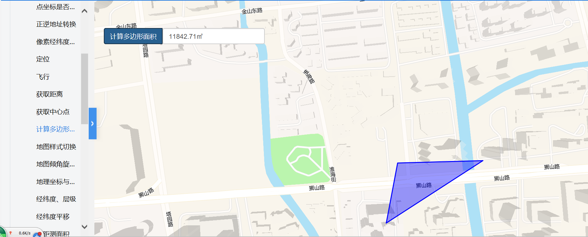

# 计算多边形面积

> 可根据画出的多边形自动给出其面积





## 运行代码：

```
<!DOCTYPE html>
<html lang="en">

<head>
    <meta charset="UTF-8">
    <title>计算多边形面积</title>
    <link rel="stylesheet" href="/kmapdemo/css/bootstrap.min.css">
    <link rel="stylesheet" href="/kmapdemo/css/main.css">
    <script src='/kmapdemo/js/jquery-2.2.3.min.js'></script>
    <script src="/kmapdemo/js/bootstrap.min.js"></script>
    <style>
        html,
        body {
            margin: 0;
            padding: 0;
        }

        html,
        body,
        #map {
            width: 100%;
            height: 100%;
        }
    </style>
</head>

<body>
    <div class="btn-group opp-area-btn" style='width:360px;left:20px'>
        <button class="btn btn-primary" id="compute_area" style="float: left;">计算多边形面积</button>
        <input type="text" id="total_area" class="form-control" style="float: left;width: 60%;" placeholder="面积">
    </div>
    <div id="map"></div>
    <script src="/kmapdemo/kmap/kmap-service-main-v1.6.7.js"></script>
    <script>
        window.onload = function() {
            var kmap;
            var onLoadMap = function() {
                //这里运行地图加载之后的方法

                //just for arcgis
                // if (kmap.mapType === 'AG') {
                //     kmap.addLayer({
                //         layerId: 'suzhou',
                //         url: 'http://172.16.235.68:6080/arcgis/rest/services/suzhouBaseMap/MapServer',
                //         type: 'dynamic'
                //     });
                // }

                var total_area = document.getElementById('total_area');
                var data = {
                    'type': 'FeatureCollection',
                    'features': [{
                        'type': 'Feature',
                        'geometry': {
                            'type': 'Polygon',
                            'coordinates': [
                                [
                                    [120.56310172948486, 31.293982802065415],
                                    [120.56503291996796, 31.294028641723756],
                                    [120.5628442374113, 31.292818467248154],
                                    [120.56310172948486, 31.293982802065415]
                                ]
                            ]
                        },
                        'properties': {
                            'id': 'bec7ebb89ec416c008b8f792e28ce7f1',
                            'color': 'blue'
                        }
                    }]
                };
                const handler = function(evt) {
                    console.log('click', evt);
                }
                kmap.addGeometryLayer({
                    sourceId: 'drawId',
                    data: data,
                    layerId: 'graphicals',
                    isSetColor: true
                });
                document.getElementById('compute_area').addEventListener('click', function() {
                    kmap.getAreaOfPolygon({
                        polygon: data.features[0].geometry.coordinates[0],
                        units: 'meters',
                        callback: function(res) {
                            total_area.value = res.data + '㎡';
                        }
                    });

                    // kmap.addEventOnLayerObject({
                    //     layerId: 'graphicals',
                    //     event: 'click',
                    //     handler: handler
                    // })
                });

                // document.getElementById('removeEvent').addEventListener('click', function () {
                //     kmap.removeEventOnLayerObject({
                //         layerId: 'graphicals',
                //         event: 'click'
                //     });
                // });
            };
            //调用科达地图API接口的配置项
            var config = {
                configUrl: '/kmapdemo/kmap/config.json',
                containerId: 'map',
                center: [120.56183, 31.29484],
                mapType: 3,
                zoom: 16,
                onLoadMap: onLoadMap //配置回调方法，用来处理业务
            };


            kmap = new KMap(config);
        }
    </script>
</body>

</html>
```

