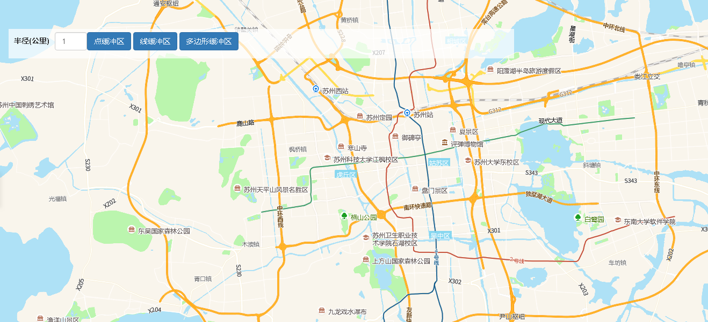

# 计算缓冲区

> 获得区域内的设备信息





## 运行代码：

```
<!DOCTYPE html>
<html lang="en">

<head>
    <meta charset="UTF-8">
    <title>计算缓冲区</title>
    <link rel="stylesheet" href="/kmapdemo/css/bootstrap.min.css">
    <link rel="stylesheet" href="/kmapdemo/css/main.css">
    <script src='/kmapdemo/js/jquery-2.2.3.min.js'></script>
    <script src="/kmapdemo/js/bootstrap.min.js"></script>
    <style>
        html,
        body {
            margin: 0;
            padding: 0;
        }

        html,
        body,
        #map {
            width: 100%;
            height: 100%;
        }
    </style>
</head>

<body>
    <div class="opp-area-btn inner" style="width: 90%">
        <div class="form-inline">
            <div class="form-group" style="float: left;">
                <label style="margin-top: 5px;">半径(公里)</label>
                <input type="number" class="form-control" style="width: 60px; margin-top: 6px" id="radius" placeholder="半径" value="1">
            </div>
            <div style="float: left;padding-top: 6px">
                <button class="btn btn-primary" id="pointToBuffer">点缓冲区</button>
                <button class="btn btn-primary" id="lineToBuffer">线缓冲区</button>
                <button class="btn btn-primary" id="polygonToBuffer">多边形缓冲区</button>
            </div>

        </div>
    </div>
    <div id="map"></div>
    <script src="/kmapdemo/kmap/kmap-service-main-v1.6.7.js"></script>
    <script>
        window.onload = function() {
            var kmap;
            var onLoadMap = function() {

                document.getElementById('pointToBuffer').addEventListener('click', function() {
                    draw('point');
                });

                document.getElementById('lineToBuffer').addEventListener('click', function() {
                    draw('line');
                });

                document.getElementById('polygonToBuffer').addEventListener('click', function() {
                    draw('polygon');
                });

                function draw(type) {

                    var radius = document.getElementById('radius').value;

                    if (!radius || radius <= 0) {
                        alert('半径必须大于0');
                        return;
                    }

                    // 清除现有的几何图形图层
                    kmap.removeAllGeometries();

                    // 绘制几何图形
                    switch (type) {
                        case 'point':
                            kmap.drawPoint({
                                callback: finishDraw
                            });
                            break;
                        case 'line':
                            kmap.drawLine({
                                callback: finishDraw
                            });
                            break;
                        case 'polygon':
                            kmap.drawPolygon({
                                callback: finishDraw
                            });
                            break;
                        default:
                            break;
                    }

                }

                function finishDraw(res) {

                    var geometryId = res.data.id;
                    var coordinates = res.data.coordinates;
                    var type = res.data.type;

                    switch (type) {
                        case 'Point':
                            kmap.pointToBuffer({
                                point: coordinates,
                                radius: parseInt(document.getElementById('radius').value),
                                callback: function(result) {
                                    addBufferGeometry(result, geometryId);
                                }
                            });
                            break;
                        case 'LineString':
                            kmap.lineToBuffer({
                                polyline: coordinates,
                                radius: parseInt(document.getElementById('radius').value),
                                callback: function(result) {
                                    addBufferGeometry(result, geometryId);
                                }
                            });
                            break;
                        case 'Polygon':
                            kmap.polygonToBuffer({
                                polygon: coordinates[0],
                                radius: parseInt(document.getElementById('radius').value),
                                callback: function(result) {
                                    addBufferGeometry(result, geometryId);
                                }
                            });
                            break;
                        default:
                            break;
                    }

                }

                function addBufferGeometry(res, geometryId) {
                    kmap.updatePolygonToEdit({
                        type: 'polygon',
                        coordinates: res.data.geometry.coordinates,
                        ended: function() {
                            kmap.removeGeometryById({
                                id: geometryId
                            });
                        }
                    });
                }


                // //这里运行地图加载之后的方法
                // var points = null;
                // var lineId = null;
                // document.getElementById('lineToBuffer').addEventListener('click', function () {
                //     kmap.removeAllGeometries();
                //     kmap.drawLine({
                //         callback: function (res) {
                //             points = res.data.coordinates;
                //             lineId = res.data.id;
                //             kmap.lineToBuffer({
                //                 polyline: points,
                //                 radius: 0.5,
                //                 callback: function (res) {
                //                     console.log(res);
                //                     // 画出来
                //                     kmap.updatePolygonToEdit({
                //                         type: 'polygon',
                //                         coordinates: res.data.geometry.coordinates,
                //                         ended: function () {
                //                             kmap.removeGeometryById({
                //                                 id: lineId
                //                             });
                //                         }
                //                     });
                //                 }
                //             });
                //         }
                //     });
                // });
            };
            //调用科达地图API接口的配置项
            var config = {
                configUrl: '/kmapdemo/kmap/config.json',
                containerId: 'map',
                mapType: 3,
                zoom: 11,
                onLoadMap: onLoadMap //配置回调方法，用来处理业务
            };


            kmap = new KMap(config);
        }
    </script>
</body>

</html>
```

