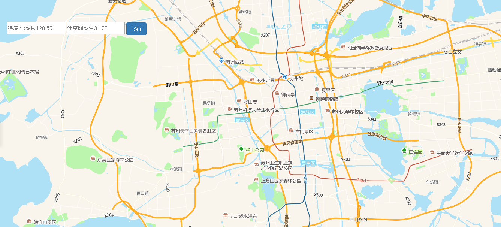

# 计算缓冲区

> 确认后视图从当前位置平移到输入位置





## 运行代码：

```
<!DOCTYPE html>
<html lang="en">

<head>
    <meta charset="UTF-8">
    <title>飞行</title>
    <link rel="stylesheet" href="/kmapdemo/css/bootstrap.min.css">
    <link rel="stylesheet" href="/kmapdemo/css/main.css">
    <script src='/kmapdemo/js/jquery-2.2.3.min.js'></script>
    <script src="/kmapdemo/js/bootstrap.min.js"></script>
    <style>
        html,
        body {
            margin: 0;
            padding: 0;
        }

        html,
        body,
        #map {
            width: 100%;
            height: 100%;
        }
    </style>
</head>

<body>

    <div class="ceng">
        <input type="text" placeholder="经度lng默认120.59" id="lng" style="height: 34px;">
        <input type="text" placeholder="纬度lat默认31.28" id="lat" style="height: 34px;">
        <button id="flyto" class="btn btn-primary" style=''>飞行</button>
    </div>
    <div id="map"></div>
    <script src="/kmapdemo/kmap/kmap-service-main-v1.6.7.js"></script>
    <script>
        window.onload = function() {
            var kmap;
            var onLoadMap = function() {
                //这里运行地图加载之后的方法
                var fly = document.getElementById('flyto');
                fly.addEventListener('click', function() {
                    var lng = document.getElementById('lng').value || 120.59;
                    var lat = document.getElementById('lat').value || 31.28;
                    if (checkNumber([lng, lat])) {
                        kmap.flyTo({
                            point: [parseFloat(lng), parseFloat(lat)],
                            ended: null
                        });
                    } else {
                        alert('请输入正确的坐标格式！');
                    }
                });

                function checkNumber(arr) {
                    for (let i = 0; i < arr.length; i++) {
                        if (isNaN(arr[i])) {
                            return false;
                        }
                    }
                    return true;
                }
            };
            //调用科达地图API接口的配置项
            var config = {
                configUrl: '/kmapdemo/kmap/config.json',
                containerId: 'map',
                mapType: 3,
                onLoadMap: onLoadMap //配置回调方法，用来处理业务
            };

            kmap = new KMap(config);
        }
    </script>
</body>

</html>
```

