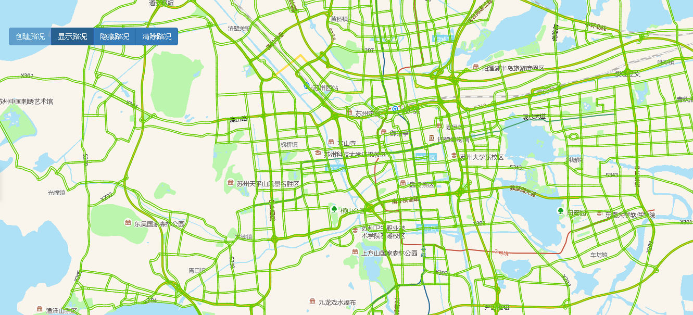

# 实时路况拥堵情况

> 创建/显示/隐藏/清除路况信息




## 运行代码：
```
<!DOCTYPE html>
<html lang="en">

<head>
    <meta charset="UTF-8">
    <title>实时路况拥堵情况</title>
    <link rel="stylesheet" href="/kmapdemo/css/bootstrap.min.css">
    <link rel="stylesheet" href="/kmapdemo/css/main.css">
    <script src='/kmapdemo/js/jquery-2.2.3.min.js'></script>
    <script src="/kmapdemo/js/bootstrap.min.js"></script>
    <style>
        html,
        body {
            margin: 0;
            padding: 0;
        }

        html,
        body,
        #map {
            width: 100%;
            height: 100%;
        }
    </style>
</head>

<body>
    <div class="btn-group opp-area-btn">
        <button class="btn btn-primary" id="create_monitor">创建路况</button>
        <button class="btn btn-primary" id="show_monitor">显示路况</button>
        <button class="btn btn-primary" id="hide_monitor">隐藏路况</button>
        <button class="btn btn-primary" id="destory_monitor">清除路况</button>
    </div>
    <div id="map"></div>

    <script src="/kmapdemo/kmap/kmap-service-main-v1.6.7.js"></script>
    <script>
        window.onload = function() {
            var kmap;
            var onLoadMap = function() {
                //这里运行地图加载之后的方法
                document.getElementById('create_monitor').addEventListener('click', function() {
                    kmap.createRealtimeRouteMonitor({
                        isFetch: true,
                        sourceId: 'myTraffic',
                        maxZoom: 19,
                        minZoom: 9,
                    });
                    document.getElementById('create_monitor').setAttribute('disabled', true);
                });

                document.getElementById('show_monitor').addEventListener('click', function() {
                    kmap.showRealtimeRouteMonitor();
                });

                document.getElementById('hide_monitor').addEventListener('click', function() {
                    kmap.hideRealtimeRouteMonitor();
                });

                document.getElementById('destory_monitor').addEventListener('click', function() {
                    kmap.clearRealtimeRouteMonitor();
                    document.getElementById('create_monitor').removeAttribute('disabled');
                });
            };
            //调用科达地图API接口的配置项
            var config = {
                configUrl: '/kmapdemo/kmap/config.json',
                containerId: 'map',
                onLoadMap: onLoadMap //配置回调方法，用来处理业务
            };


            kmap = new KMap(config);
        }
    </script>
</body>

</html>
```

