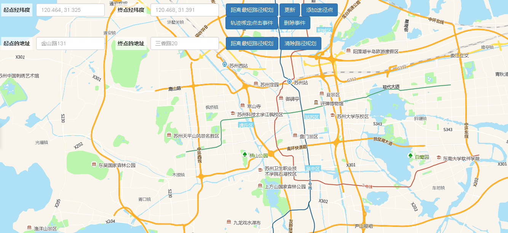

# 最短路径规划

> 通过起始经纬度和终点经纬度查询最短路径，可给轨迹绑定点击事件或删除事件





## 运行代码：

```
<!DOCTYPE html>
<html lang="en">

<head>
    <meta charset="UTF-8">
    <title>最短路径规划</title>
    <link rel="stylesheet" href="/kmapdemo/css/bootstrap.min.css">
    <link rel="stylesheet" href="/kmapdemo/css/main.css">
    <script src='/kmapdemo/js/jquery-2.2.3.min.js'></script>
    <script src="/kmapdemo/js/bootstrap.min.js"></script>
    <style>
        html,
        body {
            margin: 0;
            padding: 0;
        }

        html,
        body,
        #map {
            width: 100%;
            height: 100%;
        }
    </style>
</head>

<body>
    <style>
        #roadPlanCard {
            width: 300px;
            background-color: white;
            position: fixed;
            right: 20px;
            z-index: 900;
        }

        #roadPlanCard .panel-body {
            height: 300px;
            overflow-x: hidden;
            overflow-y: auto;
            padding: 5px;
        }

        ul li {
            list-style: none;
        }

        @media screen and (min-width: 1440px) {
            .long-buttons {
                width: 530px !important;
            }
        }
    </style>
    <div id="min-dis-plan-container" style="height:0">
        <div class="btn-group opp-area-btn row " style="width: 100%; position: relative;margin-top:0px;top:10px;left:10px;">
            <div style="width: 300px;float: left;">
                <label for="startPoint" class="text-right" style="margin:0 10px;padding-top: 0">起点经纬度</label>
                <input type="text" id="startPoint" class="form-control " style="width: 180px;float: left;" placeholder="120.464, 31.325">
            </div>
            <div style="width: 300px;float: left;">
                <label class="text-right" for="endPoint" style="margin:0 10px;padding-top: 0">终点经纬度</label>
                <input type="text" id="endPoint" class="form-control " style="width: 180px;float: left;" placeholder="120.468, 31.391">

            </div>
            <div style="width: 300px;float: left;" class="long-buttons">
                <button class="btn btn-primary " id="min_dis_plan">距离最短路径规划</button>
                <button class="btn btn-primary " id="min_dis_update">更新</button>
                <button class="btn btn-primary " id="addWayToPoint">添加途径点</button>
                <button class="btn btn-primary " id="addEvent">轨迹绑定点击事件</button>
                <button class="btn btn-primary " id="removeEvent">删除事件</button>
            </div>
        </div>
        <div class="btn-group opp-area-btn row " style="width: 100%; position: relative;margin-top:20px;top:10px;left:10px;">
            <div style="width: 300px;float: left;">
                <label class="text-right" for="startName" style="margin:0 10px;padding-top: 0">起点的地址</label>
                <input type="text" id="startName" class="form-control " style="width: 180px;float: left;" placeholder="金山路131">
            </div>
            <div style="width: 300px;float: left;">
                <label class="text-right" for="endName" style="margin:0 10px;padding-top: 0">终点的地址</label>
                <input type="text" id="endName" class="form-control " style="width: 180px;float: left;" placeholder="三香路20">
            </div>
            <div style="width: 270px;float: left;">
                <button class="btn btn-primary " id="min_dis_plan2">距离最短路径规划</button>
                <button class="btn btn-primary " id="clear_dis_plan">清除路径规划</button>
            </div>
        </div>
    </div>

    <div id="map"></div>
    <script src="/kmapdemo/kmap/kmap-service-main-v1.6.7.js"></script>
    <script>
        window.onload = function() {
            var kmap;
            var onLoadMap = function() {
                //这里运行地图加载之后的方法
                // console.log('运行 onLoadMap 方法');
                var min_dis_route;
                // 根据起始点经纬度最短距离路径规划
                document.getElementById('min_dis_plan').addEventListener('click', function() {
                    var startPoint = document.getElementById('startPoint').value;
                    var endPoint = document.getElementById('endPoint').value;
                    if (startPoint) {
                        startPoint = startPoint.split(',');
                    } else {
                        startPoint = [120.464, 31.325];
                    }
                    if (endPoint) {
                        endPoint = endPoint.split(',');
                    } else {
                        endPoint = [120.468, 31.391];
                    }
                    // 验证点坐标是否合法
                    if (startPoint.length !== 2 || endPoint.length !== 2) {
                        console.log('输入不合法');
                        return;
                    }
                    let sPoint = [];
                    let ePoint = [];
                    let sLng = parseFloat(startPoint[0]);
                    let sLat = parseFloat(startPoint[1]);
                    let eLng = parseFloat(endPoint[0]);
                    let eLat = parseFloat(endPoint[1]);
                    if (isNaN(sLng) || isNaN(sLat) || isNaN(eLng) || isNaN(eLat)) {
                        this.log('输入不合法');
                        return;
                    }
                    sPoint = [sLng, sLat];
                    ePoint = [eLng, eLat];
                    minDisPlan(sPoint, ePoint);
                });
                //根据起始点地址最短距离路径规划
                document.getElementById('min_dis_plan2').addEventListener('click', function() {
                    var startName = document.getElementById('startName').value || '金山路131';
                    var endName = document.getElementById('endName').value || '三香路20';
                    getPoint(startName, startback);
                    var startPoint, endPoint;

                    function startback(start) {
                        startPoint = start;
                        getPoint(endName, endback);
                    }

                    function endback(end) {
                        endPoint = end;
                        minDisPlan(startPoint, endPoint);
                    }
                });

                // 最短路径规划
                function minDisPlan(startPoint, endPoint) {
                    if (min_dis_route) {
                        kmap.removeRoutePlanning({
                            id: min_dis_route
                        });
                        min_dis_route = null;
                    }
                    kmap.createMinDistanceRoutePlanning({
                        startPoint: startPoint,
                        endPoint: endPoint,
                        lineColor: 'blue',
                        offset: [-11, -32],
                        lineStyle: 3,
                        // lineWidth: 10,
                        updateHandler: renderRoadPlanCard,
                        ended: function(res) {
                            min_dis_route = res.data;
                            kmap.moveTolnglat({
                                type: 2,
                                zoom: 11,
                                point: startPoint
                            });
                        }
                    });
                }
                document.getElementById('min_dis_update').addEventListener('click', function() {
                    kmap.resetRoutePlanning({
                        id: min_dis_route,
                        lineColor: 'red',
                        startPoint: [120.364, 31.325],
                        endPoint: [120.368, 31.391]
                    });
                });
                document.getElementById('addWayToPoint').addEventListener('click', function() {
                    kmap.addWayPoint({
                        id: min_dis_route,
                        point: [120.364, 31.325]
                    });
                });
                document.getElementById('addEvent').addEventListener('click', function() {
                    kmap.addEventOnRoutePlanning({
                        id: min_dis_route,
                        eventType: 'click',
                        handler: function(e) {
                            alert('结果请按F12在开发者工具中查看');
                            console.log('点击事件回调:', e);
                        }
                    });
                    document.getElementById('addEvent').setAttribute('disabled', true);
                });
                document.getElementById('removeEvent').addEventListener('click', function() {
                    kmap.removeEventOnRoutePlanning({
                        id: min_dis_route,
                        eventType: 'click'
                    });
                    document.getElementById('addEvent').removeAttribute('disabled');
                });
                // 清除路径规划
                document.getElementById('clear_dis_plan').addEventListener('click', function() {
                    if (min_dis_route) {
                        kmap.removeRoutePlanning({
                            id: min_dis_route
                        });
                        min_dis_route = null;
                        document.getElementById('roadPlanCard').remove();
                    }
                    document.getElementById('addEvent').removeAttribute('disabled');
                })

                function getPoint(address, back) {
                    kmap.getGeoPoint({
                        keyword: address,
                        callback: function(res) {
                            if (res.status === 10) {
                                var point = res.data;
                                back(point);
                            }
                        }
                    });
                }

                // 渲染路径规划面板
                function renderRoadPlanCard(data) {
                    var roadPlanCard = document.getElementById('roadPlanCard');
                    var top = document.getElementsByClassName('opp-area-btn')[0].offsetTop;
                    var panelHeader, panelBody;
                    if (!roadPlanCard) {
                        // 设置容器
                        roadPlanCard = document.createElement('div');
                        roadPlanCard.id = 'roadPlanCard';
                        roadPlanCard.className = 'panel panel-default';
                        // 设置 panel-header
                        panelHeader = document.createElement('div');
                        panelHeader.className = 'panel-heading';
                        panelHeader.id = 'roadPlanPanelHead';
                        panelHeader.innerHTML = '路径规划面板';
                        // 设置 panel-body
                        panelBody = document.createElement('div');
                        panelBody.className = 'panel-body';
                        panelBody.id = 'roadPlanPanelBody';
                        // 添加到 body
                        roadPlanCard.appendChild(panelHeader);
                        roadPlanCard.appendChild(panelBody);
                        let root = document.getElementById('map_main_area');
                        if (!root) {
                            root = document.getElementById('min-dis-plan-container');
                        }
                        root.appendChild(roadPlanCard);
                    }
                    roadPlanCard.style.top = `${top + 60}px `;
                    panelBody = panelBody ? panelBody : document.getElementById('roadPlanPanelBody');
                    var ul = document.createElement('ul');
                    ul.className = 'list-group';
                    for (var i = 0, len = data.item.length; i < len; i++) {
                        (function(i) {
                            var li = document.createElement('li');
                            li.className = 'list-group-item';
                            li.innerHTML = i + 1 + ': ' + data.item[i].strguide;
                            ul.appendChild(li);
                        })(i);
                    }
                    panelBody.innerHTML = '';
                    panelBody.appendChild(ul);
                }
            };
            //调用科达地图API接口的配置项
            var config = {
                configUrl: '/kmapdemo/kmap/config.json',
                containerId: 'map',
                mapType: 3,
                onLoadMap: onLoadMap //配置回调方法，用来处理业务
            };

            kmap = new KMap(config);
        }
    </script>
</body>

</html>
```

