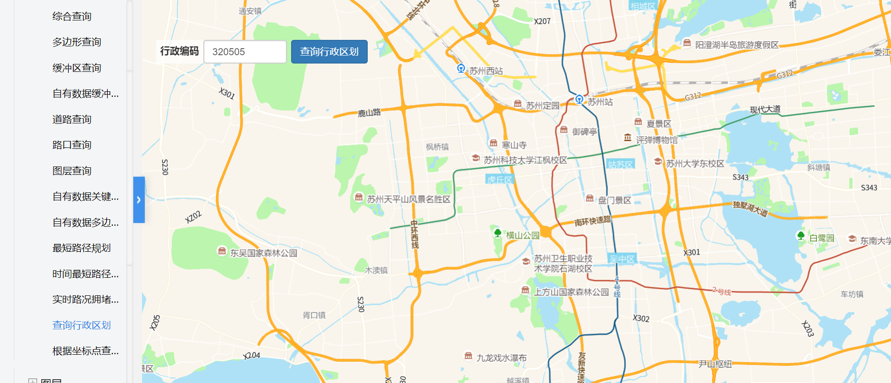

# 查询行政区划

> 输入行政编码查询行政区划




## 运行代码：

```
<!DOCTYPE html>
<html lang="en">

<head>
    <meta charset="UTF-8">
    <title>查询行政区划</title>
    <link rel="stylesheet" href="/kmapdemo/css/bootstrap.min.css">
    <link rel="stylesheet" href="/kmapdemo/css/main.css">
    <script src='/kmapdemo/js/jquery-2.2.3.min.js'></script>
    <script src="/kmapdemo/js/bootstrap.min.js"></script>
    <style>
        html,
        body {
            margin: 0;
            padding: 0;
        }

        html,
        body,
        #map {
            width: 100%;
            height: 100%;
        }
    </style>
</head>

<body>
    <div class="ceng" style="width: 60%;">
        <div style="float: left;">
            <input type="number" id="admin_code" class="form-control" style="width: 120px;float: right;" value="320505" />
            <label for="admin_code" class="text-right">行政编码</label>

        </div>
        <div class="btn-group" style="float: left;margin-left: 6px">
            <button type="button" class="btn btn-primary" id="getGeometryByCode">查询行政区划</button>
        </div>
    </div>
    <div id="map"></div>

    <script src="/kmapdemo/kmap/kmap-service-main-v1.6.7.js"></script>
    <script>
        window.onload = function() {
            var kmap;
            let layerId = null;
            var onLoadMap = function() {
                document.getElementById('getGeometryByCode').addEventListener('click', function() {
                    let code = document.getElementById('admin_code').value;
                    if (!code) {
                        alert('必须输入行政编码');
                        return;
                    }
                    if (layerId) {
                        kmap.removeLayer({
                            layerId: layerId
                        });
                    }
                    kmap.getGeometryByAdminCode({
                        code: code,
                        toWgs84: true,
                        callback: function(res) {
                            // 移动地图 data.features[0].geometry.coordinates[0]
                            kmap.panTo({
                                point: res.data.features[0].geometry.coordinates[0][0][0]
                            });
                            // 根据查询到的数据添加几何图层
                            kmap.addGeometryLayer({
                                layerId: 'geometryLayer',
                                sourceId: 'geometryLayer',
                                data: res.data,
                                ended: function(res) {
                                    layerId = res.data;
                                }
                            });
                        }
                    });
                });
            };

            var config = {
                configUrl: '/kmapdemo/kmap/config.json',
                containerId: 'map',
                mapType: 3,
                onLoadMap: onLoadMap //配置回调方法，用来处理业务
            };


            kmap = new KMap(config);
        }
    </script>
</body>

</html>
```

