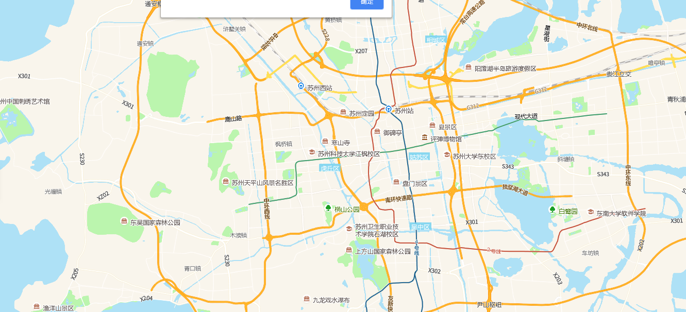

# 根据坐标点查询行政区（全国）

> 根据坐标点查询行政区域




## 运行代码：
```
<!DOCTYPE html>
<html lang="en">

<head>
    <meta charset="UTF-8">
    <title>根据坐标点查询行政区（全国）</title>
    <link rel="stylesheet" href="/kmapdemo/css/bootstrap.min.css">
    <link rel="stylesheet" href="/kmapdemo/css/main.css">
    <script src='/kmapdemo/js/jquery-2.2.3.min.js'></script>
    <script src="/kmapdemo/js/bootstrap.min.js"></script>
    <style>
        html,
        body {
            margin: 0;
            padding: 0;
        }

        html,
        body,
        #map {
            width: 100%;
            height: 100%;
        }
    </style>
</head>

<body>
    <div id="map"></div>
    <script src="/kmapdemo/kmap/kmap-service-main-v1.6.7.js"></script>
    <script>
        window.onload = function() {
            var kmap;
            let layerId = null;
            var onLoadMap = function() {
                kmap.addEventOnMap({
                    event: 'click',
                    handler: function(e) {
                        if (layerId) {
                            kmap.removeLayer({
                                layerId: layerId
                            });
                        }
                        kmap.getAdminInfoByPoint({
                            point: [e.lngLat.lng, e.lngLat.lat],
                            callback: function(res) {
                                console.log(res);
                                if (res.status === 10) {
                                    var result = res.data.result;
                                    alert("当前行政区是：" + result.provinceName + '|' + result.cityName + '|' + result.nameZh);
                                    // 根据查询到的数据添加几何图层
                                    kmap.addGeometryLayer({
                                        layerId: 'geometryLayer',
                                        sourceId: 'geometryLayer',
                                        data: result.geometry,
                                        ended: function(res) {
                                            layerId = res.data;
                                        }
                                    });
                                }
                            }
                        })
                    }
                });
            }

            //调用科达地图API接口的配置项
            var config = {
                configUrl: '/kmapdemo/kmap/config.json',
                containerId: 'map',
                onLoadMap: onLoadMap
            };


            kmap = new KMap(config);
        }
    </script>
</body>

</html>
```

