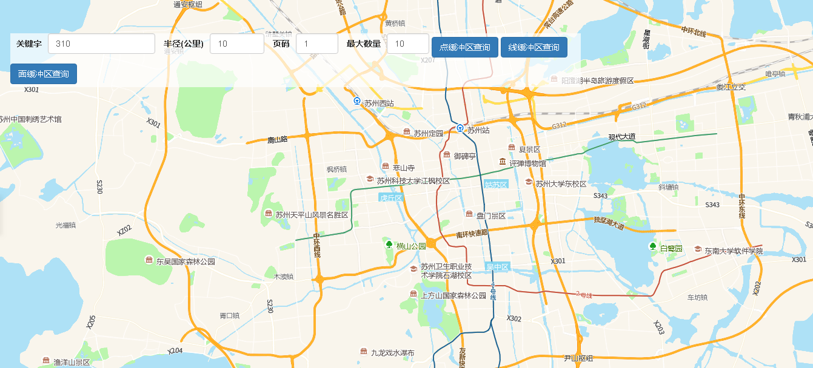

# 自有数据缓冲区查询

> 查询指定形状的自有数据





## 运行代码：

```
<!DOCTYPE html>
<html lang="en">

<head>
    <meta charset="UTF-8">
    <title>自有数据缓冲区查询</title>
    <link rel="stylesheet" href="/kmapdemo/css/bootstrap.min.css">
    <link rel="stylesheet" href="/kmapdemo/css/main.css">
    <script src='/kmapdemo/js/jquery-2.2.3.min.js'></script>
    <script src="/kmapdemo/js/bootstrap.min.js"></script>
    <style>
        html,
        body {
            margin: 0;
            padding: 0;
        }

        html,
        body,
        #map {
            width: 100%;
            height: 100%;
        }
    </style>
</head>

<body>
    <div class="opp-area-btn inner">
        <div class="form-inline">
            <div class="form-group">
                <label>关键字</label>
                <input type="text" class="form-control" id="keyword" placeholder="关键字" value="310">
            </div>
            <div class="form-group">
                <label>半径(公里)</label>
                <input type="number" class="form-control" style="width: 90px;" id="radius" placeholder="半径(公里)" value="10">
            </div>
            <div class="form-group">
                <label>页码</label>
                <input type="number" class="form-control" style="width: 70px;" id="pageNumber" placeholder="页码" value="1">
            </div>
            <div class="form-group">
                <label>最大数量</label>
                <input type="number" class="form-control" style="width: 70px;" id="maxCount" placeholder="最大数量" value="10">
            </div>
            <button class="btn btn-primary" id="point_search">点缓冲区查询</button>
            <button class="btn btn-primary" id="line_search">线缓冲区查询</button>
            <button class="btn btn-primary" id="polygon_search">面缓冲区查询</button>
        </div>
    </div>
    <div id="map"></div>
    <div class="res-box">
        <ul id="resCon"></ul>
    </div>

    <script src="/kmapdemo/kmap/kmap-service-main-v1.6.7.js"></script>
    <script>
        window.onload = function() {
            var kmap;


            var onLoadMap = function() {
                bindPageEvents();
            };
            //调用科达地图API接口的配置项
            var config = {
                configUrl: '/kmapdemo/kmap/config.json',
                containerId: 'map',
                mapType: 3,
                onLoadMap: onLoadMap // 配置回调方法，用来处理业务
            };
            var resultData = null;

            function bindPageEvents() {
                // 点缓冲区查询
                document.getElementById('point_search').addEventListener('click', function() {
                    doSearch('point');
                });
                // 线缓冲区查询
                document.getElementById('line_search').addEventListener('click', function() {
                    doSearch('line');
                });
                // 多边形缓冲区查询
                document.getElementById('polygon_search').addEventListener('click', function() {
                    doSearch('polygon');
                });
            }

            function renderResult(res) {

                var resBox = document.getElementsByClassName('res-box')[0];
                resBox.style.display = 'block';
                var top = document.getElementsByClassName('form-inline')[0].offsetTop;
                resBox.style.top = `${top + 60}px `;
                if (res.status !== 10 || res.data === null) {
                    resBox.innerHTML = `
          <ul>
              <li class="res-error">查询失败</li>
          </ul>
      `;
                    return;
                }

                resultData = res.data;

                alert(JSON.stringify(resultData));

                if (resultData === null || resultData.length === 0) {
                    resBox.innerHTML = `
          <ul>
              <li class="res-error">查询无结果</li>
          </ul>
      `;
                    return;
                }

                var ulElement = document.createElement('ul');
                var overlayParams = [];

                for (var i = 0, len = resultData.length; i < len; i++) {

                    (function(i) {

                        var liElement = document.createElement('li');
                        var overlayElement = document.createElement('div');
                        var index = i + 1;

                        liElement.innerHTML = `
              <a class="res-list">
                  <div class="res-icon">${index}</div>
                  <div class="res-con">
                      <div class="res-title">dataId: ${resultData[i].dataId ? resultData[i].dataId : '未知'}</div>
                      <div class="res-address">status: ${resultData[i].status ? resultData[i].status : '未知'}</div>
                  </div>
              </a>
          `;

                        overlayElement.setAttribute('class', 'res-icon');
                        overlayElement.innerHTML = index;

                        overlayParams.push({
                            point: resultData[i].location.coordinates,
                            element: overlayElement,
                            offset: [0, 0]
                        });

                        liElement.addEventListener('click', function() {
                            toDes(resultData[i]);
                        }, false);

                        ulElement.appendChild(liElement);

                    })(i);
                }

                ulElement.id = 'resCon';

                resBox.innerHTML = '';

                resBox.appendChild(ulElement);

                kmap.addCustomOverlays({
                    data: overlayParams,
                    offset: [-11, -32],
                    customOverlaysType: 'customType'
                });

                kmap.moveTolnglat({
                    type: 2,
                    point: resultData[0].location.coordinates
                });
            }

            function toDes(item) {
                kmap.moveTolnglat({
                    type: 2,
                    point: item.location.coordinates
                });
            }

            function doSearch(type) {

                kmap.removeLayer({
                    layerId: 'original-layer'
                });

                kmap.removeLayer({
                    layerId: 'buffer-layer'
                });

                kmap.removeCustomOverlaysByType({
                    customOverlaysType: 'customType'
                });

                var keyword = document.getElementById('keyword').value;
                var radius = document.getElementById('radius').value;
                var pageNumber = document.getElementById('pageNumber').value;
                var maxCount = document.getElementById('maxCount').value;

                if (!pageNumber || pageNumber <= 0) {
                    alert('请输入页码');
                    return;
                }

                if (!maxCount || maxCount <= 0) {
                    alert('请输入最大数量');
                    return;
                }

                var n_pageNumber = parseInt(pageNumber);
                var n_maxCount = parseInt(maxCount);

                if (isNaN(n_pageNumber) || isNaN(n_maxCount)) {
                    alert('页码或最大数量输入不合法');
                    return;
                }

                var params = {
                    serviceId: '67',
                    radius: parseInt(radius),
                    terms: [{
                        column: 'dataId',
                        value: keyword,
                        termType: 'like',
                    }],
                    pageNo: n_pageNumber,
                    maxCount: n_maxCount,
                    callback: renderResult
                };

                switch (type) {
                    case 'point':
                        kmap.drawPoint({
                            callback: function(res) {
                                params.point = res.data && res.data.coordinates;
                                // 计算缓冲区几何图形
                                kmap.pointToBuffer({
                                    point: params.point,
                                    radius: parseInt(params.radius),
                                    callback: function(res) {
                                        kmap.addGeometryLayer({
                                            layerId: 'buffer-layer',
                                            sourceId: 'buffer-source',
                                            data: res.data
                                        });
                                    }
                                });
                                // 添加原始几何图层
                                kmap.addGeometryLayer({
                                    layerId: 'original-layer',
                                    sourceId: 'original-source',
                                    data: {
                                        'type': 'FeatureCollection',
                                        'features': [{
                                            'type': 'Feature',
                                            'geometry': {
                                                'type': 'Point',
                                                'coordinates': res.data.coordinates
                                            },
                                            "properties": {}
                                        }]
                                    }
                                });
                                // 删除绘制的几何图形
                                kmap.removeAllGeometries();
                                kmap.queryCustomPointBuffer(params);
                            }
                        });
                        break;
                    case 'line':
                        kmap.drawLine({
                            callback: function(res) {
                                params.polyline = res.data && res.data.coordinates;
                                // 计算缓冲区几何图形
                                kmap.lineToBuffer({
                                    polyline: params.polyline,
                                    radius: parseInt(params.radius),
                                    callback: function(res) {
                                        kmap.addGeometryLayer({
                                            layerId: 'buffer-layer',
                                            sourceId: 'buffer-source',
                                            data: res.data
                                        });
                                    }
                                });
                                // 添加原始几何图层
                                kmap.addGeometryLayer({
                                    layerId: 'original-layer',
                                    sourceId: 'original-source',
                                    data: {
                                        'type': 'FeatureCollection',
                                        'features': [{
                                            'type': 'Feature',
                                            'geometry': {
                                                'type': 'LineString',
                                                'coordinates': res.data.coordinates
                                            },
                                            "properties": {}
                                        }]
                                    }
                                });
                                // 删除绘制的几何图形
                                kmap.removeAllGeometries();
                                kmap.queryCustomLineBuffer(params);
                            }
                        });
                        break;
                    case 'polygon':
                        kmap.drawPolygon({
                            callback: function(res) {
                                params.polygon = res.data && res.data.coordinates[0];
                                // 计算缓冲区几何图形
                                kmap.polygonToBuffer({
                                    polygon: params.polygon,
                                    radius: parseInt(params.radius),
                                    callback: function(res) {
                                        kmap.addGeometryLayer({
                                            layerId: 'buffer-layer',
                                            sourceId: 'buffer-source',
                                            data: res.data
                                        });
                                    }
                                });
                                // 添加原始几何图层
                                kmap.addGeometryLayer({
                                    layerId: 'original-layer',
                                    sourceId: 'original-source',
                                    data: {
                                        'type': 'FeatureCollection',
                                        'features': [{
                                            'type': 'Feature',
                                            'geometry': {
                                                'type': 'Polygon',
                                                'coordinates': res.data.coordinates
                                            },
                                            "properties": {}
                                        }]
                                    }
                                });
                                // 删除绘制的几何图形
                                kmap.removeAllGeometries();
                                kmap.queryCustomPolygonBuffer(params);
                            }
                        });
                        break;
                    default:
                        break;
                }
            }


            kmap = new KMap(config);
        }
    </script>
</body>

</html>
<script src='/kmapdemo/js/jquery-2.2.3.min.js'></script>

<script src='/kmapdemo/js/paging.js'></script>
```

