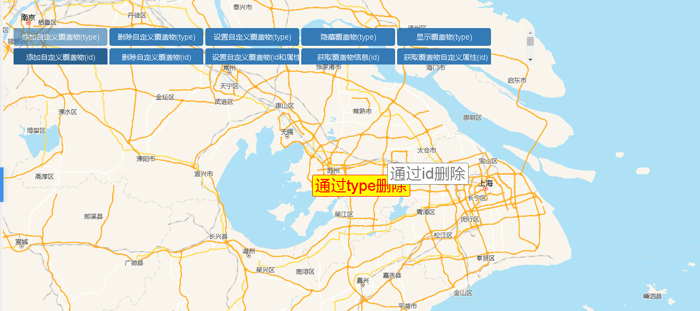

# 自定义覆盖物

> 添加/删除/设置/隐藏/显示覆盖物（type)     添加/删除/设置/获取覆盖物信息/属性（id)




## 运行代码：
```
<!DOCTYPE html>
<html lang="en">

<head>
    <meta charset="UTF-8">
    <title>自定义覆盖物</title>
    <link rel="stylesheet" href="/kmapdemo/css/bootstrap.min.css">
    <link rel="stylesheet" href="/kmapdemo/css/main.css">
    <script src='/kmapdemo/js/jquery-2.2.3.min.js'></script>
    <script src="/kmapdemo/js/bootstrap.min.js"></script>
    <style>
        html,
        body {
            margin: 0;
            padding: 0;
        }

        html,
        body,
        #map {
            width: 100%;
            height: 100%;
        }
    </style>
</head>

<body>
    <style>
        .ceng {
            max-width: 1000px;
            height: 70px;
            overflow-y: auto;
        }

        .addByTypeClass {
            font-size: 30px;
            background-color: yellow;
            color: red;
            line-height: 30px;
            padding: 5px;
            border-radius: 3px;
            border: 1px solid red;
        }

        .addByIdClass {
            font-size: 30px;
            background-color: white;
            color: gray;
            line-height: 30px;
            padding: 5px;
            border-radius: 3px;
            border: 1px solid gray;
        }

        .addByTypeClass,
        .addByIdClass {
            /* animation: customOverlaysBounce .3s ease-in infinite alternate;
        -webkit-animation: customOverlaysBounce .3s ease-in infinite alternate; */
            position: relative;
            left: 0;
            top: 10px;
        }

        @keyframes customOverlaysBounce {
            from {
                top: 10px;
            }
            to {
                top: 20px;
            }
        }

        @-webkit-keyframes customOverlaysBounce {
            from {
                top: 10px;
            }
            to {
                top: 20px;
            }
        }

        .custom button {
            width: 180px;
        }

        body {
            -webkit-touch-callout: none;
            -webkit-user-select: none;
            -khtml-user-select: none;
            -moz-user-select: none;
            -ms-user-select: none;
            user-select: none;
        }
    </style>
    <div class="ceng custom">
        <div style="margin-bottom:5px;">
            <button class="btn btn-primary" id="addByType">添加自定义覆盖物(type)</button>
            <button class="btn btn-primary" id="removeByType">删除自定义覆盖物(type)</button>
            <button class="btn btn-primary" id="setByType">设置自定义覆盖物(type)</button>
            <button class="btn btn-primary" id="hideByType">隐藏覆盖物(type)</button>
            <button class="btn btn-primary" id="showByType">显示覆盖物(type)</button>
        </div>
        <div>
            <button class="btn btn-primary" id="addById">添加自定义覆盖物(id)</button>
            <button class="btn btn-primary" id="removeById">删除自定义覆盖物(id)</button>
            <button class="btn btn-primary" id="setById">设置自定义覆盖物(id和属性)</button>
            <button class="btn btn-primary" id="getById">获取覆盖物信息(id)</button>
            <button class="btn btn-primary" id="getPropsById">获取覆盖物自定义属性(id)</button>
        </div>
        <div style="margin-top: 5px;">
            <button class="btn btn-primary" id="addDragEvent">添加拖动事件(id)</button>
            <button class="btn btn-primary" id="addClickEvent">添加点击事件获取信息(id)</button>
            <button class="btn btn-primary" id="removeDragEvent">解除拖动事件(id)</button>
            <button class="btn btn-primary" id="removeClickEvent">解除点击事件(id)</button>
            <!-- <button class="btn btn-primary" id="test">测试WeakMap</button> -->
        </div>

        <div style="margin-top: 5px;">
            <button class="btn btn-primary" id="addDragEvent_type">添加拖动事件(type)</button>
            <button class="btn btn-primary" id="addClickEvent_type">添加点击事件获取信息(type)</button>
            <button class="btn btn-primary" id="removeDragEvent_type">解除拖动事件(type)</button>
            <button class="btn btn-primary" id="removeClickEvent_type">解除点击事件(type)</button>
            <!-- <button class="btn btn-primary" id="test">测试WeakMap</button> -->
        </div>
        <!-- <button id="test">测试WeakMap</button> -->
    </div>
    <div id="map"></div>
    <script src="/kmapdemo/kmap/kmap-service-main-v1.6.7.js"></script>
    <script>
        window.onload = function() {
            var kmap;
            var onLoadMap = function() {

                var overlaysType = null;
                var overlaysId = null;

                var addByType = document.getElementById('addByType');
                var removeByType = document.getElementById('removeByType');
                var setByType = document.getElementById('setByType');
                var addById = document.getElementById('addById');
                var removeById = document.getElementById('removeById');
                var setById = document.getElementById('setById');
                var getById = document.getElementById('getById');
                var getPropsById = document.getElementById('getPropsById');
                var hideByType = document.getElementById('hideByType');
                var showByType = document.getElementById('showByType');

                var addDragEvent = document.getElementById('addDragEvent');
                var addClickEvent = document.getElementById('addClickEvent');
                var removeDragEvent = document.getElementById('removeDragEvent');
                var removeClickEvent = document.getElementById('removeClickEvent');


                var addDragEvent_type = document.getElementById('addDragEvent_type');
                var addClickEvent_type = document.getElementById('addClickEvent_type');
                var removeDragEvent_type = document.getElementById('removeDragEvent_type');
                var removeClickEvent_type = document.getElementById('removeClickEvent_type');

                function clickHandler(e, opts) {
                    alert(e.target.innerHTML);
                }
                // 拖动开始事件
                function dragStart(e) {
                    console.log('drag start');
                }

                // 拖动过程事件
                function dragMove(e) {
                    console.log('draging');
                }

                // 拖动结束事件
                function dragEnd(e) {
                    console.log('drag end');
                }

                addClickEvent.addEventListener('click', function() {
                    overlaysId && kmap.addEventOnCustomOverlays({
                        customOverlaysType: overlaysId,
                        event: 'click',
                        handler: clickHandler
                    });
                });
                removeClickEvent.addEventListener('click', function() {
                    kmap.removeEventOnCustomOverlays({
                        customOverlaysType: overlaysId,
                        event: 'click',
                        handler: clickHandler
                    });
                });

                addDragEvent.addEventListener('click', function() {
                    overlaysId && kmap.addEventOnCustomOverlays({
                        customOverlaysType: overlaysId,
                        event: 'drag',
                        dragEnd: dragEnd,
                        dragStart: dragStart,
                        dragMove: dragMove
                    });
                });

                removeDragEvent.addEventListener('click', function() {
                    kmap.removeEventOnCustomOverlays({
                        customOverlaysType: overlaysId,
                        event: 'drag',
                        dragEnd: dragEnd,
                        dragStart: dragStart,
                        dragMove: dragMove
                    });
                });


                //type
                addClickEvent_type.addEventListener('click', function() {
                    overlaysType && kmap.addEventOnCustomOverlays({
                        customOverlaysType: overlaysType,
                        event: 'click',
                        handler: clickHandler
                    });
                });
                removeClickEvent_type.addEventListener('click', function() {
                    kmap.removeEventOnCustomOverlays({
                        customOverlaysType: overlaysType,
                        event: 'click',
                        handler: clickHandler
                    });
                });

                addDragEvent_type.addEventListener('click', function() {
                    overlaysType && kmap.addEventOnCustomOverlays({
                        customOverlaysType: overlaysType,
                        event: 'drag',
                        dragEnd: dragEnd,
                        dragStart: dragStart,
                        dragMove: dragMove
                    });
                });

                removeDragEvent_type.addEventListener('click', function() {
                    kmap.removeEventOnCustomOverlays({
                        customOverlaysType: overlaysType,
                        event: 'drag',
                        dragEnd: dragEnd,
                        dragStart: dragStart,
                        dragMove: dragMove
                    });
                });

                // document.getElementById('test').addEventListener('click', function () {
                //     var domlist = document.getElementsByClassName('addByTypeClass');
                //     [...domlist].map(dom => {
                //         var domp = dom.parentElement;
                //         domp.parentElement.removeChild(domp);
                //         kmap.getCacheOverlays({
                //             key: domp,
                //             ended: function (res) {
                //                 console.log(res);
                //             }
                //         })
                //     });
                // });

                addByType.addEventListener('click', function() {
                    var element = document.createElement('div');
                    element.className = 'addByTypeClass';
                    element.innerHTML = '通过type删除';
                    kmap.addCustomOverlays({
                        data: [{
                            id: 'addByType01' + Math.random(),
                            point: [120.4598370360851 + Math.random() * 0.00001, 31.327252693143436 + Math.random() * 0.00001],
                            element: element,
                            customProps: '通过type添加的自定义属性',
                        }],
                        ended: function(res) {
                            overlaysType = res.data;
                            addByType.setAttribute('disabled', true);
                            kmap.getCustomOverlaysByType({
                                customOverlaysType: 'addByType',
                                callback: function(data) {
                                    console.log(data);
                                }
                            });
                        },
                        customOverlaysType: 'addByType'
                    });
                });
                removeByType.addEventListener('click', function() {
                    kmap.removeCustomOverlaysByType({
                        customOverlaysType: 'addByType'
                    });
                    addByType.removeAttribute('disabled');
                });
                setByType.addEventListener('click', function() {
                    kmap.setCustomOverlayProperty({
                        type: 'customOverlaysType',
                        customOverlaysType: 'addByType',
                        points: [
                            [120.24354370111831, 31.28266505757992]
                        ]
                    });
                });
                hideByType.addEventListener('click', function() {
                    kmap.hideOverlay({
                        type: 'class',
                        class: 'addByType'
                    });
                });
                showByType.addEventListener('click', function() {
                    kmap.showOverlay({
                        type: 'class',
                        class: 'addByType'
                    });
                });
                addById.addEventListener('click', function() {
                    var element = document.createElement('div');
                    element.className = 'addByIdClass';
                    element.innerHTML = '通过id删除';
                    kmap.addCustomOverlays({
                        data: [{
                            id: 'addById01',
                            point: [120.89929016109369, 31.38588847078431],
                            element: element,
                            customProps: '通过id添加的自定义属性',
                        }],
                        customOverlaysType: 'addById',
                    });
                });
                removeById.addEventListener('click', function() {
                    kmap.removeCustomOverlayById({
                        id: 'addById01'
                    });
                });
                setById.addEventListener('click', function() {
                    kmap.setCustomOverlayProperty({
                        type: 'id',
                        id: 'addById01',
                        point: [121.05103881834157, 31.19107700584874],
                        customProps: '这才是自定义属性',
                    });
                });
                getById.addEventListener('click', function() {
                    kmap.getOverlayById({
                        id: 'addById01',
                        callback: function(res) {
                            if (res.data) {
                                alert(res.data.element.innerText);
                            } else {
                                alert('不存在覆盖物');
                            }
                        }
                    });
                });
                getPropsById.addEventListener('click', function() {
                    kmap.getOverlayPropsById({
                        id: 'addById01',
                        callback: res => {
                            alert(res.data)
                        }
                    });
                });
            }
            var config = {
                configUrl: '/kmapdemo/kmap/config.json',
                containerId: 'map',
                zoom: 8,
                onLoadMap: onLoadMap
            };


            kmap = new KMap(config);
        }
    </script>
</body>

</html>
```

