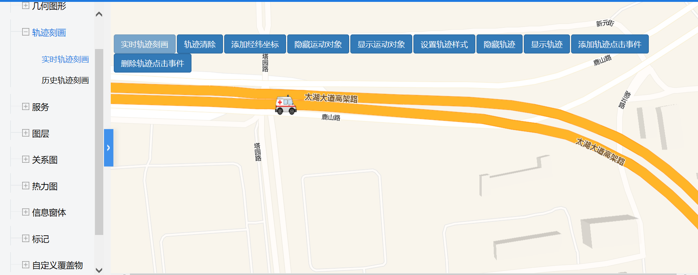

# 实时轨迹刻画

> 可刻画实时轨迹，清除轨迹，添加经纬坐标，隐藏或显示运动对象，设置或隐藏轨迹样式，添加或删除轨迹点击事件 





## 运行代码：

```
<!DOCTYPE html>
<html lang="en">

<head>
    <meta charset="UTF-8">
    <title>实时轨迹刻画</title>
    <link rel="stylesheet" href="/kmapdemo/css/bootstrap.min.css">
    <link rel="stylesheet" href="/kmapdemo/css/main.css">
    <script src='/kmapdemo/js/jquery-2.2.3.min.js'></script>
    <script src="/kmapdemo/js/bootstrap.min.js"></script>
    <style>
        html,
        body {
            margin: 0;
            padding: 0;
        }

        html,
        body,
        #map {
            width: 100%;
            height: 100%;
        }
    </style>
</head>

<body>
    <div class="ceng row">
        <button class="btn btn-primary" id="real_time_track" style="float: left;margin-right: 2px">实时轨迹刻画</button>
        <button class="btn btn-primary" id="clear_track" style="float: left;margin-right: 2px">轨迹清除</button>
        <button class="btn btn-primary" id="add_track" style="float: left;margin-right: 2px">添加经纬坐标</button>
        <button class="btn btn-primary" id="hideActor" style="float: left;margin-right: 2px">隐藏运动对象</button>
        <button class="btn btn-primary" id="showActor" style="float: left;margin-right: 2px">显示运动对象</button>
        <button class="btn btn-primary" id="setSolidLineYellow" style="float: left;margin-right: 2px">设置轨迹样式</button>
        <button class="btn btn-primary" id="hideLine" style="float: left;margin-right: 2px">隐藏轨迹</button>
        <button class="btn btn-primary" id="showLine" style="float: left;margin-right: 2px">显示轨迹</button>
        <button class="btn btn-primary" id="addEvent" style="float: left;margin-right: 2px">添加轨迹点击事件</button>
        <button class="btn btn-primary" id="removeEvent" style="float: left;">删除轨迹点击事件</button>
    </div>
    <div id="map"></div>
    <script src="/kmapdemo/kmap/kmap-service-main-v1.6.7.js"></script>
    <script>
        window.onload = function() {
            var kmap;
            var onLoadMap = function() {
                //这里运行地图加载之后的方法
                // console.log('运行 onLoadMap 方法');

                var id;

                const path = [
                    [120.55103903352335, 31.32685739303399],
                    [120.55167253532846, 31.326830062380367],
                    [120.55220365302466, 31.326786333312867],
                    [120.55268997767126, 31.32675353650542],
                    [120.55306112013835, 31.326737138090934],
                    [120.55332987849647, 31.326682476705955],
                    [120.55355384377464, 31.32665514600157],
                    [120.55387379420245, 31.326595018413556],
                    [120.55414895155036, 31.32650209389209],
                    [120.55441131088833, 31.326392770817392],
                    [120.5546352761969, 31.326299846096333],
                    [120.55482724643537, 31.326163191926554],
                    [120.55506400975378, 31.325982808130675],
                    [120.55526877800202, 31.325807890177586],
                    [120.55547354628067, 31.325572843658577],
                    [120.55575510264867, 31.32518474231449],
                    [120.55597906792684, 31.32481850436885],
                    [120.55616463917556, 31.32448506260768],
                    [120.5563374124145, 31.324195349956824],
                    [120.55654857968284, 31.323872838603364],
                    [120.55672135292184, 31.323594056715777],
                ];

                var idx = 1;

                function getMathPoint() {
                    //return [120.8071916076828 + Math.random() * 0.001, 31.5985506094399 + Math.random() * 0.001];
                    return [120.53563125603569 + Math.random() * 0.001, 31.321827036484635 + Math.random() * 0.001];
                };
                var url = '/kmapdemo/images/car.png';
                document.getElementById('real_time_track').addEventListener('click', function(e) {
                    kmap.createRealtimeTrack({
                        //points: [[120.52, 31.31], [120.53, 31.32], [120.51, 31.33], [120.52, 31.36]],
                        points: [path[0]],
                        //points: respPoints,
                        type: 1,
                        strategy: 1,
                        criteria: 0,
                        lineColor: '#00ff00',
                        url: url,
                        autoLocate: true,
                        actorWidth: 40,
                        actorHeight: 40,
                        rotation:270,
                        //offset:[100,100],
                        ended: function(res) {
                            if (res.status === 10) {
                                id = res.data;
                                e.target.setAttribute('disabled', 'disabled');
                                // setTimeout(() => {
                                //     kmap.updateRealtimeTrackPoint({
                                //         id: id,
                                //         point: getMathPoint()
                                //     });
                                // },1000)
                            }
                        },
                    });

                });

                document.getElementById('clear_track').addEventListener('click', function() {
                    if (id) {
                        kmap.removeRealtimeTrack({
                            id: id
                        });
                        document.getElementById('real_time_track').removeAttribute('disabled');
                    }
                });

                document.getElementById('add_track').addEventListener('click', function() {
                    if (idx >= path.length - 1) {
                        alert('到达终点了!');
                        return;
                    }
                    kmap.updateRealtimeTrackPoint({
                        id: id,
                        point: path[idx]
                    });
                    idx++;
                    // function laterFunc() {
                    //     setTimeout(function () {
                    //         kmap.updateRealtimeTrackPoint({
                    //             id: id,
                    //             point: getMathPoint(),
                    //             duration: 1,
                    //         });
                    //         laterFunc();
                    //     }, 1200);
                    // }
                    // laterFunc();
                });

                document.getElementById('hideActor').addEventListener('click', function() {
                    if (id) {
                        kmap.setTrackProperty({
                            type: 2,
                            id: id,
                            showActor: false
                        });
                    }
                });

                document.getElementById('showActor').addEventListener('click', function() {
                    if (id) {
                        kmap.setTrackProperty({
                            type: 2,
                            id: id,
                            showActor: true
                        });
                    }
                });

                document.getElementById('setSolidLineYellow').addEventListener('click', function() {
                    if (id) {
                        kmap.setTrackProperty({
                            type: 2,
                            id: id,
                            lineStyle: 1,
                        });
                    }
                });

                document.getElementById('hideLine').addEventListener('click', function() {
                    if (id) {
                        kmap.setTrackProperty({
                            type: 2,
                            id: id,
                            showLine: false
                        });
                    }
                });

                document.getElementById('showLine').addEventListener('click', function() {
                    if (id) {
                        kmap.setTrackProperty({
                            type: 2,
                            id: id,
                            showLine: true
                        });
                    }
                });
                const handler = function(e) {
                    console.log(e);
                    alert('lng:' + e.lngLat.lng + '  lat:' + e.lngLat.lat);
                }
                document.getElementById('addEvent').addEventListener('click', function() {
                    kmap.addTrackLayerEvent({
                        id: id,
                        eventType: 'click',
                        handler: handler
                    })
                });

                document.getElementById('removeEvent').addEventListener('click', function() {
                    kmap.removeTrackLayerEvent({
                        id: id,
                        eventType: 'click',
                    });
                });

            };
            //调用科达地图API接口的配置项
            var config = {
                configUrl: '/kmapdemo/kmap/config.json',
                containerId: 'map',
                mapType: 3,
                zoom: 16,
                onLoadMap: onLoadMap //配置回调方法，用来处理业务
            };


            kmap = new KMap(config);
        }
    </script>
</body>

</html>

```

